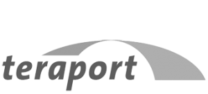

:slug: partners/
:category: partners
:description: FLUID is a company focused on information security, ethical hacking, penetration testing and vulnerabilities detection with over 18 years providing its services to the colombian market. The purpose of this page is to present our  business partners in the market.
:keywords: FLUID, Partners, Pentesting, Ethical Hacking, Information Security, Company.
:translate: aliados/

= Partners

[role="aliados tb-alt"]
[cols=2, frame="none"]
|====

^.^a|image:logo-choucair.png[alt="Logo Choucair",link="http://www.choucairtesting.com/"]

a|== Choucair

Colombian company pioneer in software testing created in 1999
with international projection, which offers services
related to software testing to reduce the risks of its operation.
The success of the services provided by the organization
are based on research and qualified human resources,
supported by a certified and effective methodology.

a|== Evolution IT

Company that promotes, implements and strengthens
the effective management of information technology
as a pillar of companies to improve their competitiveness
through better quality services,
which help increase their profitability,
employing world-class practices
and establishing relationships of trust with customers,
business partners and collaborators.

^.^a|

^.^a|

a|== GreenSQA

Company focused on software testing,
such as performance tests,
tests on different mobile devices and tests automation throughout
the life cycle of product development
with 15 years of experience lending its services.

a|== NewNet
Colombian company dedicated to provide services and solutions in +IT+,
a pioneer in the field of information technology,
with more than 20 years of experience.
Its objective is to plan, establish, implement, operate,
review, maintain, and improve technological management
within a framework of security, service, support and support
according to the needs of each organization.

^.^a|

^.^a|

a|== Teraport

German company specialized in software development
and services in the field of virtual product development.
Experts in automotive, aerospace and manufacturing industries fields,
offering specific solutions and standardized products regarding development,
simulation and quality assurance
as well as services and consulting in product development engineering.

a|== The missing link

Australian provider of information technology solutions,
provide services for infrastructure, security, backup, disaster recovery,
communications and cloud services.
Recognized as a leader industry and accredited with the highest levels
in design, delivery and support of the latest technologies.

^.^a|image:logo-tml.png[alt="Logo The Missing Link",link="https://www.themissinglink.com.au/"]

|====
