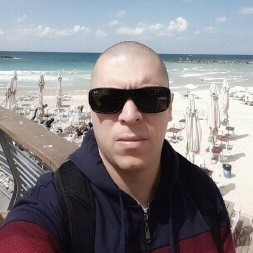

:slug: people/aroldan/
:category: people
:description: Fluid Attacks is a company focused on ethical hacking, pentesting and vulnerabilities detection in applications with over 18 year of experience providing our services to the Colombian market. The purpose of this page is to present the members that make up our work team.
:keywords: Fluid Attacks, Team, People, Members, Andres, Roldan.
:translate: personas/aroldan/

= Andres Roldan

[role="img-ppl"]

Cyber Security Specialist from the University of Maryland. +Fluid Attacks+
partner and Senior Security Architect with 20 years of experience in
security-related tasks, responsible for leading advanced ethical hackings
and red team engagements.

He has held the +CEH+ certification several times, and currently holds
the +OSCP+ certification.
He has been an active official Debian Developer for 14 years and had
frequently attended cutting-edge security conferences and trainings in
countrys like +USA+, +Israel+, +Argentina+ and +Colombia+.
