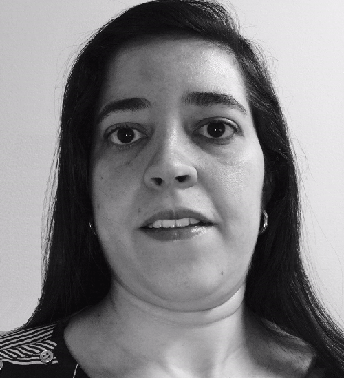

:slug: people/ccarrasco/
:category: people
:description: Fluid Attacks is a company focused on ethical hacking, pentesting and vulnerabilities detection in applications with over 18 year of experience providing our services to the Colombian market. The purpose of this page is to present the members that make up our work team.
:keywords: Fluid Attacks, Team, People, Members, Carolina, Carrasco

= Carolina Carrasco

[role="img-ppl"]

Electronic Engineer specialized in Management.
+Fluid Attacks+ Senior Project Manager,
responsible for project management team
and also managing projects regarding red team operation;
she has been part for our team for almost four years
and has also helped in security architecture area.
She has over eight year experience in project management,
four years specifically managing information security related projects,
she has managed projects in English and Spanish
as she is fluent in both languages,
she also has an intermediate level of French.

Before being part of +Fluid Attacks+,
she was project manager for a telecommunication company
and also was worked in telecommunication industry
in both technical and coordination activities.
