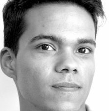

:slug: people/jarmas/
:category: people
:description: FLUID is a company focused on ethical hacking, pentesting and vulnerabilities detection in applications with over 18 year of experience providing our services to the colombian market. The purpose of this page is to present the members that make up our work team.
:keywords: FLUID, Team, People, Members, Jonathan, Armas.
:translate: personas/jarmas

= Jonathan Armas

 

Born in Caracas Venezuela, 
he is a Systems Engineer from the +UNIMET+ (Universidad Metropolitana), 
and currently certified as +COMPTIA Security Plus+. 
An enthusiast of technology, 
he is always searching and testing new software and developing new tools. 
With a high interest in Information Security and Ethical Hacking, 
he is member of +ASOVESINFO+ (Venezuelan Association of Information Security), 
also has participated in several courses and conferences 
like +Maestre’s Malware and Backup+, 
+CCNA+ and Ethical Hacking and Disaster Recovery.

As an Information Security Analyst in a financial company, 
he raised the information security awareness of the company, 
learned and applied +ISO 27001+ and +PCI-DSS+ to their main process. 
On the other side, with +FLUIDAttacks+ he is performing Penetration Tests 
and Ethical Hacking assessments to applications, 
networks and communications platforms, 
learning with each project new tools 
and new ways to compromise ethically, our clients systems. 
Because of his work as a +Blue Team+ and now as +Red Team+ 
he has a great understanding of each side of the information security world.