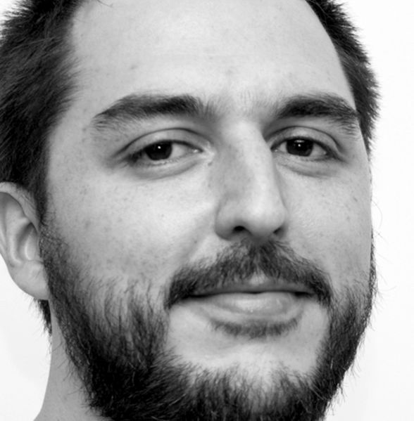

:slug: people/ralvarez/
:category: people
:description: FLUID is a company focused on ethical hacking, pentesting and vulnerabilities detection in applications with over 18 year of experience providing our services to the colombian market. The purpose of this page is to present the members that make up our work team.
:keywords: FLUID, Team, People, Members, Rafael, Alvarez.
:translate: personas/ralvarez

= Rafael Alvarez

Systems Engineer from the EAFIT University, 
scholar of the +International Max-Planck Research School 
for Computer Science+ in Germany 
and the +Center for Development of Advanced Computing+ 
of the Government of India 
for the Computer Fraud Reduction Program. 
Currently certified as a professional in information security +CISSP+. 
He served as a lecturer of the subjects 
Operative Systems at EAFIT University 
and Telematics and Distributed Systems 
at the Pontificia Bolivariana University. 
He was one of the first Colombians to be 
an official developer of the +Debian+ project.

He was a member of the technical committee 181 of +ICONTEC+ 
where he actively participated in the homologation 
of multiple +ISO+ standards related to safety to Colombian Technical Standard. 
He is a founding member of FLUID 
and part of its management team for 16 years, 
from where he led the implementation 
of the first +ISO 27001+ certification in Colombia 
and in which he participated in its maintenance for 6 years. 
He is an investor and board member in +Empiricus+ and +Biva+,
also an independent member of the boards of +Cidenet+ and +Nous Digital+.
In the past he participated in the boards of directors 
of +S-SQUARE+, +Nuva+ and +Al Derecho+. 
He has been a jury member at +iNNpulsa Colombia+ and +Startup Weekend+, 
he is a frequent speaker on issues related to security and entrepreneurship.