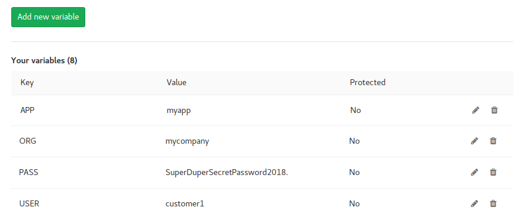

:slug: products/asserts/
:category: products
:description: In this page we present the products offered by FLUID. Asserts is an engine to automate the closing of security findings over execution environments, which can be implemented in a CI pipeline to determine if a security issue persists in the application.
:keywords: FLUID, Products, Asserts, Ethical Hacking, Pentesting, Security.
:translate: productos/asserts/

= Asserts

== 1. Description

+Asserts+ is an engine to automate the *closing* of security findings
over execution environments +(DAST)+.

.Use flow

== 2. Execution

=== In a PC

==== Linux

Make sure the file +~/.pip/pip.conf+ exists and have the following content
(The user and password will be provided by us!):

----
[global]
index-url = https://pypi.python.org/simple/
extra-index-url = https://<user>:<key>@fluid.jfrog.io/fluid/api/pypi/python/simple
----

Then, execute:

[source, bash]
----
$ pip install -U fluidasserts
$ export FA_LICENSE_KEY=<Licence ID>
$ export FA_USER_EMAIL=<Your e-mail>
$ export FA_STRICT="false"

$ python exploit.py
----

==== Windows

Make sure the file +%APPDATA%\pip\pip.ini+ exists and have the
following content (The user and password will be provided by us!):

----
[global]
index-url = https://pypi.python.org/simple/
extra-index-url = https://<user>:<key>@fluid.jfrog.io/fluid/api/pypi/python/simple
----

[source, bash]
----
> pip install -U fluidasserts
> set FA_LICENSE_KEY=<Licence ID>
> set FA_USER_EMAIL=<Your e-mail>
> set FA_STRICT="false"

> python exploit.py
----

=== In a CI (Continuous Integration) pipeline

If you have an application subscribed to our *Continuous Hacking Service*
which includes the use of +Asserts+,
you may add it to your Continuous Integration pipeline.
To achieve this, follow these steps:

* Add the required environment variables +USER+, +PASS+, +ORG+ and +APP+.
Don't worry, the values will be provided by us!:

** +USER+: Name of the user from our Container Registry
** +PASS+: The password of the user
** +ORG+: The name of the organization
** +APP+: The name of the application

.Example of environment variables in Gitlab CI

* Add a job where the container is executed.

.In Gitlab CI, add:
[source, yaml]
----
fluidasserts:
    script:
        - docker login fluid-docker.jfrog.io -u $USER -p $PASS
        - docker pull fluid-docker.jfrog.io/$ORG:$APP
        - docker run -e ORG=$ORG -e APP=$APP -e USER=$USER -e PASS=$PASS -e FA_STRICT="true" fluid-docker.jfrog.io/$ORG:$APP
----

*NOTE:* The variable +FA_STRICT+ must have
the values +true+ or +false+.
When it is set to +true+,
and one of the vulnerabilities remains open,
the pipeline will break!

== 3. Requirements

=== To execute in a PC

* *Operating system*:
** Any SO that supports +Python+
* *Network*:
** Access to the Artifacts Repository https://fluid.jfrog.io
* *Software dependencies*:
** +Python 3.6+

=== To include in a CI pipeline

* *Operating system*:
** Any Linux-based distribution that supports +Docker CE+
** Windows Server with +HyperV+ and +Docker+
** MacOS
* *Network*:
** Access to the Container Registry https://fluid-docker.jfrog.io
** Access to the integration environment where your application or platform is running
* *Software dependencies*:
** +DockerCE 17+ or superior

=== Commons

* *CPU*: 4 cores @1.8GHz
* *RAM*: 4GiB DDR3 @1.6Ghz
* *Disk space*: 10GiB

== 4. Exploit examples

=== SQL Injection

.ex1_open.py: Verify if SQL injection is still present
[source, python, linenum]
----
from fluidasserts.service import http

URL = 'http://testphp.vulnweb.com/AJAX/infoartist.php?id=3%27'

http.has_sqli(URL)
----

.Results from executing ex1_open.py
[source, bash]
----
$ python ex1_open.py
Loading modules...
2018-02-09 11:15:22,273 - FLUIDAsserts - INFO - OPEN: http://testphp.vulnweb.com/AJAX/infoartist.php?id=3%27 Bad text present, Details=Warning.*mysql_.*
----

.ex1_close.py: Verify closed SQL injection
[source, python, linenum]
----
from fluidasserts.service import http

URL = 'http://testphp.vulnweb.com/AJAX/infoartist.php?id=3'

http.has_sqli(URL)
----

.Results from executing ex1_close.py
[source, bash]
----
$ python ex1_close.py
Loading modules...
2018-02-09 11:16:04,923 - FLUIDAsserts - INFO - CLOSE: http://testphp.vulnweb.com/AJAX/infoartist.php?id=3 Bad text not present
----

=== Cross-Site Scripting

.ex2_open.py: Verify if XSS is still present
[source, python, linenum]
----
from fluidasserts.service import http

URL = 'http://testphp.vulnweb.com/guestbook.php'
BAD_TEXT = r""

DATA = 'name=test&text=%3Cscript%3Ealert%28%27Hacked+by+FLUID%27%29%3C%2Fscript%3E&submit=add+message'
http.has_xss(URL, BAD_TEXT, data=DATA)
----

.Results from executing ex2_open.py
[source, bash]
----
$ python ex2_open.py
Loading modules...
2018-02-09 11:17:55,375 - FLUIDAsserts - INFO - OPEN: http://testphp.vulnweb.com/guestbook.php Bad text present, Details=
----

.ex2_close.py: Verify closed XSS
[source, python, linenum]
----
from fluidasserts.service import http

URL = 'http://testphp.vulnweb.com/guestbook.php'
BAD_TEXT = r""

DATA = 'name=test&text=Hacked+by+FLUID&submit=add+message'
http.has_xss(URL, BAD_TEXT, data=DATA)
----

.Results from executing ex2_close.py
[source, bash]
----
$ python ex2_close.py
Loading modules...
2018-02-09 11:19:28,075 - FLUIDAsserts - INFO - CLOSE: http://testphp.vulnweb.com/guestbook.php Bad text not present, Details=
----

=== Breaking the Continuous Integration pipeline

.ex1_open.py: Verify if SQL Injection is still present
[source, python, linenum]
----
from fluidasserts.service import http

URL = 'http://testphp.vulnweb.com/AJAX/infoartist.php?id=3%27'

http.has_sqli(URL)
----

.Execution result breaking the pipeline
[source, bash]
----
$ export FA_STRICT="false"
$ python ex1_open.py
Loading modules...
2018-02-09 11:19:55,339 - FLUIDAsserts - INFO - OPEN: http://testphp.vulnweb.com/AJAX/infoartist.php?id=3%27 Bad text present, Details=Warning.*mysql_.*
$ echo $?
0
$ export FA_STRICT="true"
$ python ex1_open.py
Loading modules...
2018-02-09 11:20:07,758 - FLUIDAsserts - INFO - OPEN: http://testphp.vulnweb.com/AJAX/infoartist.php?id=3%27 Bad text present, Details=Warning.*mysql_.*
$ echo $?
1
$
----

== Licence

Write us at relations@fluidattacks.com to obtain
information about licenses.

