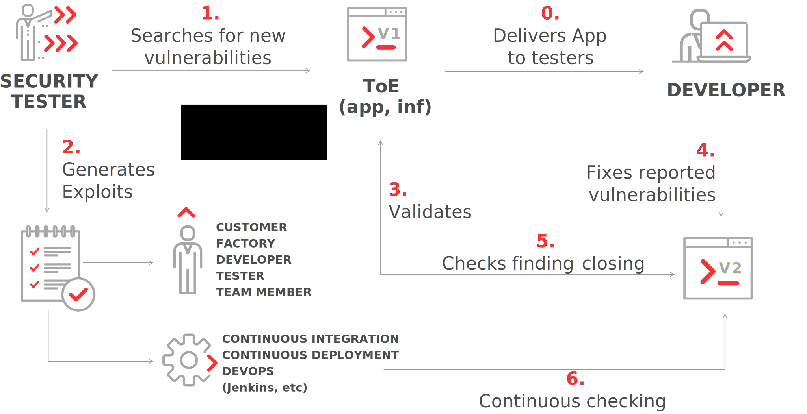

:slug: products/asserts/
:category: products
:description: In this page we present the products offered by Fluid Attacks. Asserts is an engine to automate the closing of security findings over execution environments, which can be implemented in a CI pipeline to determine if a security issue persists in the application.
:keywords: Fluid Attacks, Products, Asserts, Ethical Hacking, Pentesting, Security.
:translate: productos/asserts/

= Asserts

== 1. Description

+Asserts+ is an *automated closing engine* which closes security findings
over execution environments (+DAST+).

.Use case

Read the [button]#link:https://fluidattacks.com/asserts/[API documentation]#

== 2. Installation

+Asserts+ is hosted on +PyPI+,
so you can install it easily using +pip3+ on a system with +Python 3+:

[source, bash, linenums]
.asserts installation
----
$ pip3 install -U fluidasserts
----

For normal/interactive usage,
you should set the environment variable +FA_STRICT+ to +false+ (see below).
In an +UNIX+ -like +OS+:

[source, bash, linenums]
----
$ export FA_STRICT="false"
----

In +Windows+:

[source, bash, linenums]
----
> set FA_STRICT="false"
----

Now you’re ready to begin link:https://fluidattacks.com/asserts/usage/[testing]
vulnerabilities’ closure.

=== Inside a Docker Container

If you have +Docker+ you can check out
and run +Asserts+ inside a container. Just:

[source, bash, linenums]
----
$ docker pull fluidattacks/asserts
----

And then go inside the container:

[source, bash, linenums]
----
$ docker run -it fluidattacks/asserts sh
/ # asserts
----

[source, bash, linenums]
----
#  ___
# | >>|> fluid
# |___|  attacks, we hack your software
#
# Loading attack modules ...
----

Make sure to do the +docker pull+
before every docker run to ensure
you are running the latest +Asserts+ version.

From inside the container you could run +Asserts+
from the +Python+ interactive shell,
or quickly whip up a script using +vi+.
But it would be much more useful
to mount the directory where your exploits live into the container:

[source, bash, linenums]
----
$ docker run -v /home/me/myexploits/:/exploits/ -it fluidattacks/asserts sh
/ # asserts /exploits/open-sqli.py
----

[source, bash, linenums]
----
#  ___
# | >>|> fluid
# |___|  attacks, we hack your software
#
# Loading attack modules ...

check: fluidasserts.proto.http.has_sqli
status: OPEN
message: A bad text was present
details:
  bad_text: Warning.*mysql_.*
  fingerprint:
    banner: "Server: nginx/1.4.1\r\nContent-Type: text/xml\r\nTransfer-Encoding: chunked\r\
      \nConnection: keep-alive\r\nX-Powered-By: PHP/5.3.10-1~lucid+2uwsgi2"
    sha256: 588702eb0b53294654f934d86664956e9739db47c34ffd8d703550cd5fd670a0
  url: http://testphp.vulnweb.com/AJAX/infoartist.php?id=3%27
when: 2018-09-06 08:33:08.781518
----

=== Usage in a CI (Continuous Integration) pipeline

If you have an application subscribed to our link:../../services/continuous-hacking/[Continuous Hacking Service ]
which includes the use of +Asserts+,
you can integrate it into your +CI+ pipeline
to ensure that your software builds and ships with no open vulnerabilities.
We will provide a custom +Docker+ container
with the specific tests you need and maintain the build-breaking exploit.

To achieve this, follow these steps:

. Add the required environment variables +USER+, +PASS+, +ORG+ and +APP+.
Don’t worry, the values will be provided by us!:
+
* +USER:+ Name of the user from our Container Registry.
* +PASS:+ The password of the user.
* +ORG:+ The name of the organization.
* +APP:+ The name of the application.
+
For example, in Gitlab, your environment would look like this:
+
image::vars.png[Gitlab CI environment variables]

. Add a job to run +Asserts+.
For example, in +Gitlab+,
you would add these three lines to your +.gitlab-ci.yml+:
+
.asserts in gitlab
[source, bash, linenums]
----
fluidasserts:
  script:
    - docker login fluid-docker.jfrog.io -u "$USER" -p "$PASS"
    - docker pull fluid-docker.jfrog.io/"$ORG":"$APP"
    - docker run -e ORG="$ORG" -e APP="$APP" -e USER="$USER"
                 -e PASS="$PASS" -e FA_STRICT="true" --rm
                 fluid-docker.jfrog.io/"$ORG":"$APP"
    - docker logout fluid-docker.jfrog.io
----

. Now your pipeline will break if any vulnerability is found to be open.
In order to not break the build,
but still run the tests, set the +FA_STRICT+ variable above to +false+.

==== CI Stages

OK, I’m in. But in what stage should I test my app with +Asserts+ ?
There are at least three good moments to perform closure testing:

. After deploying to a staging or ephemeral environment
. After deploying to the production environment
. Even after every single commit!

==== Post-production

Just as before, we log in to the artifacts repository,
pull the custom image and run it with +Docker+.
This time, however,
we mount the volume corresponding to the current commit
+/tmp${CI_PROJECT_DIR}/${CI_COMMIT_REF_NAME}+
to the +/code+ directory in the container,
since the container is already set-up to test the code there.
This job is ran only in the +master+ branch
and in one of the latest stages, namely +post-deploy+.

[source, bash, linenums]
.post-deploy
----
asserts-prod:
  stage: post-deploy
  script:
    - docker login fluid-docker.jfrog.io -u "$USER" -p "$PASS"
    - docker pull fluid-docker.jfrog.io/"$ORG":"$APP"
    - docker run -e ORG="$ORG" -e APP="$APP" -e USER="$USER" -e PASS="$PASS"
                 -e FA_STRICT="true" --rm -e STAGE=post-deploy
                 -v /tmp${CI_PROJECT_DIR}/${CI_COMMIT_REF_NAME}:/code
                 fluid-docker.jfrog.io/"$ORG":"$APP"
    - docker logout fluid-docker.jfrog.io
  retry: 2
  only:
    - master
----

==== Post-ephemeral

But wait! We could catch bugs before deploying to production.
If you use ephemeral environments,
you can also perform closure testing in those:

[source, bash, linenums]
----
Asserts-Review:
  stage: test
  script:
    - docker login fluid-docker.jfrog.io -u "$USER" -p "$PASS"
    - docker pull fluid-docker.jfrog.io/"$ORG":"$APP"
    - docker run -e ORG="$ORG" -e APP="$APP" -e USER="$USER" -e PASS="$PASS"
                 -e FA_STRICT="true" --rm -e STAGE=test
                 -e BRANCH="$CI_COMMIT_REF_SLUG"
                 -v /tmp${CI_PROJECT_DIR}/${CI_COMMIT_SHA}:/code
                 fluid-docker.jfrog.io/"$ORG":"$APP"
    - docker logout fluid-docker.jfrog.io
  retry: 2
  except:
    - master
    - triggers
----

In contrast to the post-deploy job above,
this one runs on the development branches, during the +test+ stage.
Otherwise, everything else is the same,
just like staging environments mirror production environments.

==== Pre-commit

As a developer you might be thinking
“why wait until all other +CI+ stages are finished
if I just want to test whether my last commit fixed the security hole?”
You could just run +Asserts+ in your development machine,
but sometimes tiny details (like dependencies versions)
might cause the testing to pass in your machine
but fail continuous integration.

In that case you might run the +Dockerized+ incarnation of +Asserts+
as a +pre-commit+ hook:

[source, bash, linenums]
.pre-commit
----
- id: asserts-docker
  name: Running Asserts on the code
  description: Run Asserts to perform SAST
  entry: -v /path/to/your/code/:/code fluidattacks/asserts:latest /code/asserts.sh
  language: docker_image
----

This particular configuration is for the link:https://pre-commit.com/[+pre-commit+] tool,
but can be adapted for similar tools like link:https://github.com/brigade/overcommit[+overcommit+].
The use of such tools is convenient for the developer,
as tests can be quickly run in their machine with every commit:

image::pre-commit-ok.png[Pre-commit test passed]

image::pre-commit-fail.png[Pre-commit test failed]

The same tests can also be run in +CI+ time
(for example, in a +lin+t stage) to ensure that nothing is broken,
even if the developer forgot to run it. Just:

[source, bash, linenums]
----
pre-commit run --all-files
----

somewhere in your +CI+ script.
