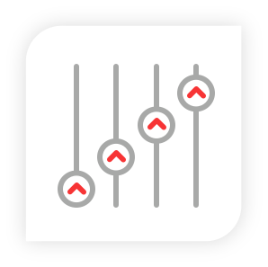

:slug: products/commands/
:category: products
:description: Commands is Fluid Attacks´ cyberweapon used for in depth penetration testing of work stations and critical servers. It looks to take full control of multiple critical systems in order to create a network of infected nodes that can be controled from a command and control center.
:keywords: Fluid Attacks, Products, Commands, Security, Pentesting, Application.
:translate: productos/commands/
:caption:

= Commands

Cyberweapon developed completely by +Fluid Attacks+
for in depth penetration of work stations and critical servers
during the Pentests where its use is authorized
in our [button]#link:../../services/one-shot-hacking/[One-Shot Hacking]# Service.

[role="integrates tb-alt"]
[cols=3, frame="topbot"]
|====
2+a|== Purpose

We are not only interested in finding a vulnerability
but also showing the client the pottential risks it implies
and the direct impact it has on the business.
To do this, we look to take full control of multiple critical systems
in order to create a network of infected nodes
and be able to control them
to obtain sensitive information or further infect other nodes.

a|image::purpose.svg[Código propagándose en varios servidores]

a|image::method.svg[Flechas entrando en un computador]
2+a|== How we do it

In order to be able to use +FLUIDCommands+
we first need administrative access to the vulnerable system,
this we achieve through the manual tests that our experts execute.
Once administrative access is obtained
we can proceed to remotely infect the machine.
With the first machine compromised and under our control
we can now expand and infect other connected nodes
or focus on the machine at hand
and do an in-depth search in look of sensitive information
or new and bigger attack vectors.

2+a|== Zero Collateral Damage

It is important to note that the commands cyberweapon
is never installed on the vulnerable system as a service
nor an automatic running task.
Once all tests have concluded
it is remotely uninstalled
without leaving any traces or collateral damage.
a|image::zero-effects.svg[Símbolo de calavera con un signo de verificación]

a|.Image taken from link:https://www.darpa.mil/program/hallmark[Darpa]

2+a|== Command and Control Center

+FLUIDCommands+ counts with a Command and Control Center
from which we can send orders/commands to our botnet of infected nodes.
The Command and Control Center communicates with all infected nodes
through a reverse proxy using ICMP
giving us always have full control over our cyberweapon.
Having only one node infected,
commands can remotely spread to neighbouring systems.

2+a|== Capture Feature

* Screen Shot: Through the +scr+ command we can take a screen capture
of the infected machine without alerting the victim.
* Audio capture: Using the +mic+ command we can open you microphone
and capture live audio.
* Keylogger: The +keylog+ command allows us to capture
and log all your keyboard strokes in order to obtain sensitive data
such as credentials or credit card info.
a|image::screenshot.svg[Toma de pantallazo]

a|image::exec.svg[Ejecución del comando psexec]
2+a|== exec Feature

This feature allows us to remotely execute any command available
through +cmd+ on the infected machine.

2+a|== echo Feature

This command is used to test the connection and assure
we have control of the infected node.
It echos back whatever we pass to it.
a|image::echo.svg[Ejecución del comando echo]

a|image::evasion.svg[Símbolo de calavera con un signo de escondido]
2+a|== Detection Evasion

Our cyberweapon avoids being detected
by all +AntiX+ and +SOC+ controls
by masking all requests and commands
under a familiar and trusted protocol.

|====
