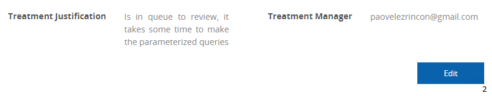

:slug: products/fluidintegrates/
:category: products
:description: TODO
:keywords: TODO

= FLUIDIntegrates

System where all interested parties in the project's chain of value come together
(hacker, developer, project managers, auditors, product managers, etc).
It aims to bring the developer and the hacker closer together,
so the vulnerabilities can be remediated
in an efficient manner.
It also provides real-time information
about the security state of the systems
to the decision makers.

[role="integrates tb-alt"]
[cols=2, frame="none"]
|====
a|== Easy and Fast Authentication

User credentials are not stored.
The authentication is federated, thus allowing the authentication with corporate users.
a|image::authentication.png[Authentication]

a|image::main-menu.png[Main Menu]
a|== Main Menu

The dashboard allows the users to have direct access to all of their projects.
It is also possible to visualize the eventualities associated to each one of the projects.

a|== View Real-Time Eventualities

The events that prevent the development of the project
can be known in real-time.
a|image::eventualities.png[Eventualities]

a|image::graphs.png[Graphs]

a|== Graps of the Project Status

The current state of the reported vulnerabilities can be visualized.
Thus allowing to:

* Prioritize vulnerabilities by their confirmed exploitability
* Indicate which are vulnerabilities and how many are security issues or hygiene issues.
* Know how many vulnerabilities have been remediated and how many remain open.

a|== Project Metrics

They allow to perform a follow-up of the current state of the project.
Some of the used metrics are:

* The amount of detected vulnerabilities.
* The current criticality of the project.
* Remediated vulnerabilities.
a|image::metrics.png[Metrics]

a|image::technical-report.png[Technical Report]
a|== Generate Technical Reports

This document provides detailed information of each vulnerability.
It has great usefulness for the technical staff when remediating
the reported security flaws.

a|== Generate Executive Reports

This document provides summarized and organized information.
Thus, it may be useful for every person interested in the project's chain of value.

a|image::executive-report.png[Executive Report]

a|image::prioritize-remediation.png[Prioritize Remediation]
a|== Prioritize Remediation

Vulnerabilities can be prioritized according to several parameters.
This with the aim of knowing which require an inmediate solution.
Some of these parameters are:

* *Age:* Time that elapses between the report of the vulnerability and the solution applied
by the client.
* *Severity:* Criticality according to the CVSS standard.
* *Status:* Open, closed or partially closed.
* *Treatment:* Assumed, pending or remediate.

a|== Visualize Vulnerabilities

Each vulnerability has information about its current state,
as well as its criticality, type and report date.
a|image::vulnerabilities.png[Vulnerabilities]

a|image::vulnerability-description.png[Vulnerability Description]
a|== Vulnerability Description

The technical detail can be found, which allows the understanding
of the nature of the vulnerability,
location of the security issues,
unfulfilled requirements,
risks and recommendations for the solution.

a|== Remediation / Treatment

Clients may request the revision ^1^ of a vulnerability that has been corrected,
and document ^2^ its treatment.
For the documentation, the client has the following options:

* *Assumed:* The client assumes the risk that implies not solving the security issue.
* *Pending:* The client still has not decided whether to assume or to remediate the vulnerability.
* *Remediate:* The client will solve the security issue.
a|image::remediation.png[Remediation]

a|image::vulnerability-severity.png[Vulnerability Severity]
a|== Vulnerability Severity

The technical assessment of the vulnerability is shown,
based on the CVSS standard (Common Vulnerability Scoring System).
This with the aim of determining the criticality of the vulnerability.

a|== Vulnerability Evidences

The evidence of the existence of the vulnerability is shown graphically.
In some cases, the exploitation process is shown by the means of an animation.
a|image::vulnerability-evidence.gif[Vulnerability Evidence]

a|image::vulnerability-exploitation.png[Vulnerability Exploitation]
a|== Vulnerability Exploit

The *script* used to exploit the vulnerability is shown.
This can be reused to validate the applied corrections.

If the user has acquired a licence of the product link:../fluidasserts/[FLUIDAsserts],
he may reproduce the vulnerability.

a|== Timeline of the Vulnerability

Shows the evolution of the vulnerability across time,
indexing the report dates
and the different closing cycles performed.
This section is of great utility to know the effectiveness of the closing cycles performed.
a|image::timeline.png[Timeline]

a|image::vulnerability-comments.png[Vulnerability Comments]
a|== Solution of Doubts regarding the Vulnerabilities

The users of the project's chain of value, FLUID included,
may exchange insights, doubts or observations
regarding the vulnerability in question.
This section helps the developers to understand where the issue is located,
so a solution can be applied.

a|== Chat with Us

It allows te users to solve doubts regarding the vulnerabilities
or the platform itself.

The engineering team will reply in less than 4 hours in a 8 a.m-5 p.m work schedule.
A notification will also be sent via e-mail
once a reply to the question has been made.
a|image::chat.png[Chat]

a|image::mail.png[Mail]
a|== Notifications via e-mail

Notifications are sent via e-mail to the users of the project's chain of value.
Some of them are:

* Weekly, regarding new reported vulnrabilities.
* When a user comments in a specific vulnerability.
* When a user reports that a vulnerability has been remediated.
* When a validation of the remediation of a vulnerability is made.

a|== Knowledge Base

Users have access to FLUID's Knowledge Base (link:../../kb/[KB]).
Here they can find examples about how to fulfill the security requirements
that are checked in the tests performed.
a|image::knowledge-base.png[Knowledge Base]
|====
