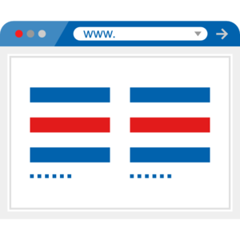
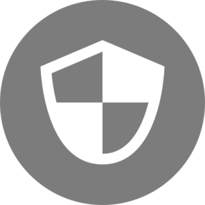
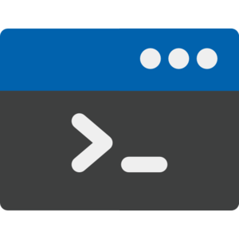

:slug: products/
:description: The purpose of this page is to present the products offered by Fluid Attacks, which focus on helping customers in the security testing process, aiming to improve their experience and allowing us to keep close contact with them. Our star products are Integrates, Asserts and Commands.
:keywords: Fluid Attacks, Products, Ethical Hacking, Pentesting, Security, Information.
:translate: productos/
:caption:

= Products

[role="tb-alt"]
[cols=3, frame="topbot"]
|====

2+a|== link:integrates/[Integrates]

System where all the project's stakeholders come together.
It aims to bring the hacker and the developer closer together,
besides giving the ability to remediate reported vulnerabilities
in an effective manner.
a|.Icon made by link:https://www.alfredocreates.com/[Alfredo Hernandez] from link:https://www.flaticon.com[Flaticon]

a|.Icon made by link:https://www.freepik.com/[Freepik] from link:https://www.flaticon.com[Flaticon]

2+a|== link:asserts/[Asserts]

Engine to automate the closing of security findings
over execution environments.
It can be executed in computers running OS +Windows+ or +Linux+, and it can
also be included in your +Continuous Integration+ environment.

2+a|== link:rules/[Rules]

Set of requirements  used to parameterize a +pen test+.
These rules determine how rigurous a +pen test+ really is,
by defining what is going to be tested,
and what is going to be considered a vulnerability.
a|.Icon made by link:https://smashicons.com/[Smashicons] from link:https://www.flaticon.com[Flaticon]

a|.Icon made by link:https://smashicons.com/[Smashicons] from link:https://www.flaticon.com[Flaticon]

2+a|== link:defends/[Defends]

Set of detailed procedures which allow the development of secure applications,
secure configuration of technological components,
and remediation of vulnerabilities found and reported by us.

2+a|== link:commands/[Commands]

Cyberweapon developed entirely by us for in-depth penetration of work stations
and critical servers during +pen tests+.
a|.Icon made by link:https://www.freepik.com/[Freepik] from link:https://www.flaticon.com[Flaticon]

|====
