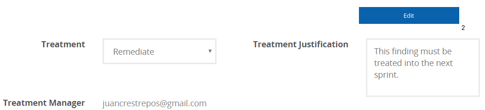

:slug: products/integrates/
:category: products
:description: Integrates is a system which provides all interested parties information and updates about the current state of the project, the number of security findings discovered and its criticality, occurrences, among other information in order to keep close contact with our customers.
:keywords: Fluid Attacks, Products, Integrates, Ethical Hacking, Pentesting, Security.
:translate: productos/integrates/

= Integrates

[role="tb-product"]
[cols="^.^", frame="none"]
|====

a|At Integrates a project’s stakeholders
(developers, technicians, management, etc.) can interface
with +Fluid Attacks+ hackers.
Through Integrates, +Fluid Attacks+ communicates all identified security risks
to a client’s systems for prompt,
efficient and effective remediation by the client company.
It also provides the client company’s decision-makers
with real time information regarding their systems’ security
and +Fluid Attacks+ project progress.

a|You can access the product

a|[button]#link:../../../../integrates[here]#
|====

[role="tb-alt"]
[cols=3, frame="topbot"]
|====
2+a|== Easy and Fast Authentication

A client company’s user credentials are not stored.
Using Integrates, a client company can access information
provided by +Fluid Attacks+ through their corporate email accounts
from +Google+ or +Microsoft+.

a|image::authentication.svg[Authentication]

a|image::main-menu.svg[Main Menu]
2+a|== Main Menu

Dashboard allows a client company direct access
to all their ongoing projects with +Fluid Attacks+.
A client company can review an up-to-the-minute work history
of each of their project's events.

2+a|== Project Indicators

Project Indicators inform a client company
about the current status of a project,
using information including:

* Number of identified security vulnerabilities.
* Current threat level vulnerabilities pose to a client company’s systems.
* Vulnerabilities that have been remediated.

a|image::indicators.svg[Indicators]

a|image::graphs.svg[Graphs]
2+a|== Project Status Graphs

In Project Status Graphs a client company can see
the current status of reported security vulnerabilities.
This allows a client company to:

* Prioritize security vulnerabilities by the threat level they pose
to a client company’s systems.

* Differentiate between real vulnerabilities,
simple security issues, and hygiene issues.

* See a project’s progress based on the number of vulnerabilities remediated,
in the process of being remediated,
or that are waiting to be remediated.

2+a|== View Real-Time Events

All events that inhibit the execution of the project
can be viewed in real time.
a|image::eventualities.svg[Events]

a|image::user-tracking.svg[User Tracking]
2+a|== User tracking

Tracks and displays all users who have accessed a particular project.

2+a|== User Administration

A user can grant or revoke access to other users using this module.
a|image::user-administration.svg[Administration Access]

a|image::technical-report.svg[Technical Report]
2+a|== Generate Technical Reports

Executive Reports are a summary version of the technical report
specifically written so that non-technical stakeholders
and decision-makers can understand a client company’s vulnerabilities,
the threats they pose, the steps taken to insure system security,
and to track progress toward an endpoint.

2+a|== Generate Executive Reports

This document provides summarized and organized information.
Thus, it may be useful for all the project's stakeholders.

a|image::executive-report.svg[Executive Report]

a|image::prioritize-remediation.svg[Prioritize Remediation]
2+a|== Prioritize Remediation

Prioritizing remediation helps a client company
determine which vulnerabilities require immediate attention.
Security vulnerabilities are prioritized based on parameters including:

* *Age:* Time between the report of an identified vulnerability
and the repair by a client company’s technical team.

*  *Severity:* level of threat posed by a vulnerability
according to the +CVSS+ (Common Vulnerability Scoring System) standard.

* *Status:* *OPEN* (a current, active threat),
*CLOSED* (no longer an active threat),
*PARTIALLY CLOSED* (poses a lowered threat level).

* *Resolution options:* *ASSUMED* (client company assumes any security risks
stemming from inaction), *PENDING* (client company has not yet decided
on any further action), *REMEDIATE* (client company will resolve
the security risk posed by the vulnerability).

2+a|== View Vulnerabilities

View Vulnerabilities allows the client company to see vulnerabilities
and information on their current status,
including severity of the threat, type of threat posed,
and identification/report date.

a|image::vulnerabilities.png[Vulnerabilities]

a|image::vulnerability-description.png[Vulnerability Description]
2+a|== Vulnerability Description

The Vulnerability Description contains technical information
about each vulnerability.
Information includes their location,
security risks they pose, and recommendations on how to eliminate them.

2+a|== Request Verification / Treatment

Clients may request a revision ^1^ of a vulnerability
they have remediated and ask +Fluid Attacks+ for documentation ^2^
of their remediation or treatment.
For documentation purposes, a client has the following options:

* *Accepted:* The client assumes the risk
that implies not solving the security issue.
* *New:* The client still has not decided whether to assume
or to remediate the vulnerability.
* *In Progress:* The client will solve the security issue.
a|image::request-verification.png[Request Verification]

a|image::vulnerability-severity.png[Vulnerability Severity]
2+a|== Vulnerability Severity

Vulnerability Severity indicates the risk level
an identified vulnerability poses to a client company’s systems
using the international Common Vulnerability Scoring System (+CVSS+) standard.

2+a|== Vulnerability Evidence

In Vulnerability Evidence proof that a security vulnerability exists
is shown graphically and includes a descriptive explanation.

a|image::vulnerability-evidence.png[Vulnerability Evidence]

a|image::exploitation-animation.gif[Exploitation Animation]
2+a|== Exploitation Animation

Process executed to exploit the vulnerability
is shown through an animation (+gif+).

2+a|== Exploit

The *script* used to exploit the vulnerability is shown.
This can be reused to validate the applied corrections.

By downloading our product [button]#link:../asserts/[Asserts]#,
and following the [button]#link:https://fluidsignal.gitlab.io/asserts/[documentation]#
you may reproduce the attack that takes advantage of the vulnerability
and determine autonomously if it was already remedied.
When you reproduce an attack, the code that exploits the vulnerability
is injected into the application.
a|image::vulnerability-exploitation.png[Vulnerability Exploitation]

a|image::timeline.png[Timeline]
2+a|== Timeline of the Vulnerability

Shows the evolution of the vulnerability across time,
indexing the report dates
and the different closing cycles performed.
This section is of great utility to know the effectiveness
of the closing cycles performed.

2+a|== Compromised Records

Information such as names, identifiers, balances, products, etc.
that was compromised during the execution of security tests,
through the exploitation of a vulnerability.
a|image::records.png[Compromised Records]

a|image::vulnerability-comments.png[Vulnerability Comments]
2+a|== Doubts regarding the Vulnerabilities

The project's stakeholders, Fluid Attacks included,
may exchange insights, doubts or observations
regarding the vulnerability in question.
This section helps the developers understand where the issue is located
in order to apply a solution.

2+a|== Chat with Us

It allows the users to solve doubts regarding the vulnerabilities
or the platform itself.

The engineering team will reply in less than 4 hours
during business hours (8a.m - 5p.m).
A notification will also be sent via e-mail
once a reply to the question has been posted.

a|image::chat.png[Chat]

a|image::mail.png[Mail]
2+a|== Notifications via e-mail

Notifications are sent via e-mail to the project's stakeholders.
Some of them are:

* Weekly, regarding changes in vulnerabilities.
* When a user comments in a specific vulnerability.
* When a user reports that a vulnerability has been remediated.
* When a validation of the remediation of a vulnerability is made.
* When a vulnerability reaches a certain age
(15, 30, 60 days old ...) and has not been treated.

2+a|== Knowledge Base

Users have access to Fluid Attacks's product [button]#link:../../defends/[Defends]#
where they can find examples about how to fulfill the security requirements
that are verified in the tests performed.
a|image::knowledge-base.png[Knowledge Base]
|====
