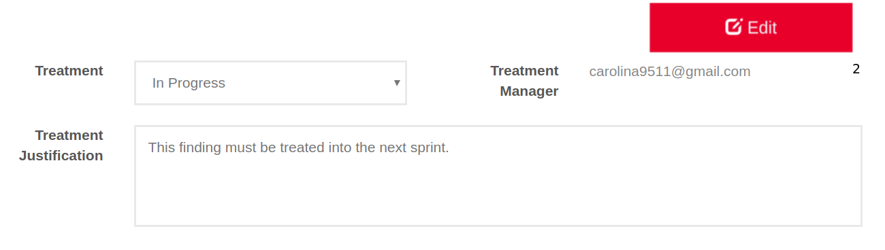

:slug: products/integrates/
:category: products
:description: Integrates is a system which provides all interested parties information and updates about the current state of the project, the number of security findings discovered and its criticality, occurrences, among other information in order to keep close contact with our customers.
:keywords: FLUID, Products, Integrates, Ethical Hacking, Pentesting, Security.
:translate: productos/integrates/

= Integrates

System where all the project's stakeholders come together
(hacker, developer, project managers, auditors, product owner, etc).
It aims to bring the developer and the hacker closer together
in order to remediate all reported vulnerabilities
in an effective and efficient manner.
It also provides the decision makers
with real time information
regarding the state of their system´s security.

You can access the product [button]#link:../../../../integrates[here]#

[role="integrates tb-alt"]
[cols=2, frame="none"]
|====
a|== Easy and Fast Authentication

User credentials are not stored.
Federated identity, thus allowing authentication with corporate users.
a|image::authentication.png[Authentication]

a|image::main-menu.png[Main Menu]
a|== Main Menu

The dashboard allows users direct access to all their projects.
It is also possible to view the events associated to each one of the projects.

a|== View Real-Time Events

All events that inhibit the execution of the project
can be viewed in real time.
a|image::eventualities.png[Events]

a|image::graphs.png[Graphs]

a|== Project Status Graphs

You can view the current state of the reported vulnerabilities.
Easily allowing to:

* Prioritize vulnerabilities by their confirmed exploitability
* Indicate which are vulnerabilities and how many are security issues or hygiene issues.
* Know how many vulnerabilities have been remediated and how many remain open.

a|== Project Statistics

They allow to perform a follow-up of the current state of the project.
Some of the used statistics are:

* The amount of detected vulnerabilities.
* The current severity of the project.
* Remediated vulnerabilities.
a|image::metrics.png[Statistics]

a|image::technical-report.png[Technical Report]
a|== Generate Technical Reports

This document provides detailed information of each vulnerability.
It is of great use to all technical personnel
when it comes to remediating the reported security flaws.

a|== Generate Executive Reports

This document provides summarized and organized information.
Thus, it may be useful for all the project's stakeholders.

a|image::executive-report.png[Executive Report]

a|image::prioritize-remediation.png[Prioritize Remediation]
a|== Prioritize Remediation

Vulnerabilities can be prioritized based on several parameters.
This with the aim of knowing which require an inmediate solution.
Some of these parameters are:

* *Age:* Time that elapses between the report of the vulnerability and the solution applied
by the client.
* *Severity:* Criticality according to the CVSS standard.
* *Status:* Open, closed or partially closed.
* *Treatment:* Assumed, pending or remediate.

a|== View Vulnerabilities

Each vulnerability has information regarding its current state,
as well as its severity, type and report date.
a|image::vulnerabilities.png[Vulnerabilities]

a|image::vulnerability-description.png[Vulnerability Description]
a|== Vulnerability Description

Contains technical details
that allow for a better understanding
of the nature of the vulnerability,
location of the security issues,
unfulfilled requirements,
risks and recommendations for the solution.

a|== Request Verification / Treatment

Clients may request the revision ^1^ of a vulnerability that has been corrected,
and document ^2^ its treatment.
For the documentation, the client has the following options:

* *Assumed:* The client assumes the risk that implies not solving the security issue.
* *Pending:* The client still has not decided whether to assume or to remediate the vulnerability.
* *Remediate:* The client will solve the security issue.
a|image::request-verification.png[Request Verification]

a|image::vulnerability-severity.png[Vulnerability Severity]
a|== Vulnerability Severity

The technical score
according to the international CVSS (Common Vulnerability Scoring System) standard
is shown.
This with the aim of determining the severity of the vulnerability.

a|== Vulnerability Evidences

Existence of a vulnerability is shown through a series of evidences (images)
with its respective description.
a|image::vulnerability-evidence.png[Vulnerability Evidence]

a|image::exploitation-animation.gif[Exploitation Animation]
a|== Exploitation Animation

Process executed to exploit the vulnerability
is shown through an animation (gif).

a|== Exploit

The *script* used to exploit the vulnerability is shown.
This can be reused to validate the applied corrections.

If the user has acquired a licence of the product [button]#link:../asserts/[Asserts]#,
he may reproduce the attack that takes advantage of the vulnerability
and determine autonomously if it was already remedied.
When you reproduce an attack, the code that exploits the vulnerability
is injected into the application.
a|image::vulnerability-exploitation.png[Vulnerability Exploitation]

a|image::timeline.png[Timeline]
a|== Timeline of the Vulnerability

Shows the evolution of the vulnerability across time,
indexing the report dates
and the different closing cycles performed.
This section is of great utility to know the effectiveness of the closing cycles performed.

a|== Compromised Records

Information such as names, identifiers, balances, products, etc.
that was compromised during the execution of security tests,
through the exploitation of a vulnerability.
a|image::records.png[Compromised Records]

a|image::vulnerability-comments.png[Vulnerability Comments]
a|== Doubts regarding the Vulnerabilities

The project's stakeholders, FLUID included,
may exchange insights, doubts or observations
regarding the vulnerability in question.
This section helps the developers understand where the issue is located
in order to apply a solution.

a|== Chat with Us

It allows the users to solve doubts regarding the vulnerabilities
or the platform itself.

The engineering team will reply in less than 4 hours during business hours(8a.m - 5p.m).
A notification will also be sent via e-mail
once a reply to the question has been posted.
a|image::chat.png[Chat]

a|image::mail.png[Mail]
a|== Notifications via e-mail

Notifications are sent via e-mail to the project's stakeholders.
Some of them are:

* Weekly, regarding changes in vulnerabilities.
* When a user comments in a specific vulnerability.
* When a user reports that a vulnerability has been remediated.
* When a validation of the remediation of a vulnerability is made.
* When a vulnerability reaches a certain age (15, 30, 60 days old ...) and has not been treated.

a|== Knowledge Base

Users have access to FLUID's product [button]#link:../../defends/[Defends]#
where they can find examples about how to fulfill the security requirements
that are verified in the tests performed.
a|image::knowledge-base.png[Knowledge Base]
|====

