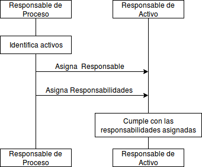

:slug: rules/002/
:category: rules
:description: This document contains the details of the security requirements related to a company's information assets. Each and every single information asset must have an owner or owners in order to assure the correct execution of the implemented security controls.
:keywords: Requirement, Security, Assets, Information, Assignment, Responsible.
:rules: yes
:translate: rules/002/

= REQ.002 Asset Owners are Defined

== Name

All information assets must have an owner clearly defined.

== Description

Once the organization
has identified each and every asset,
an owner or several owners for said asset must be defined.
The assignment of ownership guarantees
the implementation and execution of security controls
as well as improvements in the identification process
and security risk mitigation.
Critical information assets include but are not limited to:
Financial information, patents, intellectual property
and employee information.

== Implementation

Defining the owner of an asset
is part of the Asset Management process.
The asset owner
is responsible of assuring the security of the information asset.

Each of the owners must have
certain responsibilities over the asset
which should at least include:

. Classification and value of Information Assets.

. Establishing the security requirements and best practices
that should be followed
in order to prevent all possible security risks
that could attempt against the integrity of the asset.

. Define, manage and approve
the allowed access rights and privileges for the asset users.

. Guarantee that the security requirements
are met for each of the information assets.

. Identify and manage possible risks
that could compromise the integrity of the information assets.

== Diagram

== Solutions

* ISO 27005 - Risk management for an ISMS with ISO 27005.

* Consulting - Define the Information Asset Inventory.

* ISO 27003 - ​ISO 27003 Guide.

* Consulting - Establishing the Owner of an Information Asset.

* Consulting - Answering the Information Asset Inventory Questionnaire.

== Abuse Cases

An anonymous person or employee
executes actions that attempt against
the security of any of the organization’s information assets,
since the affected assets do not have an owner assigned
the incident is not managed.

== Attributes

* Layer: Resource Layer.

* Asset: Information Assets.

* Scope: Adherence.

* Phase: Analysis.

* Type of Control: Procedure.

== References

. link:http://www.pmg-ssi.com/2015/05/como-clasificar-los-activos-de-seguridad-en-un-sgsi/[ISMS - How to classify information assets in an ISMS?].

. link:https://www.iso.org/isoiec-27001-information-security.html[ISO/IEC 27000 Norms and Standards].

