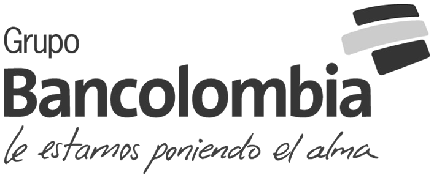

:slug: sectors/financial/
:category: sectors
:description: FLUID is a company focused on information security, ethical hacking, penetration testing and vulnerabilities detection in applications with over 18 years of experience in the colombian market. In this page we present our contributions to the financial sector.
:keywords: FLUID, Information, Financial, Security, Ethical Hacking, Pentesting.
// :translate: sectores/financiero/

= Financial

[frame="none", cols="^.^,^.^,^.^"]
|=======
| |image:logo-aval.png[logo aval, 300, 110] |image:logo-bbva.png[logo bbva, 300, 100]
|image:logo-colpatria.png[logo colpatria, 280, 70] | |image:logo-pacifico.png[logo pacifico, 290, 210]
|image:logo-ach.png[logo ach, 270, 150] | |image:logo-sura.png[logo sura, 290, 110]
3+|image:logo-proteccion.png[logo proteccion, 270, 90]
|=======
