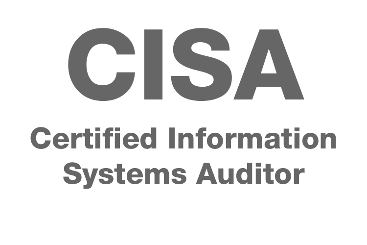
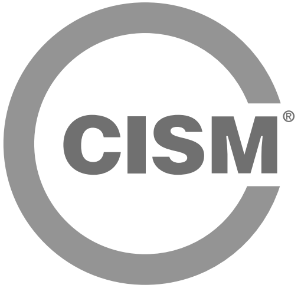
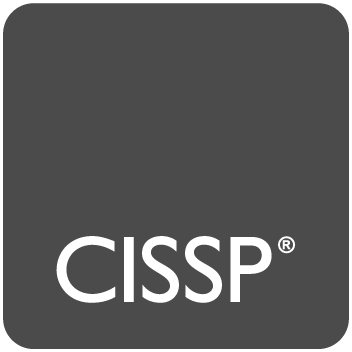
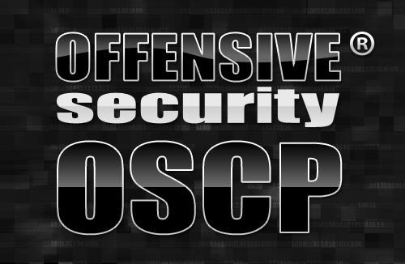
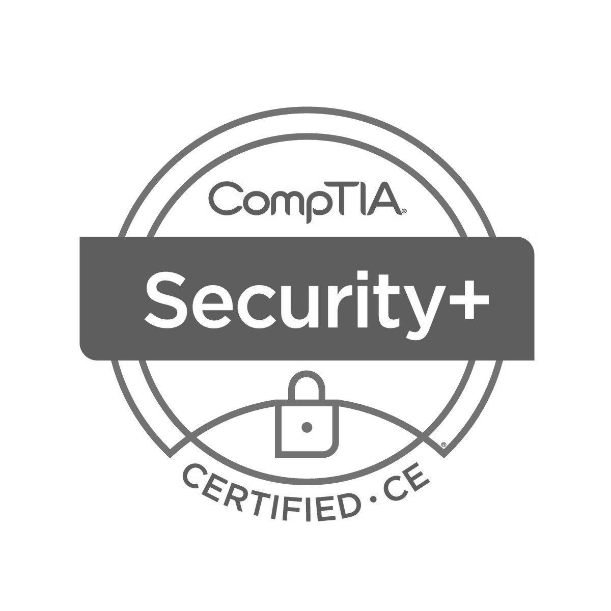

:slug: services/certifications/
:category: services
:description: Our Ethical Hacking and Pentesting services seek to find and report all the present vulnerabilities and security issues in your application. The purpose of this page is to present the certifications related to information security with which our professional team counts.
:keywords: FLUID, Ethical Hacking, Team, Certifications, Security, Information.
:translate: servicios/certificaciones/

= Certifications

[role="aliados tb-alt"]
[cols=2, frame="none"]
|====

^.^a|

a|== Certified Ethical Hacker (CEH)

Internationally recognized certification of +EC-Council+,
which accredits the knowledge of the main techniques of hacking,
as well as security audit of information systems.
This certification is updated periodically,
incorporating the latest techniques and methodologies relating to this field.

a|== Certified Information Systems Auditor (CISA)

Certification that validates the skills and expertise in auditing,
control and information security of a professional.
It proves the ability to assess vulnerabilities,
report on compliance and validate and enhance controls in an enterprise.

^.^a|

^.^a|

a|== Certified Information Security Manager (CISM)

Certification focused on management,
which promotes international security practices
and accredits people who manage, design, supervise
and assess the information security of a company.

a|== Certified Information Systems Security Professional (CISSP)

Certification of high professional level,
which aims to help companies to recognize professionals
with training in the area of information security.
It is widely recognized and worldwide accredited.

^.^a|

^.^a|

a|== Offensive Security Certified Professional (OSCP)

Ethical hacking certification offered by +Offensive Security+ company
that teaches penetration testing methodologies
and the use of the tools included the pentesting backtrack test.
This certification is a hands-on penetration testing,
requiring holders to successfully attack and penetrate
various live machines in a safe lab environment.

a|== CompTIA Security+

Worldwide trusted certification which aims to validate knowledge
and security skills of +IT+ essentials in terms of supplier.
As a reference for best practices in +IT+ security,
this certification addresses the essential principles
of network security and risk management,
which makes it an important starting point for a career in +IT+ security.

^.^a|

|====
