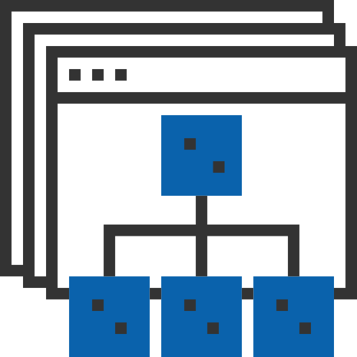
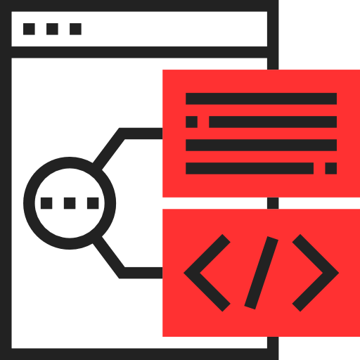
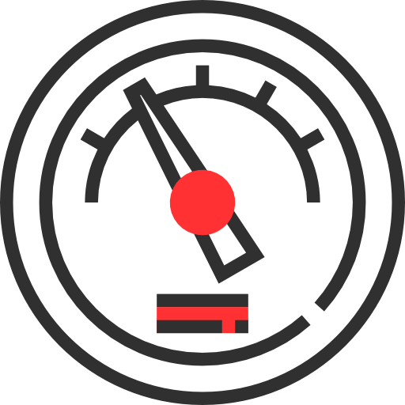
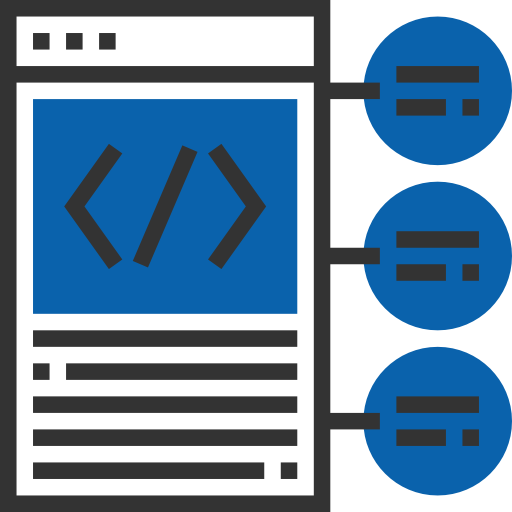
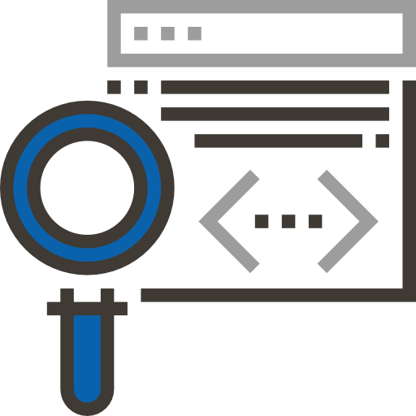
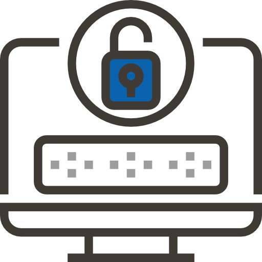
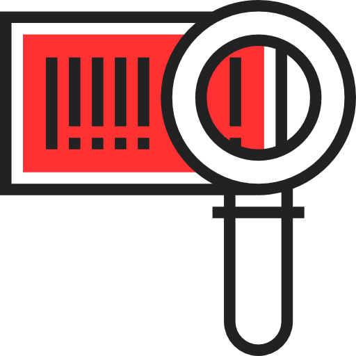
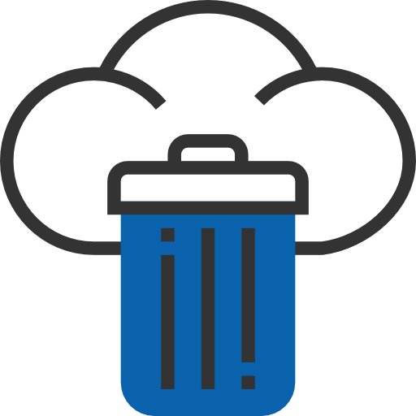

:slug: services/continuous-hacking/
:category: services
:description: In this page we describe our Continuous Hacking service, which aims to detect and report all the vulnerabilities in your application as soon as possible. Our participation in the development life cycle allow us to continuously detect security findings in a development environment.
:keywords: FLUID, Services, Continuous Hacking, Ethical Hacking, Pentesting, Security.
:translate: servicios/hacking-continuo/

= Continuous Hacking

Continuous hacking service aims to detect and report all vulnerabilities
and security issues during all software development cycle,
our participation during all development period
allow us to detect security issues continuously
as software version evolve during development cycle,
the rigorous inspection carried out by our team
allows us to detect all security issues with no false positives
and check if issues were properly repaired
before system goes into production phase.

[role="tb-alt"]
[cols=2, frame="none"]
|====

a|== Ethical hacking can start before there is a working environment

Ethical Hacking can start along with code development,
even before a first application version is released.
There's no need to have a working environment to start testing,
since we are able to analyse source code
published on project's +GIT+ repository.

^.^a|

^.^a|

a|== Testing technique

* Integral continuous hacking is achieved through application
and infrastructure ethical hacking as well as source code analysis.
In order to perform integral continuous hacking,
access to both +GIT+ repository and integration environment are required.

* In limited continuous ethical hacking
customer can choose from application ethical hacking or source code analysis.
In order to perform limited continuous hacking,
access to +GIT+ or not +GIT+ repository
or access to integration environment is required.

a|== Monthly test limit

The monthly scope limit in all scenarios
is max +10+ repositories and +10K+ deltas per month.
For limited continuous ethical hacking over applications
monthly scope is max +10+ new application fields per month.

^.^a|

^.^a|

a|== Coverage

Service goal is to achieve +100%+ coverage during the entire subscription time,
when continuous ethical hacking starts with development,
security testing should also end with development as long as development
does not exceed monthly +10K+ deltas test limit,
if development exceeds the limit,
customer can choose between +2+ options:

* Ask for extra monthly revision (with added monthly cost).

* Take more months to get to the +100%+ coverage
(this last options means security testing
will not end alongside development).

a|== Healthcheck

Whenever a new continuous ethical hacking subscription starts,
if there are any previous developments is necessary to perform a healthcheck.
This means we will test all developments up to subscription start point
plus the monthly test limit to get even with development team
within first +3+ subscription months,
and then we’ll continue testing alongside development
(health will have additional fees).

^.^a|

^.^a|

a|== Strictness

Customers are able to decide which security requirements will be tested
on each Ethical Hacking (Profiling) through our
[button]#link:../../products/rules/[Rules]# product.

Customers will know the exact strictness for each test
(For inspected and non-inspected profiled requirements).

a|== Duration

Minimum subscription time to continuous ethical hacking is one year.

^.^a|

^.^a|image:img9.png[alt="img9", width="55%"]

a|== Communication using Integrates

All project communication is done through
[button]#link:../../products/integrates/[Integrates]#,
customers can use chat and comments for any project or finding question.

a|== Testing environments

Basic service allows customers to choose a single environment from production,
testing or integration environment,
customers can also add additional testing environments
for finding validation with an additional charge.

^.^a|

^.^a|image:img11.png[alt="img11", width="55%"]

a|== Highly trained hacking team

Our hackers are certified in practical hacking in real scenarios,
they also have security related studies,
they are able to perform manual testing
and also use tools to guarantee the reporting of several types of findings
including those with specific business impact,
those regarding insecure programming practices,
and those regarding standard alignment and security regulation compliance,
enabling us to detect +Zero Day+ findings,
all with no false positives reports.

a|== Exploitation

As long as we have access to deployed applications
and customer authorization,
using our own exploitation engine [button]#link:../../products/asserts/[Asserts]#

^.^a|

^.^a|image:img13.png[alt="img13", width="55%"]

a|== Critical information extraction

Whenever findings make it possible to get information,
all compromised records are extracted
to maximize finding impact and compromise sensible information

a|== Infection

Whenever findings allow it, infrastructure gets infected
with malicious files in order to get additional information,
infect servers and verify network controls.
We use +Shells+ and customized +Trojans+ with previous customer authorization.

^.^a|image:img14.png[alt="img14", width="55%"]

^.^a|

a|== Follow up using Integrates

During project execution customers can check out finding information,
visualize real time project statistics,
check on finding remediation status,
classify findings according age,
and other functionalities using our
[button]#link:../../products/integrates/[Integrates]# product.

a|== Remediation validation

Multiple finding validation cycles are performed during subscription time
to assure findings have been properly repaired,
we can check if any finding is closed as many times as customer needs us to.
In order to perform remediation validation
customers must define a finding treatment
and then request for finding validation through our
[button]#link:../../products/integrates/[Integrates]# platform.

^.^a|

^.^a|

a|== Remediation support

During the project customers can request clarifications directly to our hackers
via [button]#link:../../products/integrates/[Integrates]#.

Customers can use our detailed remediation guides
via [button]#link:../../products/defends/[Defends]#.

a|== Generate technical and executive reports from Integrates

Technical report provides detailed information of each vulnerability.
It is of great use to all technical personnel
when it comes to remediating the reported security flaws.
Executive report provides summarized and organized information.
Thus, it may be useful for all the project’s stakeholders.

^.^a|

^.^a|

a|== Information gets deleted securely

+7+ days after customer's final report approval
all information gathered during Ethical Hacking
is deleted securely from all our systems.

|====

* To check on differences between our services
and other providers take a look at our differentiators
[button]#link:../differentiators/[here]#.

* To check on differences between our One-shot hacking
and Continuous hacking take a look at our comparative
[button]#link:../comparative/[here]#.

~Icons designed by Eucalyp from Flaticon~
