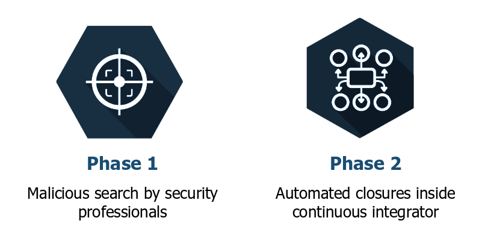
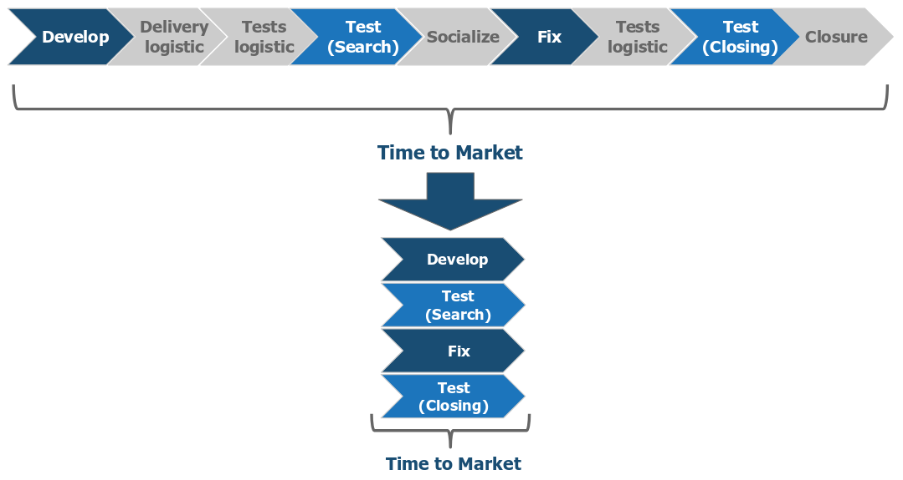
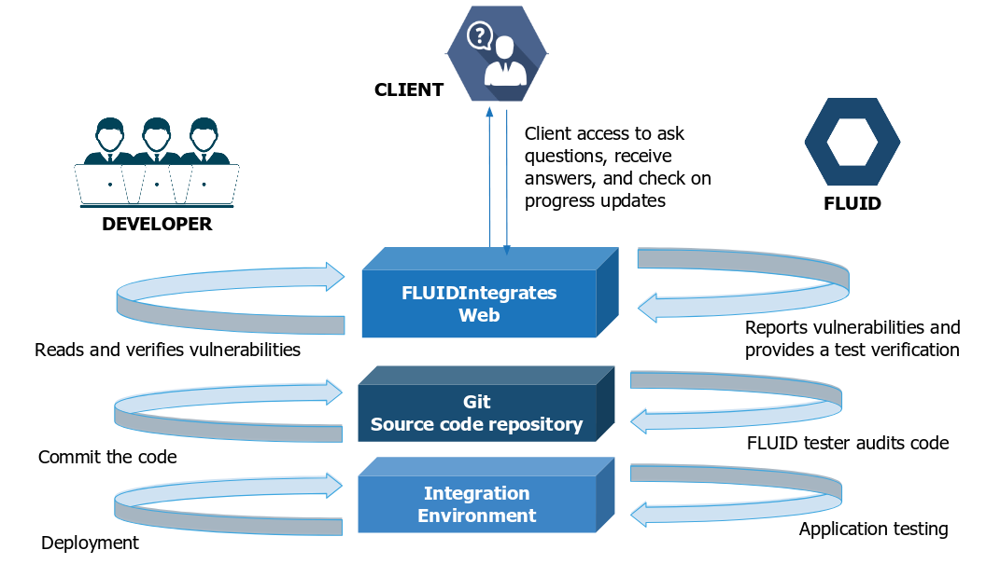
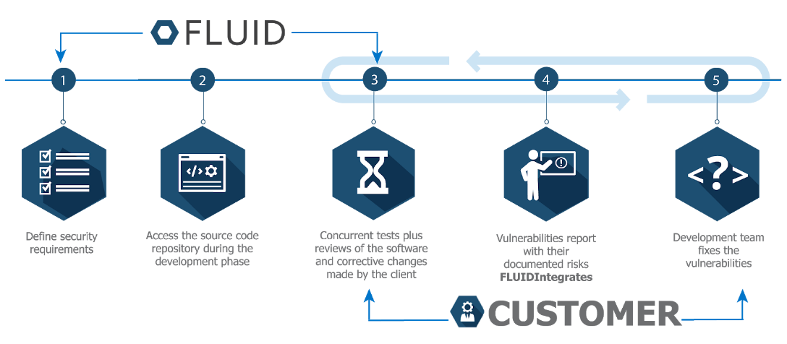
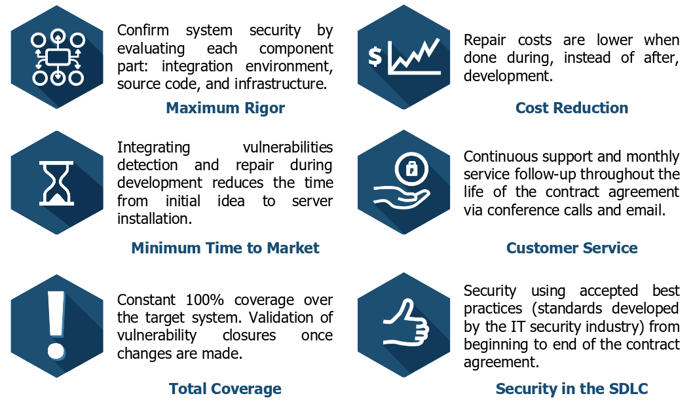

:slug: services/continuous-hacking/
:category: services
:description: In this page we describe our Continuous Hacking service, which aims to detect and report all the vulnerabilities in your application as soon as possible. Our participation in the development life cycle allow us to continuously detect security findings in a development environment.
:keywords: FLUID, Services, Continuous Hacking, Ethical Hacking, Pentesting, Security.

= Continuous Hacking

*Find and Report all existing security vulnerabilities within your information technology system.*

== Early tests on the SDLC:

* Minimizing the cost of repair.
* Reducing to zero the time of security certifications.
* Certifying an effective closure of the vulnerabilities within the continuous integration of the projects.

== Why do we do it??

* *Time to market*: organizations want to release more features in less time.
* *Range*: accomplish a coverage from 100% without raising the times of releasing.
* *Mitigation*: close vulnerabilities before releasing new features.
* *Precision*: expert evolutionary reviews.

== How?

* Continuous Ethical Hacking on the source code and applications. (Expert review)
* Automate closure of confirmed vulnerabilities.

== Solution

== Transformation

== Architecture

== Methodology

== Benefits

== Differentiators

[role="tb-fluid tb-row"]
[cols="1,2,2", options="header"]
|====
| Field
| FLUID
| Others

| Revision methods
| Hybrid (automated program tools + expert manual (OSCP) review)
| Automated program tools

| Type of findings
a|* Specific impact to the business.
* Insecure practices in programming.
* Alignment to security standards and regulations.
| Syntactic

| False-positive probability
| No
| Yes

| Estimation
a|* Only what was defined is tested
* By open ports
* By entry fields in forms and headers
* By effective lines of code (higher coverage and rigor)
| By time without a specific scope

| Exploitation capacity
|Yes - if access to the requested test application is granted
|No

| Deliverables
| Vulnerability to exploitation report and high-level recommendations.
| Summary report
|====
