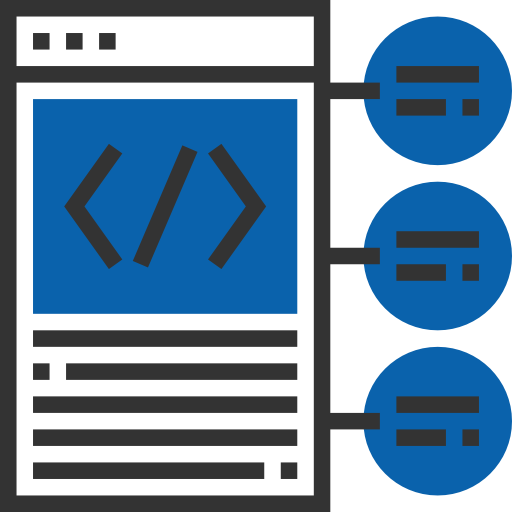
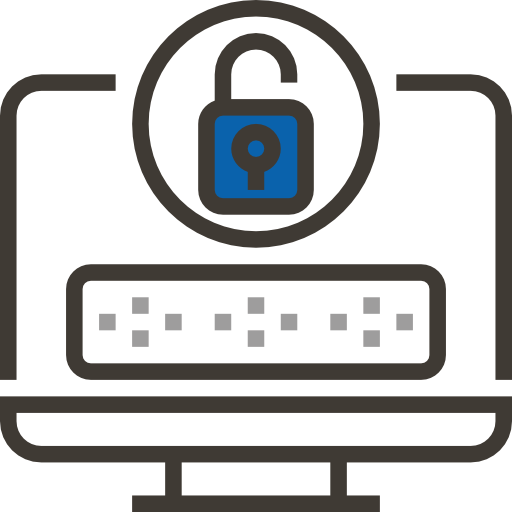
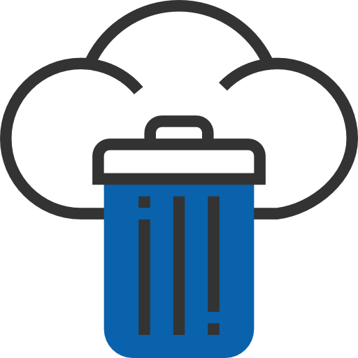

:slug: services/one-shot-hacking/
:category: services
:description: In this page we present our One Shot Hacking service, which aims to detect and report all vulnerabilities and security issues within your application. The rigorous inspection of our team allow us to detect all existing security findings with no false positives.
:keywords: FLUID, Services, Ethical Hacking, Pentesting, Security, Application.
:translate: servicios/hacking-puntual/

= One-Shot Hacking

The One Shot Hacking service aims to detect and report all vulnerabilities
and security issues within one specific version of your application.
The rigorous inspection carried out by our team allows us to detect
all existing security issues with no false positives.

[role="tb-alt"]
[cols=2, frame="none"]
|====

a|== Testing techniques
It's possible to perform source code,
application or infrastructure Ethical Hacking.
Customers are able to choose which testing technique
suit best their needs regarding each system requiring security assessment.

^.^a|

^.^a|

a|== Coverage

Ethical Hacking can be done to achieve specific coverage,
variable coverage or full coverage.

Specific coverage refers to a system
where its overall size can be assessed
(application fields, lines of code, open ports)
and the customer chooses to cover only a specific percentage of the system.

Variable coverage refers to a system where its overall size cannot be assessed
and specific scope is predefined
(fixed number of application fields, lines of code or open ports).
Testing ends when the target size is achieved,
regardless of the total size the system has.

Full coverage refers to a system where its overall size can be assessed
(application fields, lines of code, open ports)
and the customer chooses to cover the entire system.

a|== Strictness

Customers are able to decide which security requirements will be tested
on each Ethical Hacking (Profiling)
through our [button]#link:../../products/rules/[Rules]# product

Customers will know the exact Ethical Hacking strictness for each test
(For inspected and non-inspected profiled requirements).

^.^a|

^.^a|image:img5.png[alt="img5", width="55%"]

a|== Specific length

Depending on system size, a typical Ethical hacking
lasts between +1+ and +4+ weeks.

a|== Follow up

Each project will have a project manager,
so customers can express their needs before, during and after execution.

^.^a|image:img6.png[alt="img6", width="55%"]

^.^a|image:img7.png[alt="img7", width="55%"]

a|== Scheduled ethical hacking

After all requirements to start an Ethical hacking have been met,
each test will have a defined start and finishing date.

a|== Testing environments

Customers are able to choose one testing environment
from their available software environments
(production, development, integration, etc.)

^.^a|image:img8.png[alt="img8", width="55%"]

^.^a|image:img9.png[alt="img9", width="55%"]

a|== Highly trained hacking team

Our hackers are certified in practical hacking in real scenarios,
they also have security related studies,
they are able to perform manual testing and also use tools
to guarantee the reporting of several types of findings
including those with specific business impact,
those regarding insecure programming practices,
and those regarding standard alignment and security regulation compliance,
enabling us to detect +Zero Day+ findings,
all with no false positives reports.

a|== Exploitation

As long as we have access to deployed applications and customer authorization,
using our own exploitation engine [button]#link:../../products/asserts/[Asserts]#.

^.^a|

^.^a|image:img11.png[alt="img11", width="55%"]

a|== Critical information extraction

Whenever findings allow the extraction of information,
all compromised records are extracted to maximize finding impact
and compromise sensible information.

a|== Infection

Whenever findings allow it, infrastructure gets infected
with malicious files in order to get additional information,
infect servers and verify network controls.
We use +Shells+ and customized +Trojans+ with previous customer authorization.

^.^a|image:img12.png[alt="img12", width="55%"]

^.^a|

a|== Daily progress reports

Daily progress reports are sent via e-mail,
report include coverage, strictness, partial result and overall progress.

a|== Finding follow up using Integrates

Customers can check out finding status during project execution
using our [button]#link:../../products/integrates/[Integrates]# product.

^.^a|

^.^a|

a|== Remediation

Customers can use our detailed remediation guides
via [button]#link:../../products/defends/[Defends]#.

a|== Reports delivered by secure vault

Final report versions along with all evidences gathered
are delivered to customers using a secure file transfer website.

^.^a|

^.^a|image:img17.png[alt="img17", width="55%"]

a|== Report validation meeting

Each Ethical Hacking test includes a meeting
with customer's technical team to validate reports.
If there are any observations these are addressed.
Meeting can take place personally or remotely according to customer's need.

a|== Report presentation meeting

Formal executive report presentation meeting,
where all project stakeholders can take part of it.
It can take place personally or remotely according to customer's need.

^.^a|

^.^a|

a|== Information gets deleted securely

+7+ days after customer's final report approval
all information gathered during Ethical Hacking
is deleted securely from all our systems.

a|== Remediation validation

Up to 3 months after final report approval,
customers can request a remediation validation cycle
to check if findings originally reported were correctly repaired.
In order to arrange this, customer must provide system access
and share final reports once again.
In remediation cycle system does not get tested for new vulnerabilities.

^.^a|

|====

* To check on differences between our services
and other providers take a look at our differentiators
[button]#link:../differentiators/[here]#.

* To check on differences between our One-shot hacking
and Continuous hacking take a look at our comparative
[button]#link:../comparative/[here]#.

~Icons designed by Eucalyp from Flaticon~
