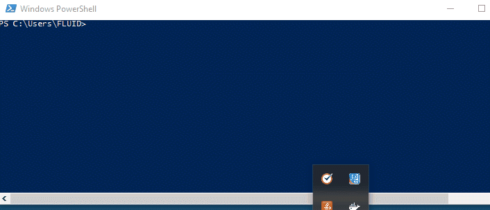

:slug: style/
:description: The purpose of this page is to establish the main guidelines for the articles and documents published in our website. Also, we present the acceptance criteria, the format and structure requirements and all the information you may need if you wish to share your opinion in our blog.
:keywords: FLUID, Style, AsciiDoc, Articles, Requirement, Website.
:translate: estilo/

= Style

The goal of +Fluid Attacks+ blog
is to share opinions and knowledge
on information security issues
in a clear and understandable manner.

[quote]
We invite you to share your knowledge with us and the world.

The target audience is people
who don’t have an advanced technical knowledge.
You must use simple language but
provide relevant knowledge on security issues.

== Topics

The blog topics are oriented
only towards security and +IT+,
however, there are situations that are not necessarily security related but
can be treated as such:

1. How to explain to a Manager
that they must invest in security.

2. How to use a specific component:
You can explain the secure way to use and implement it.

3. Explain a concept by solving a +hacking+ challenge.

You can also check our link:../topics/[list of topics].

== Reader’s profile

image::lector.png[reader]

* *Age range:* 20 – 60 years old.

* *Level of Education:* Undergraduate (Higher Education).

* *Role:* From students to CISO (Chief Information Security Officers).

* *Knowledge:* Varied with emphasis on information security.

* *Interests:* IT and information security.

== Acceptance Criteria

=== 1. Title

The title of the article must grab the reader's attention.
*It must not exceed 35 characters*

. Make the topic something fun or curious.
It can be in the form of a question.
+
*Examples:*

* Wanting the +Cookie+.
* Information Security, an expense or an investment?

. Avoid generic titles at all costs.
+
*Examples:*

* SQL Injection.
* XSS Vulnerability.

. The title must reflect the content of the document,
always avoid false expectations.
+
*Examples:* Whitelist; your ally in input validation,
and then talk about injections
without touching the subject of whitelist or
their implementation.

=== 2. Structure

All documents must have:

. *First section:* An introduction that tells the reader
what he/she can expect.

. *Last Section:* A short conclusion
that tells the reader the overall topic.

. The document must have a LIX complexity below 50.
This guarantees that the document is easy to read.

=== 3. Format

Documents will only be accepted in an +AsciiDoc+ format.
For more information check out our
link:../../en/format/[format page], the
link:http://asciidoctor.org/docs/asciidoc-writers-guide/[+AsciiDoc+ guide],
or a link:http://asciidoctor.org/docs/asciidoc-syntax-quick-reference/[quick reference].

=== 4. Word limit

Documents have strict length limits:

. *For KB documents:*
Between 400 and 800 words.

. *For Posts:*
between 800 and 1600 words.

. *For pages (sites):*
Between 400 and 1600 words.

=== 5. Semantic Line Breaks

Documents must have Semantic Line Breaks
(link:http://sembr.org/[SLB]),
in order to facilitate editing and
keep an organized record of modifications
in our version control system (+Gitlab+).
To do this, we define the following rules:

. Minimum words before a SLB: 4.
. Maximum number of characters before a SLB: 80.
. A SLB *must* be added after a period (.).
. A SLB *can* be added after
link:https://emedia.rmit.edu.au/learninglab/content/common-linking-words-0[linking  words and connectors], depending on the context and
respecting the previous rules.

Exceptions to the rule are:

. Links.
. Source Code.

*Example:*

.Example SLB.

For more information regarding LSB and their use,
You can checkout the link:http://rhodesmill.org/brandon/2012/one-sentence-per-line/[semantic linefeeds guide],
link:https://scott.mn/2014/02/21/semantic_linewrapping/[semantic line wrapping guide],
or the link:http://asciidoctor.org/docs/asciidoc-recommended-practices/#one-sentence[+AsciiDoc+ documentation]

=== 6. Images

. All documents must include at least
one image related to the topic being presented.

. Images that are not yours
must include a reference..

. Include a description for the image.

=== 7. Videos

. They must be your own videos.
. The video must be sent
in order to upload it to our +Fluid Attacks+ youtube channel.
. They video must include an introduction and a conclusion.

=== 8. Font

Unless the language forces you to do otherwise,
the source code must comply with the following:

. Be in english (even the comments).
. Indent using +2+ spaces instead of tabs.
. Use the +brace style+ seen in
link:https://en.wikipedia.org/wiki/Indentation_style#Variant:_Stroustrup[stroustrup]
(+no one liners+).
link:https://eslint.org/docs/rules/brace-style#stroustrup[Example].
. Lines must not exceed +80+ characters in length.

Embedded code snippets must comply with the following:

. Be enumerated. To do so add the parameter +linenums+
to the +source+ block.
. Not have more than +8+ lines.
. It is not allowed to repeat a snippet that has already been used in the guide.
. Add the lines of code to the +post+ using a code block,
don’t use images.

*Example:*

.example.c
[source, C, linenums]
----
function cool(x){
  /*Please use SHORT comments in english when necessary.
  You must explain your code in the document*/
  int y;
  y = x + 1;
  return y;
  //And remember, do NOT exceed 8 lines ;)
}
----

=== 9. Exploit Explanations

In the case of documents focused on exploitation,
once the procedure is explained,
we recommend including a short +gif+
showing the result of what was explained.
Add a description for the +gif+.

.Exploit description example.

=== 10. Not permitted

. Code snippets that are not your own.

. Images without the original reference.

. Technical explanations not relevant to security:
+
*Example:* Introduction to a programming language
without mentioning how to securely program in said language.

=== 11. Metadata

Metadata are variables that are included at the beginning of a document
which influence the final rendering of it and
how the search engine indexes them.
You can find more information regarding +AsciiDoc+ variables by clicking
[button]#link:../../en/format/#variables[here.]#.
Below is a table
with the mandatory metadata for a document:

.List of metadata present in a document.

[cols="15,10,10,10, 55"]
|===
|*Metadata* | *Page* | *KB* | *Post* | *Description*

|+:slug:+| Yes | Yes | Yes
| Link where the document can be found once it has been accepted.
The +slug+ must be the name of the article in lowercase,
with no spaces, prepositions, conjunctions or connectors and
separated by a dash "-".

|+:description:+ | Yes | Yes | Yes
| Brief summary of the main idea of the document (250 to 300 characters long).
This description will appear in the search engine search results.

|+:keywords:+ | Yes | Yes | Yes
| Keywords through which a search engine can find the document.
The document must include 6 +keywords+.

|+:translate:+ | Yes | Yes | Yes
| Attribute that indicates if a translated version of the documents
is available in the +Fluid Attacks+ website.
In case there is a translated version available,
The +slug+ of the translated document must be included.

|+:subtitle:+ | Yes | Yes | Yes
| Short subtitle that specifically indicates the purpose of the document.
*It must not exceed 55 characters*.

|+:defends:+ | No | Yes | No
| Unique metadata of +Knowledge Base+ articles.
The only accepted value is +yes+.

| +:date:+ | No | No | Yes
| Date the document was created.

| +:category:+ | No | No | Yes
| Category to which the document falls under.
Example: Security opinions, Best practices, etc.

| +:tags:+ | No | No | Yes
| Similar to the metadata +:keywords:+
Noteworthy words that index the document internally.

| +:image:+ | No | No | Yes
| Image that will appear in the article preview.
This image must have certain dimensions, 600 x 200 px and
must not exceed 300 Kb in size.

| +:alt:+ | No | No | Yes
| Description of the image in the article preview.

| +:author:+ | No | No | Yes
| Name of the author that will appear at the top of the document.
Name and last name only.

| +:writer:+ | No | No | Yes
| Name and extension of the image that represents you as the author.
The only extension permitted is PNG.

| +:name:+ | No | No | Yes
| Name that will appear under the author’s image/picture.
It can be your full name or +nickname+.

| +:about1:+ | No | No | Yes
| Main information about the author:
scholarship, experience, role (if it applies).

| +:about2:+ | No | No | Yes
| Additional information about the author:
likes, interests, links to personal blogs or profiles.

|===

=== 12. Additional Information

. If acronyms are used, their meaning should be included in parentheses.

. Include references when using fragments from external sources.

. Paragraphs *must* be original,
don’t use text from other sites
unless they are specific phrases.

. Foreign and reserved words
used outside of blocks of code
must use +monospace+.

. Make sure to include the +link:+
before adding a link.

. When including a reference,
use the letter "r" as an +anchor_ID+
followed by the reference number.
Use superscript to quote it.

*Example:*

----
I'm talking about some topic
and now I need to cite a reference <<r# ,^[#]^>>

== References

. [[r#]] link:https://my-url[Fancy name for url].
----

. For more information regarding +AsciiDoc+,
check out our [button]#link:../../en/format[allowed formats and examples.]#

== Authors

If you want to share your security knowledge and opinions
with the community and you are not part of +Fluid Attacks+,
you can be a guest author,
write your +post+ in a text editor of your choosing and
send us everything you need to publish it.
*Do not forget* to send with it,
a paragraph telling us a little bit about yourself and
an image that represents you,
since at the end of the +post+
the guest’s profile will be included.

. Author’s name and last name.
. Short description, minimum 15 words – maximum 30.
You may include: What you do for a living,
years of experience, certifications, likes and interests.
. Optional: Link to personal blog – +github+ – +linkedin+

=== Requests

. If you are part of the +Fluid Attacks+ team,
you can send us your document through a +Merge Request+
in the +AsciiDoc+ format and
complying with all the above rules.

. If you are not part of the +Fluid Attacks+ team,
you just have to send your document to communications@fluidattacks.com
attaching all the required files in order to create the +post+.
Once the document is sent,
It is put through an evaluation process to determine if it will be published.

== Terms and Conditions

. +Fluid Attacks+ reserves the rights of admission
of all documents sent in.

. We perform a non-substantive review of the document.
+Fluid Attacks+ doesn’t evaluate if we agree or not with the author’s opinion but
only that the documents meets the required criteria described above.

. Once a draft is completed
you must request the revision of the document
through a +Merge Request+
so that we can evaluate the content.

If the document is accepted and published
the author *transfers* the copyrights of said document to +Fluid Attacks+;
If necessary,
changes will be made
without the author’s consent.
