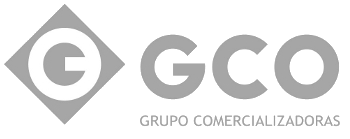
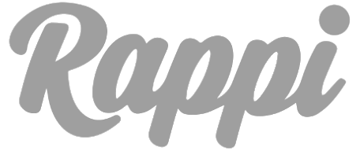
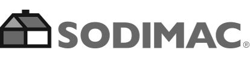

:slug: clientes/comercial/
:category: clientes
:description: FLUID es una compañía especializada en seguridad informática, ethical hacking, pruebas de intrusión y detección de vulnerabilidades en aplicaciones con más de 18 años prestando sus servicios en el mercado colombiano. En esta página presentamos nuestras soluciones en el sector comercial.
:keywords: FLUID, Clientes, Comercial, Seguridad, Pentesting, Ethical Hacking.
:translate: customers/consumer/

= Comercial

{description}

[role="comercial tb-alt"]
[cols=2, frame="none"]
|====
^.^a|image:logo-exito.png[alt="Logo Exito",link="https://www.grupoexito.com.co/es/"]

a|== Grupo Exito

Empresa multinacional colombiana,
realiza actividades de comercio al detal en Suramérica.
Presentes en Colombia con el Grupo Éxito;
en Brasil con el Grupo Pão de Açúcar;
en Uruguay con los Grupos Disco y Devoto
y en Argentina con Libertad

a|== Grupo Uribe

Grupo textil colombiano,
de tendencia familiar, fundado en 1907 por el patriarca, John Uribe.
Sus hijos y los hijos de sus hijos
han contribuido durante décadas al desarrollo y fortalecimiento del negocio.
El grupo tiene la representación, producción y comercialización
para Colombia y el caribe de marcas internacionales como Chevignon,
Naf Naf, Americanino, Esprit, Rifle, American Eagle,
Mother Care, American Brands, LBT, entre otras.

^.^a|

^.^a|

a|== Rappi

Es una compañía colombiana de comercio electrónico, fundada en Bogotá en 2015.
La aplicación móvil permite a los consumidores
pedir el mandado del supermercado, comida, y medicamentos de farmacias,
pero también permite enviar dinero en efectivo a alguien,
o que un corredor retire dinero de su cuenta bancaria
de un cajero automático y entregárselo.

a|== Semana

Grupo mediático que agrupa las revistas de mayor circulación
e influencia en Colombia,
buscando posicionar en la opinión pública
distintas temáticas de interés nacional.
Además, ofrece sus servicios para que compañías y/o entidades del Estado
puedan publicar su propia revista.

^.^a|image:logo-semana.png[alt="Logo Semana",link="http://www.semana.com/"]

^.^a|

a|== Sodimac

Empresa que opera en el retail.
Busca satisfacer al cliente a través de múltiples puntos de contacto
y canales de venta que aseguran un modelo de negocio Omnicanal
(Tiendas, Internet y Teléfono).
Su actividad se focaliza en desarrollar y proveer soluciones
a los proyectos de remodelación y construcción de sus clientes,
además de satisfacer las necesidades de mejoramiento
y decoración de sus hogares, ofreciendo excelencia en el servicio,
integridad en su trabajo y un fuerte compromiso con la comunidad.

|====
