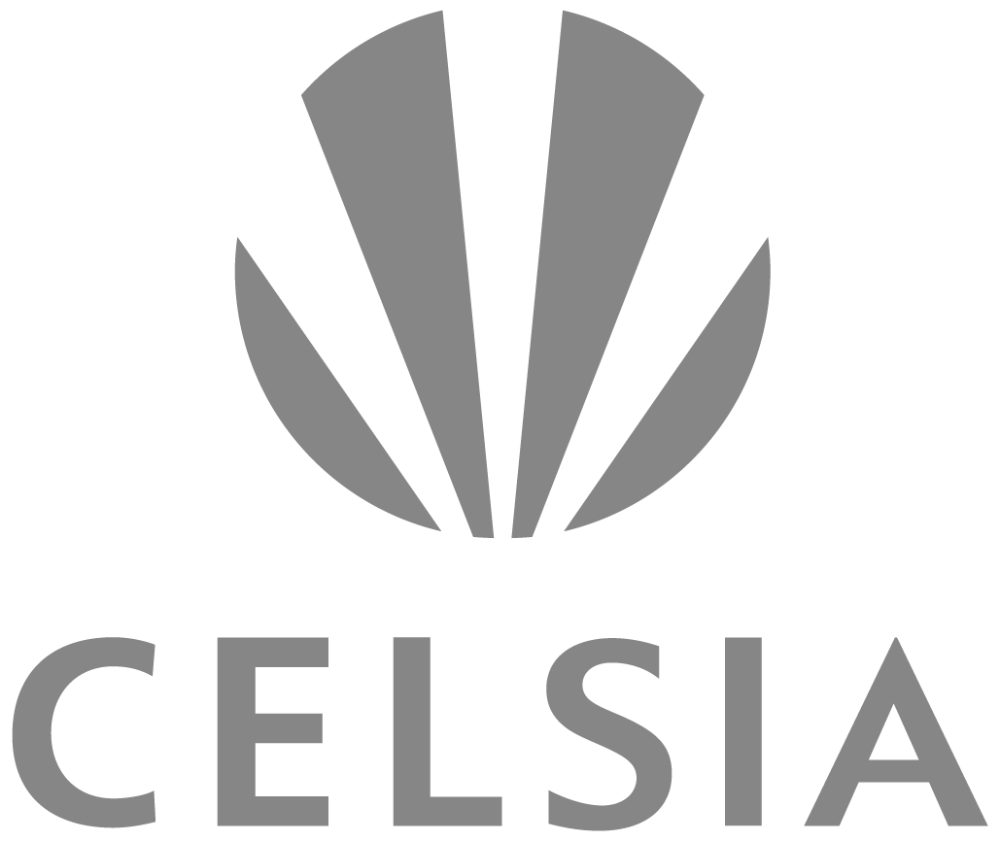

:slug: clientes/energia/
:category: clientes
:description: FLUID es una compañía especializada en seguridad informática, ethical hacking, pruebas de intrusión y detección de vulnerabilidades en aplicaciones con más de 18 años prestando sus servicios en el mercado colombiano. En esta página presentamos nuestras soluciones en el sector energético.
:keywords: FLUID, Seguridad, Energía, Clientes, Pentesting, Ethical Hacking.
:translate: customers/utilities/

= Energía

[role="energia tb-alt"]
[cols=2, frame="none"]
|====
^.^a|

a|== Celsia

Empresa que genera, transmite, distribuye y vende electricidad en Colombia, 
Costa Rica y Panamá. En el sector de generación, la compañía opera un total de 21 
plantas hidroeléctricas, 5 termoeléctricas, y un parque eólico, con lo que atiende 
a 580.000 usuarios residenciales, comerciales e industriales.

a|== XM

Empresa de ISA especializada en la gestión de sistemas de tiempo real. La gestión de sistemas 
de tiempo real consiste en la planeación, diseño, optimización, puesta en servicio, operación,
administración o gerenciamiento de sistemas transaccionales o plataformas tecnológicas, que involucran 
el intercambio de información con valor agregado, y mercados de bienes y servicios relacionados. 

^.^a|

|====
