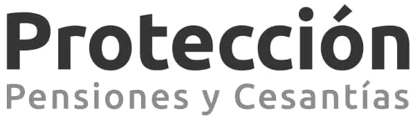

:slug: clientes/financiero/
:category: clientes
:description: FLUID es una compañía especializada en seguridad informática, ethical hacking, pruebas de intrusión y detección de vulnerabilidades en aplicaciones con más de 18 años prestando sus servicios en el mercado colombiano. En esta página presentamos nuestras soluciones en el sector financiero.
:keywords: FLUID, Clientes, Seguridad, Financiero, Pentesting, Ethical Hacking.
:translate: customers/financial/

= Financiero

[role="Financiero tb-alt"]
[cols=2, frame="none"]
|====
^.^a|

a|== Bancamia

Banco con sentido social que busca apoyar el desarrollo productivo de los emprendedores en la 
base de la pirámide económica, a través de productos y servicios financieros diseñados a la medida 
de sus necesidades. Las Finanzas Productivas Responsables, se convierten en una herramienta eficaz 
para el desarrollo social y monetario de las comunidades más desfavorecidas, al proveerles productos 
y servicios encaminados a generar ingresos y excedentes por medio del desarrollo de un negocio. 

a|== Banco del pacifico

Banco que forma parte del Centro Bancario Internacional integrado 
en la ciudad de Panamá, con instituciones provenientes de más de 30 países. El Centro tiene una 
estructura financiera amplia y una importancia capital para la vida económica del país, 
lo cual es garantía de su permanencia y estabilidad.

^.^a|image:logo-pacifico.png[logo pacifico, width=40%, link=https://www.bancodelpacifico.com/grupo-banco-del-pacifico/banco-del-pacifico-panama.aspx]

^.^a|image:logo-banistmo.png[logo banistmo, width=50%, link=https://www.banistmo.com/quienes-somos]

a|== Banistmo

Organización panameña que cuenta con la solidez y el respaldo del 
Grupo Bancolombia, una entidad financiera con 140 años en el mercado, con presencia 
en 10 países, más de 40 mil empleados, 9 millones de clientes y 3821 cajeros automáticos.

a|== BBVA

Banco Bilbao Vizcaya Argentaria Colombia S.A. es uno de los primeros bancos
de la eurozona por rentabilidad y eficiencia; es la primera entidad financiera 
de México y cuenta además con una sólida posición en España y con franquicias líderes 
en América del Sur y en la región.

^.^a|image:logo-bbva.png[logo bbva, width=40%, link=https://www.bbva.com.co/]

^.^a|

a|== CFA

Organización fusión de las cooperativas DONMATÍAS y COOBANCOQUIA con los propósitos 
de garantizar a los asociados y ahorradores la seguridad sobre la totalidad de sus ahorros
y aportes sociales, siendo una alternativa social y económica para los asociados de las dos 
cooperativas y canalizar recursos para financiar actividades productivas.

a|== Coopcentral

Banco propiedad de entidades del sector solidario, orientado a la atención especializada 
de dicho sector. Ofrecen servicios financieros y a través de la Red Coopcentral integramos 
plataformas tecnológicas que permiten prestar servicios transaccionales a los asociados de 
las entidades que la conforman.

^.^a|

^.^a|image:logo-colpatria.png[logo colpatria, width=60%, link=https://www.colpatria.com/Acerca-de/banco-colpatria/informacion-institucional/nuestra-organizacion]

a|== Colpatria

Colpatria es un grupo empresarial colombiano, con negocios en banca, seguros, construccion 
y mineria entre otros. En el Banco Colpatria desde 2012 participa como socio el banco canadiense 
Scotiabank. Quien adquirió el 51% de sus acciones.1 En cuanto a los seguros, desde 2014, la francesa AXA, 
quien es la mayor aseguradora del mundo, adquirio el 51% de la unidad de seguros generales y vida.

a|== Deceval

Depósito Centralizado de Valores de Colombia -DECEVAL S.A.-, es una institución encargada 
de la custodia, administración, compensación y liquidación de valores en depósito de títulos 
valores de contenido crediticio, de participación, representativos de mercancías e instrumentos 
financieros que se encuentren inscritos en el Registro Nacional de Valores y Emisores,
ya sea que se emitan, negocien o registren localmente o en el exterior.

^.^a|image:logo-deceval.png[logo deceval, width=50%, link=https://www.deceval.com.co/portal/page/portal/Home/Empresa/Quienes_Somos]

^.^a|image:logo-aval.png[logo aval, width=50%, link=https://www.grupoaval.com/wps/portal/grupo-aval/aval/acerca-nosotros]

a|== Grupo AVAL

Grupo Aval Acciones y Valores S.A. Es un holding colombiana dedicado a una gran variedad 
de actividades principalmente financieras. Es el grupo financiero más grande de Colombia 
con el control de 4 bancos exitosos y uno de los grupos más grandes de Centroamérica siendo 
controlador del Grupo BAC Credomatic, teniendo también la mayor administradora de fondos de 
pensiones y cesantías en Colombia.

a|== Grupo Bancolombia

Bancolombia es una organización financiera colombiana, perteneciente al Grupo Sura, 
a su vez parte del Grupo Empresarial Antioqueño, es el banco privado más grande de Colombia 
(por el tamaño de su patrimonio y activos) y uno de los más grandes de América. 

^.^a|image:logo-bancolombia.png[logo bancolombia, width=50%, link=https://www.grupobancolombia.com/wps/portal/acerca-de]

^.^a|

a|== Protección

Sociedad Anónima, Sociedad de Servicios Financieros y Administradora de fondos de 
Pensiones y Cesantías. Una unidad del holding colombiano Grupo de Inversiones Suramericana, 
es la segunda mayor administradora de fondos de pensiones y cesantías del país con cerca de 
1,6 millones de afiliados. La empresa administra tres fondos para seguro de cesantía, 
pensiones voluntarias y pensiones obligatorias.

a|== SURA

Grupo Empresarial SURA es una compañía latinoamericana del sector Servicios 
Financieros Diversos, que forma parte del Índice de Sostenibilidad Dow Jones con el 
cual se reconocen a las compañías que se destacan a nivel mundial por sus buenas 
prácticas en materia económica, ambiental y social.

^.^a|image:logo-sura.png[logo sura, width=50%, link=https://www.gruposura.com/corporativo/Paginas/default.aspx]

|====
