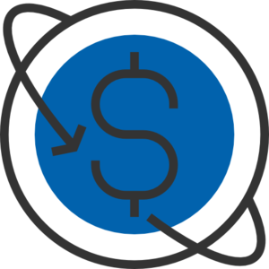
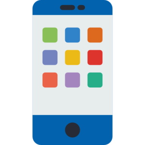
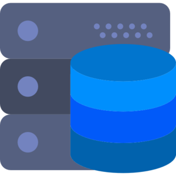
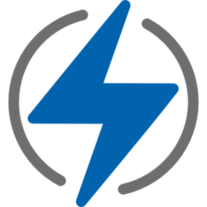
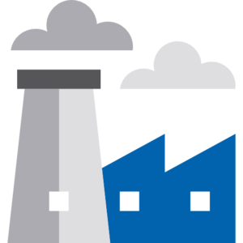
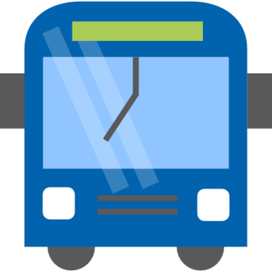

:slug: clientes/
:description: FLUID es una compañía especializada en seguridad informática, ethical hacking, pruebas de intrusión y detección de vulnerabilidades en aplicaciones con más de 18 años prestando sus servicios en el mercado colombiano. En esta página presentamos los sectores en los cuales nos especializamos.
:keywords: FLUID, Seguridad, Clientes, Información, Pentesting, Ethical Hacking.
:translate: customers/
:caption:

= Clientes

[role="tb-alt"]
[cols=2, frame="none"]
|====
a|== link:financiero/[Financiero]

Los clientes de +FLUIDAttacks+ en el sector financiero
comprenden algunos de los bancos más importantes de América Latina,
además de empresas encargadas del recaudo de aportes sociales, entre otras.
Algunos de nuestos clientes son +Bancolombia+, +BBVA+,
+Davivienda+, +Sura+, +Protección+, +Colpatria+.
a|.Ícono hecho por link:https://creativemarket.com/eucalyp[Eucalyp] de link:www.flaticon.com[Flaticon]

a|.Ícono hecho por link:https://smashicons.com/[Smashicons] de link:www.flaticon.com[Flaticon]

a|== link:comunicaciones/[Comunicaciones]

+FLUIDAttacks+ ha ofrecido soluciones a algunos de los principales proveedores
de servicios de comunicaciones en Colombia, entre ellos +Claro+,
+Tigo UNE+, +ETB+ y +Edatel+.

a|== link:comercial/[Comercial]

Hemos trabajado con varias compañías cuyo objetivo es complacer al consumidor
desde diferentes áreas, sea ventas al detal, +E-Commerce+, la industria textil,
o soluciones de tecnología. Algunos de estos clientes son
+Grupo Éxito+, +Grupo Uribe+, +Rappi+, +Semana+,
y la compañía australiana +The Missing Link+.
a|.Ícono hecho por mynamepong de link:www.flaticon.com[Flaticon]

a|.Ícono hecho por link:https://smashicons.com/[Smashicons] de link:www.flaticon.com[Flaticon]

a|== link:tecnologia/[Tecnología]

+FLUIDAttacks+ ha contribuido a empresas que ofrecen +software+,
infraestructura y otras soluciones de tecnología a sus clientes,
en un rango amplio de aplicaciones.
Algunos de nuestros clientes en esta área son
+PSL+, +S4N+, +Arus+, +Ceiba+, las empresas americanas +Cre8tive+, +KometSales+
and +VM2020+, y la empresa española +Indra+.

a|== link:energia/[Energía]

También hemos ejecutado proyectos en compañías que se especializan
en el sector de la energía, ya sea en la generación, distribución
y comercialización, como +Celsia+, o en la planeación, diseño y manejo
de los sistemas transaccionales, como +XM+.
a|.Ícono hecho por Good Ware de link:www.flaticon.com[Flaticon]

a|.Ícono hecho por link:https://www.freepik.com/[Freepik] de link:www.flaticon.com[Flaticon]

a|== link:industrial/[Industrial]

También hemos asistido a diversos fabricantes y participantes
del sector industrial en sus necesidades de seguridad de +software+
y seguridad de infraestructura.
Algunos de estos clientes son +Grupo Argos+, +Manuelita+, +Corona+,
+Cadena+ and +Odinsa+.

a|== link:transporte/[Transporte]

+FLUIDAttacks+ ha trabajado con gigantes del sector de transporte
como +Avianca+ y +F2X+, para asegurar que sus aplicaciones
y plataformas +Web+ ofrezcan la mejor seguridad a sus usuarios.
a|.Ícono hecho por link:https://www.freepik.com/[Freepik] de link:www.flaticon.com[Flaticon]

|====
