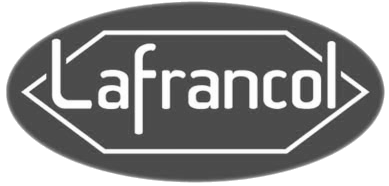
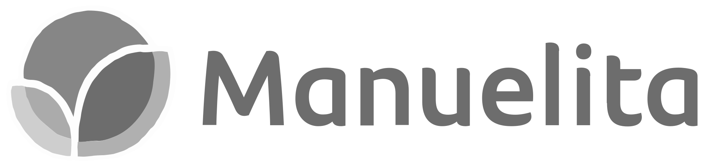

:slug: clientes/industrial/
:category: clientes
:description: FLUID es una compañía especializada en seguridad informática, ethical hacking, pruebas de intrusión y detección de vulnerabilidades en aplicaciones con más de 18 años prestando sus servicios en el mercado colombiano. En esta página presentamos nuestras soluciones en el sector industrial.
:keywords: FLUID, Clientes, Sector, Industrial, Seguridad, Pentesting.
:translate: customers/industrial/

= Industrial

[role="industrial tb-alt"]
[cols=2, frame="none"]
|====

^.^a|

a|== Cadena

Organización que brinda a sus clientes soluciones confiables para simplificar sus procesos críticos a
través de la tecnología, incrementando su eficiencia, sostenibilidad y rentabilidad. Tienen
conocimiento de los procesos clave del negocio del cliente, integran las capacidades propias y de terceros.

a|== Corona

Multinacional colombiana con 135 años de historia empresarial. Está compuesta por seis unidades
estratégicas de negocio dedicadas a la manufactura y comercialización de productos para el hogar y
la construcción. Cuenta con 19 plantas de manufactura en Colombia, 3 en Estados Unidos, 3 en
Centro América, 3 en México y una en Brasil. Exporta sus productos a diversos mercados alrededor del
mundo, incluyendo Estados Unidos, Canadá, México, Brasil, Chile, Venezuela, Centro América,
el Caribe, Italia, España y el Reino Unido.

^.^a|

^.^a|

a|== Cre8tive

Empresa con experiencia en la fabricación y venta de muebles con un software dedicado a
la fabricación de muebles y ventas minoristas de muebles. Tiene integración con un sistema
de contabilidad, hoy QuickBooks, y se puede integrar con otros para que haya integridad
con las transacciones y la publicación automática.

a|== Grupo Argos

Matriz del Grupo Empresarial de inversiones sostenibles en infraestructura.
Su naturaleza jurídica corresponde a una sociedad anónima, inscrita en la Bolsa de Valores
de Colombia, al igual que sus filiales Argos (cemento), Celsia (energía) y Odinsa (concesiones viales y aeroportuarias).

^.^a|

^.^a|

a|== LAFRANCOL

Fabricantes y distribuidores a nivel nacional e internacional productos farmacéuticos
y alimentos funcionales de consumo humano con los más altos niveles de calidad. Cuentan con el
reconocimiento de la efectividad y seguridad de sus compuestos ante el cuerpo médico y la sociedad
de la salud, LAFRANCOL ha ido creciendo sostenidamente durante casi 100 años alcanzando una posición de
liderazgo en la industria farmacéutica nacional, tanto por su volumen de ventas como por su imagen de calidad.

a|== Manuelita

Organización agroindustrial diversificada, multilatina de origen colombiano, consolidada como
una organización agroindustrial diversificada, cuya estrategia se basa en un modelo de negocio sostenible.
Elabora productos de naturaleza agroindustrial, elaborados a partir de fuentes renovables, mediante el
uso sostenible de los recursos naturales, con un impacto positivo sobre el bienestar de las comunidades vecinas.

^.^a|

^.^a|

a|== Odinsa

Filial del Grupo Argos, es una compañía colombiana dedicada a la estructuración, promoción,
gestión y desarrollo de proyectos de infraestructura viales y aeroportuarios, con presencia en
Colombia, Ecuador, Aruba y República Dominicana, que se ha convertido en un vehículo para
la conectividad regional y una fuente de desarrollo.

|====
