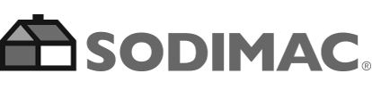

:slug: clientes/industrial/
:category: clientes
:description: FLUID es una compañía especializada en seguridad informática, ethical hacking, pruebas de intrusión y detección de vulnerabilidades en aplicaciones con más de 18 años prestando sus servicios en el mercado colombiano. En esta página presentamos nuestras soluciones en el sector industrial.
:keywords: FLUID, Clientes, Sector, Industrial, Seguridad, Pentesting.
:translate: customers/industrial/

= Industrial

[role="industrial tb-alt"]
[cols=2, frame="none"]
|====
a|image:logo-corona.png[logo corona, 300, 55, link=https://www.corona.co]

a|== Corona

Corona es una multinacional colombiana con 135 años de historia empresarial.
Está compuesta por seis unidades estratégicas de negocio dedicadas a la manufactura y
comercialización de productos para el hogar y la construcción. Cuenta con 19 plantas de
manufactura en Colombia, 3 en Estados Unidos, 3 en Centro América, 3 en México y una en Brasil.
Exporta sus productos a diversos mercados alrededor del mundo, incluyendo Estados Unidos,
Canadá, México, Brasil, Chile, Venezuela, Centro América, el Caribe, Italia, España y el Reino Unido.

a|== Manuelita

Manuelita es una organización agroindustrial diversificada,
multilatina de origen colombiano, consolidada como una organización agroindustrial diversificada,
cuya estrategia se basa en un modelo de negocio sostenible. Elabora productos de naturaleza agroindustrial,
elaborados a partir de fuentes renovables, mediante el uso sostenible de los recursos naturales,
con un impacto positivo sobre el bienestar de las comunidades vecinas.

a|image:logo-manuelita.png[logo manuelita, 300, 70, link=http://www.manuelita.com/perfil-corporativo]

a|image:logo-cadena.png[logo cadena, 290, 110, link=http://www.cadena.com.co/es/home.aspx]

a|== Cadena

Cadena brinda a sus clientes soluciones confiables para simplificar sus procesos críticos a 
través de la tecnología, incrementando su eficiencia, sostenibilidad y rentabilidad. Tienen 
conocimiento de los procesos clave del negocio del cliente, integran las capacidades propias y de terceros.

a|== Sodimac

Sodimac es una empresa que opera en el retail. Busca satisfacer al cliente a través de múltiples
puntos de contacto y canales de venta que aseguran nuestro modelo de negocio Omnicanal (Tiendas, Internet y Teléfono). 
Su actividad se focaliza en desarrollar y proveer soluciones a los proyectos de remodelación y construcción 
de sus clientes, además de satisfacer las necesidades de mejoramiento y decoración de sus hogares, 
ofreciendo excelencia en el servicio, integridad en su trabajo y un fuerte compromiso con la comunidad.

a|

a|image:logo-francol.png[logo francol, 300, 110, link=http://www.lafrancol.com/nuestra-empresa/]

a|== LAFRANCOL

LAFRANCOL fabricantes y distribuidores a nivel nacional e internacional productos farmacéuticos
y alimentos funcionales de consumo humano con los más altos niveles de calidad. Cuentan con el 
reconocimiento de la efectividad y seguridad de sus compuestos ante el cuerpo médico y la sociedad 
de la salud, LAFRANCOL ha ido creciendo sostenidamente durante casi 100 años alcanzando una posición de 
liderazgo en la industria farmacéutica nacional, tanto por su volumen de ventas como por su imagen de calidad. 

|====
