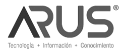
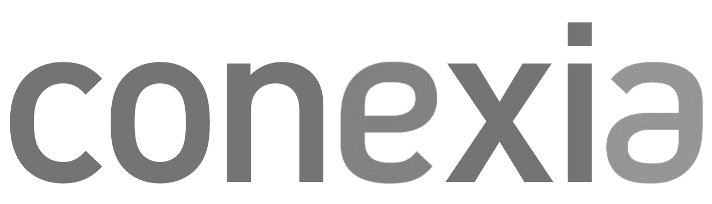
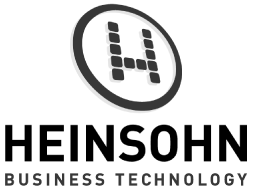
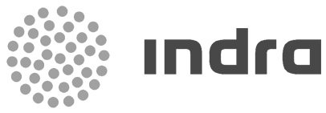
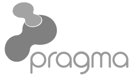
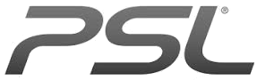
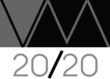

:slug: clientes/tecnologia/
:category: clientes
:description: FLUID es una compañía especializada en seguridad informática, ethical hacking, pruebas de intrusión y detección de vulnerabilidades en aplicaciones con más de 18 años prestando sus servicios en el mercado colombiano. En esta página presentamos nuestras soluciones en el sector tecnológico.
:keywords: FLUID, Tecnología, Información, Seguridad, Pentesting, Clientes.
:translate: customers/technology/

= Tecnología

[role="Tecnologia tb-alt"]
[cols=2, frame="none"]
|====
^.^a|

a|== Arus

Compañía que entrega soluciones integradas de información, tecnología y conocimiento, con un equipo
de expertos comprometidos con las necesidades de las organizaciones. Integradora de recursos, enfocada
en entregar una plataforma segura para realizar los pagos de la seguridad social a través de su plataforma,
SuAporte, atendiendo las necesidades de forma ágil, oportuna y confiable.

a|== Ceiba Software

Compañía con 9 años en el mercado y 185 ingenieros, especializada en la construcción
e integración de soluciones de software en diversas tecnologías.  Buscan generar
mayor valor en el negocio de sus clientes administrando los proyectos bajo metodologías
ágiles combinando tres elementos fundamentales: Sólida capacidad técnica, Diversas
herramientas de software y Conocimiento en verticales de industria.

^.^a|image:logo-ceiba.png[alt="Logo Ceiba",link="https://www.ceiba.com.co/es"]

^.^a|

a|== Conexia

Empresa de servicios focalizada en la industria de la salud,
que nace a partir de una visión de desarrollar una solución integral capaz de conectar
a todos sus participantes. Su mercado está compuesto por todas aquellas organizaciones
que tienen como objetivo brindar un servicio de salud a la población; ya sean entidades
públicas, empresas de medicina privada, prestadores, cooperativas, sindicales y aseguradoras.

a|== Cre8tive

Empresa que ha desarrollado e implementado sistemas de Gestión de Calidad
para documentar las mejores prácticas de negocio, satisfacer los requerimientos
y expectativas de los clientes y mejorar la gestión global de la compañía.

^.^a|

^.^a|

a|== Heinsohn

Empresa con amplio conocimiento en todos los sectores de la industria, con experiencia en las
principales empresas en América Latina y los EE.UU; Relaciones con proveedores líderes de tecnología
en el mundo como IBM, Oracle, Microsoft, Saba, CA, SAP, entre otros. Casa matriz en Bogotá, Colombia,
con sedes en siete ciudades del país y sucursales en América Latina y los Estados Unidos. Cumplen con
la norma ISO 9001:2000 y están valoradas con el nivel más alto en la calidad de los procesos CMMI Nivel 5, versión 1.3.

a|== Indra

Una de las principales compañías globales de tecnología y consultoría para las
operaciones clave de los negocios. Proveedor líder mundial de soluciones propias
en segmentos específicos de los mercados de Transporte y Defensa, y la empresa líder
en Tecnologías de la Información en España y Latinoamérica.

^.^a|

^.^a|image:logo-intergrupo.png[alt="Logo Intergrupo",link="http://www.intergrupo.com/"]

a|== Intergrupo

Organización con presencia en el mercado de Latinoamérica y España, reconocida por entregar soluciones
y servicios integrales basados en tecnología de punta, enfocados a contribuir con la transformación
digital de las organizaciones. Tiene una trayectoria importante en el mercado, gracias al posicionamiento
que ha ido obteniendo por más de 20 años de servicio.

a|== Kometsales

Plataforma web para la industria de las flores que simplifica y
automatiza procesos de ventas, compras y logística. Proporcionamos las herramientas
necesarias para simplificar las operaciones diarias, conectando los principales socios
de la industria y brindando además tranquilidad y confianza a nuestros clientes.

^.^a|

^.^a|

a|== Pragma

Organización que ofrece soluciones digitales para satisfacer las necesidades de empresas. Actualmente
con sedes en Bogotá, Medellín y Cali, integradas por un staff de profesionales compuesto
por creativos e ingenieros. El portafolio se compone por: Fábrica de Software, Integración
y Automatización de Procesos, Agencia Digital, Portales y CERO.

a|== PSL

Organización mundialmente reconocida por la adopción de las mejores prácticas
existentes en Ingeniería de Software en el mundo. La compañía cuenta con dos grandes
línesa de negocio: Productos y Servicios, entre los cuales ofrece consultoría, desarrollo y
mantenimiento de software y servicios de outsourcing (web, móviles, misión crítica).

^.^a|

^.^a|

a|== S4N

Empresa de tecnología dedicada a transformar la forma en la que opera cada uno de sus clientes,
implementando soluciones de software que superen desafíos de negocios y tengan foco absoluto en
la creación de valor. Proveedores de servicios de tecnología que busca transformar las organizaciones
y mejorar la vida de la gente mediante el aprovechamiento de las tecnologías y las nuevas tendencias.

a|== VM2020

Organización con tecnología en las áreas de Recuperación de Desastres y Resistencia Cibernética.
Con VM2020 se pueden aumentar los niveles de preparación, validar planes de respuesta
a incidentes en condiciones reales, alinear la continuidad del negocio y las prácticas cibernéticas,
cumplir con los requisitos de cumplimiento y obtener tiempos de recuperación confiables y predecibles.

^.^a|

|====
