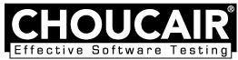

:slug: clientes/tecnologia/
:category: clientes
:description: FLUID es una compañía especializada en seguridad informática, ethical hacking, pruebas de intrusión y detección de vulnerabilidades en aplicaciones con más de 18 años prestando sus servicios en el mercado colombiano. En esta página presentamos nuestras soluciones en el sector tecnológico.
:keywords: FLUID, Tecnología, Información, Seguridad, Pentesting, Clientes.
:translate: customers/technology/

= Tecnología

[role="Tecnologia tb-alt"]
[cols=2, frame="none"]
|====
a|image:logo-komet.png[logo komet, 300, 80, link=https://www.kometsales.com/]

a|== Kometsales

Plataforma web para la industria de las flores que simplifica y 
automatiza procesos de ventas, compras y logística. Proporcionamos las herramientas 
necesarias para simplificar las operaciones diarias, conectando los principales socios 
de la industria y brindando además tranquilidad y confianza a nuestros clientes

a|== Conexia

Empresa de servicios focalizada en la industria de la salud, 
que nace a partir de una visión de desarrollar una solución integral capaz de conectar 
a todos sus participantes. Su mercado está compuesto por todas aquellas organizaciones 
que tienen como objetivo brindar un servicio de salud a la población; ya sean entidades 
públicas, empresas de medicina privada, prestadores, cooperativas, sindicales y aseguradoras.

a|image:logo-conexia.png[logo conexia, 290, 90, link=http://conexia.com/es/index.html]

a|image:logo-ceiba.png[logo ceiba, 270, 120, link=https://www.ceiba.com.co/es]

a|== Ceiba Software

Compañía con 9 años en el mercado y 185 ingenieros, especializada en la construcción 
e integración de soluciones de software en diversas tecnologías.  Buscan generar 
mayor valor en el negocio de sus clientes administrando los proyectos bajo metodologías 
ágiles combinando tres elementos fundamentales: Sólida capacidad técnica, Diversas
herramientas de software y Conocimiento en verticales de industria.

a|== PSL

Organización mundialmente reconocida por la adopción de las mejores prácticas 
existentes en Ingeniería de Software en el mundo. La compañía cuenta con dos grandes 
línesa de negocio: Productos y Servicios, entre los cuales ofrece consultoría, desarrollo y 
mantenimiento de software y servicios de outsourcing (web, móviles, misión crítica). 

a|image:logo-psl.png[logo psl, 300, 100, link=http://www.psl.com.co/]

a|image:logo-creative.png[logo creative, 300, 100, link=http://www.ctnd.com/]

a|== Cre8tive

Empresa que ha desarrollado e implementado sistemas de Gestión de Calidad 
para documentar las mejores prácticas de negocio, satisfacer los requerimientos 
y expectativas de los clientes y mejorar la gestión global de la compañía.

a|== Choucair 

Compañía colombiana pionera en software testing creada en 1999 con proyección internacional, 
la cual ofrece servicios relacionados con pruebas de software para disminuir los riesgos de su 
operación. El éxito de los servicios prestados por la organización se sustenta en la investigación 
y el recurso humano calificado, apoyado en una metodología certificada y efectiva. 

a|

a|image:logo-s4n.png[logo s4n, 260, 100, link=http://s4n.co/]

a|== S4n

Empresa de tecnología dedicada a transformar la forma en la que opera cada uno de sus clientes, 
implementando soluciones de software que superen desafíos de negocios y tengan foco absoluto en 
la creación de valor. Proveedores de servicios de tecnología que busca transformar las organizaciones 
y mejorar la vida de la gente mediante el aprovechamiento de las tecnologías y las nuevas tendencias.

a|== Intergrupo

Organización con presencia en el mercado de Latinoamérica y España, reconocida por entregar soluciones 
y servicios integrales basados en tecnología de punta, enfocados a contribuir con la transformación 
digital de las organizaciones. Tiene una trayectoria importante en el mercado, gracias al posicionamiento 
que ha ido obteniendo por más de 20 años de servicio. 

a|image:logo-intergrupo.png[logo intergrupo, 280, 90, link=http://www.intergrupo.com/]

a|image:logo-pragma.png[logo pragma, 180, 100, link=http://www.pragma.com.co/]

a|== Pragma

Desde 1996 ofrecen soluciones digitales para satisfacer las necesidades de empresas que no 
se conforman y quieren lo mejor. Actualmente con sedes en Bogotá, Medellín y Cali, integradas 
por un staff de profesionales compuesto por creativos e ingenieros. Aprovechan las capacidades 
analíticas e interactivas de la red para desarrollar productos y servicios especializados; uniendo 
el poder de la tecnología con la estrategia y la creatividad para ofrecer el mejor servicio. 
El portafolio se compone por: Fábrica de Software, Integración y Automatización de Procesos, 
Agencia Digital, Portales y CERO.

a|image:logo-heinson.png[logo heinson, 230, 180, link=https://www.heinsohn.com.co]

a|== Heinsohn

Empresa con amplio conocimiento en todos los sectores de la industria, con experiencia en las 
principales empresas en América Latina y los EE.UU; Relaciones con proveedores líderes de tecnología 
en el mundo como IBM, Oracle, Microsoft, Saba, CA, SAP, entre otros. Casa matriz en Bogotá, Colombia, 
con sedes en siete ciudades del país y sucursales en América Latina y los Estados Unidos. Cumplen con 
la norma ISO 9001:2000 y están valoradas con el nivel más alto en la calidad de los procesos CMMI Nivel 5, versión 1.3.

a|== Arus

Compañía que entrega soluciones integradas de información, tecnología y conocimiento, con un equipo 
de expertos comprometidos con las necesidades de las organizaciones. Integradora de recursos, enfocada 
en entregar una plataforma segura para realizar los pagos de la seguridad social a través de su plataforma, 
SuAporte, atendiendo las necesidades de forma ágil, oportuna y confiable.

a|image:logo-arus.png[logo arus, 210, 100, link=https://www.arus.com.co/]

|====