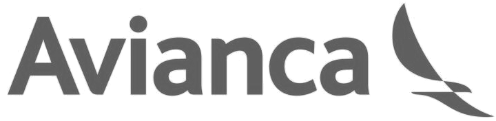

:slug: clientes/transporte/
:category: clientes
:description: FLUID es una compañía especializada en seguridad informática, ethical hacking, pruebas de intrusión y detección de vulnerabilidades en aplicaciones con más de 18 años prestando sus servicios en el mercado colombiano. En esta página presentamos nuestras soluciones en el sector del transporte.
:keywords: FLUID, Clientes, Sector, Transporte, Información, Seguridad.
:translate: customers/transportation/

= Transporte

[role="transporte tb-alt"]
[cols=2, frame="none"]
|====
^.^a|

a|== Avianca

Marca comercial que representa a las aerolíneas latinoamericanas
integradas en Avianca Holdings S.A. Especializadas en el transporte
de pasajeros y carga, atención directa en más de 100 destinos
en 26 países de América y Europa a bordo de una moderna flota de
172 aeronaves de corto, mediano y largo alcance.

a|== F2X

Son la unión de 2 compañías colombianas de ingeniería, con 12 años
de experiencia y presencia en 5 países de Latinoamerica. Especializados en
integrar soluciones tecnológicas para gestión y operación de infraestructura vial.

^.^a|

|====
