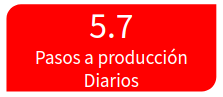

:slug: conferencias/habitos-secdevops/
:category: conferencias
:description: Ésta página tiene como objetivo informar a los clientes sobre el servicio de conferencias ofrecido por FLUIDAttacks. La presente conferencia tiene por objetivo socializar nuestras metodologías de trabajo para implementar un ambiente SecDevOps y ofrecer mejoras al cliente diariamente.
:keywords: FLUIDAttacks, Taller, SecDevOps, Seguridad, Software, Tecnología.
:image-caption:

= Nuestros Hábitos SecDevOps

== 1. Objetivo

El término +SecDevOps+ ha venido sonando mucho los últimos años,
sin embargo, toda persona, todo +Webinar+ que habla del tema,
únicamente se centra en los beneficios que trae, o en los posibles
casos de uso; sin prestarle ni un minuto de atención a la razón
por la que posiblemente muchos asistentes decidieron ir al evento,
*¿cómo se hace?, ¿por dónde se empieza?*
Tal vez nos mostrarían cómo hacen una que otra prueba
sobre un ambiente exageradamente simple,
con el que ningún asistente se relacionará en cuanto a su labor diaria,
generando otras preguntas, *¿esto en verdad funciona?*,
*¿esto aplica en mi empresa?*

En este espacio buscamos dar respuesta a estas preguntas,
mediante la socialización de nuestras prácticas de trabajo,
metodologías y costumbres que nos permiten implementar una cultura +SecDevOps+
en nuestros proyectos; desde la administración de la infraestructura,
hasta el desarrollo de nuestra plataforma de orquestación
para la remediación de vulnerabilidades:
[button]#link:../../productos/integrates/[Integrates]# +
Estos hábitos nos permiten aumentar nuestra productividad,
generando valor diario al cliente, además de incrementar
la seguridad de nuestros despliegues a producción.
Así logramos alcanzar, en los últimos seis meses, un promedio de:

.Datos de 2018/01/01 a 2018/06/06
[caption=""]

== 2. Contenido

Este *taller* se puede entender como la puesta en práctica
de todo lo visto en
[button]#link:../quemar-el-datacenter/[Quemar el DataCenter]# +
Todo lo que se muestra es *en vivo y en directo*,
no una aplicación ni una infraestructura diseñada
como +demo+ específicamente para este taller.
Se ofrece una visión de lo que está ocurriendo dentrás de cámaras,
las herramientas que se utilizan, los +logs+ que arrojan
y que permiten identificar problemas, incluso el código fuente
que define cada uno de los pasos para el correcto despliegue
de nuestros productos, todo esto resultando en que es posible ver
cómo se actualiza nuestra infraestructura
y nuestros productos en *tiempo real*.

Para poder entender cómo ocurre todo lo mencionado anteriormente,
además de mostrar cómo dar un primer paso para alcanzar esta configuración,
el taller viene acompañado de la explicación
de todos los hábitos de trabajo que nos han permitido
llegar hasta este punto y seguir mejorando diariamente.
Estos hábitos tratan temas como:

* Administración del código fuente al interior del repositorio,
siguiendo una estructura *monorepo* (adiós al multirepo).

* Mantener un ambiente limpio y pequeño por desarrollador, incluyendo
todos los cambios en la rama principal, evitando así la acumulación de código y
logrando tener *cero inventario* (dejar atrás el +gitflow+).

* Generar valor diario al cliente mediante la metodología de *microcambios*
(no una funcionalidad enorme cada 6 meses o más).

* Migrar y administrar toda la infraestructura como código fuente, versionado,
conviertiéndola en *infraestructura inmutable*
(olvidar consolas de gestión y evitar cambios no autorizados).

* Definir los ambientes de Integración Continua como código fuente,
+*pipeline as code*+, versionado, de manera que sea más fácil de configurar,
modificar, y realizar todo tipo de pruebas
(evitando ser susceptibles a las limitaciones que impone una interfaz gráfica
para la configuración del +pipeline+).

* Evitar servidores a toda costa, migrando a servicios en la nube y alcanzando
una estructura *serverless*

* Administración segura de credenciales a la hora de desplegar una aplicación,
sin quemarlas en el código fuente y manteniendo los *secretos protegidos*.

* Desplegar *ambientes efímeros* que permitan probar todas las funcionalidades
desarrolladas antes de hacer el paso a producción
(sin complicar más el proyecto teniendo ambientes de desarrollo, pruebas,
+QA+, producción, ...).

* *Rompimiento del +build+* incluso antes de hacer +commit+ al repositorio,
utilizando +*pre-commit*+ para hacer chequeos por verificaciones.

* Ejecutar pruebas sobre el código fuente y sobre el despliegue
que *rompan el +build+* ante el más mínimo error
(no que notifiquen y permitan que éste evolucione):
** Integración multiplataforma.
** Pruebas unitarias.
** Cobertura.
** +Linters+ intolerantes.
** +Security Gates (SAST y DAST)+

* Reducción extrema del tiempo de +build+,
mediante el correcto uso de la *caché*.

* Aprovechar funcionalidades del cliente de control de versionamiento +Git+:
** +Peer Review+.
** +Squashing+.
** +Rebasing+.
** +Rollback+
** +Trigger builds+.

* Administración y manejo de errores.

Cada punto descrito anteriormente está acompañado con la entrada al interior
de los sistemas de +FLUIDAttacks+ para ver su implementación y funcionamiento.
Según la necesidad o el interés de los asistentes,
es posible hacer énfasis en los temas que ellos consideren más importantes.

== 3. Experiencia

Este *taller* es nuevo, se ha presentado a personas de tecnología
de empresas como
link:https://www.grupobancolombia.com/wps/portal/personas[+Bancolombia+] y
+F2X+.

== 4. ¿Dónde?

El lugar del *taller* es denifido por +FLUIDAttacks+,
por fuera de las instalaciones del cliente.

== 5. Duración

El *taller* tiene una duración de *5 horas*
(no es posible reducir su duración).
Comprende la demostración en vivo de nuestras prácticas,
además de un espacio para tomar una media-mañana,
y un almuerzo al mediodía.

== 6. Cuándo

El *taller* está diseñado para darse desde las *9 A.M.* hasta las *2 P.M.*.
El día se agenda según común acuerdo entre los asistentes por parte del cliente
y +FLUIDAttacks+.

== 7. Detalles

. *Inversión*: A diferencia de las demás conferencias
ofrecidas por +FLUIDAttacks+, el espacio de este *taller*
y los costos asociados a él corren enteramente por cuenta de +FLUIDAttacks+.
La alimentación también está incluida en la invitación,
con la opción de que el pago lo pueda hacer el cliente si decide cubrir
la alimentación de los asistentes.
Esto último es enteramente opcional, pues +FLUIDAttacks+ inicialmente
ofrece tanto el espacio, como la alimentación.

. *Material*: Al igual que las demás conferencias
ofrecidas por +FLUIDAttacks+, el material se le envía solo a los asistentes
que diligencien la evaluación de satisfacción 1 día después
de la conferencia.

== 8. Público

El *taller* es apto para personal técnico y
personal gerencial de tecnología.
Ambos perfiles son bienvenidos y su satisfacción es alta indistintamente.
Sin embargo, si desea disparar cambios y experimentos
dentro de su organización, es importante considerar
la presencia de personas con poder de decisión.

El *taller* se encuentra diseñado para un público entre
*8 y 12* personas por parte del cliente, además de las 4 adicionales
que puede invitar +FLUIDAttacks+.

== 9. Requisitos

[button]#link:../#requisitos[Requisitos]#

== 10. Expositor

* [button]#link:../../personas/jrestrepo/[Juan Carlos Restrepo]#
