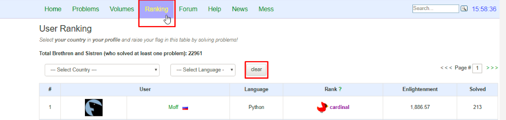
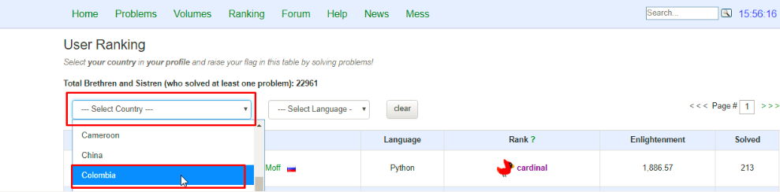
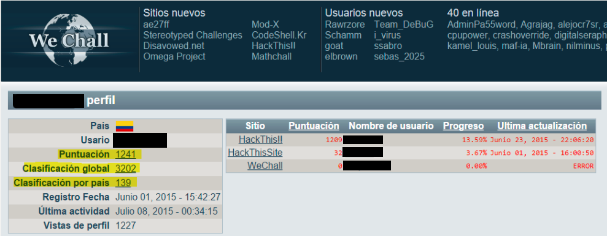

:slug: empleos/retos-tecnicos/
:category: empleos
:description: La siguiente página tiene como objetivo informar a los interesados en ser parte del equipo de trabajo de FLUID sobre el proceso de selección realizado. La etapa de retos técnicos consiste en evaluar las competencias del candidato mediante ejercicios prácticos de programación y hacking.
:keywords: FLUID, Empleos, Proceso, Selección, Retos, Técnicos.
:toc: yes
// :translate: careers/technical-challenges/

= Retos Técnicos

Esta etapa es paralela a las demás etapas del proceso y 
por ende, entre más avance desde ahora en ella, 
mayor es la probabilidad que cuando finalicen las demás etapas, 
usted pueda ser evaluado antes que los demás participantes.

También puede considerarse como una especie de salvavidas en el proceso, 
pues usted puede no estar graduado, no tener experiencia, 
o que el resultado de su examen de conocimiento sea bajo, 
pero si fue capaz de finalizar esta etapa, 
usted evidenciará que tiene la competencia más valiosa: 
aprender de cosas nuevas sobre la marcha y aplicarlas para resolver problemas reales. 
Esto, con la calidad humana, que tiene mayor peso que todo lo demás.

== 1. Objetivos

En esta etapa se busca que usted evidencie mediante ejercicios prácticos sus competencias técnicas en problemas parecidos a los que enfrentará en FLUID, 
y con las cuales podrá solucionar de forma efectiva problemas de nuestros clientes en el ámbito de la seguridad. 
También demuestra que usted será un compañero valioso para enriquecer a los miembros actuales del equipo de trabajo.

Los retos técnicos se dividen en retos de hacking y retos de programación. 
Con los primeros usted demuestra su habilidad y astucia para sobrepasar controles de seguridad, 
con los segundos usted demuestra que está en capacidad de rápidamente entender un programa, 
comprender un lenguaje y por ende, 
le será más fácil auditar código fuente y encontrar vulnerabilidades.

Para los retos de programación usted puede utilizar la plataforma Codeabbey. 
Para los retos de hacking usted puede utilizar cualquier sitio indexado por Wechall 
(no aplican retos tipo adivinanzas o similares, solo retos que impliquen destreza técnica).

La filosofía es fomentar el aprendizaje a partir de la solución activa de problemas y 
desestimular el aprendizaje pasivo.

El repositorio contiene las soluciones a retos computacionales públicos construidos en el contexto anterior. 
Al hacer los retos públicos buscamos:

. Fomentar la solución de retos no resueltos,

. Si el reto está resuelto, fomentar la solución del reto de otra forma,

. Si el reto está resuelto, hacer evidente la similitud de la nueva solución.

. Darles vida a las soluciones financiadas por FLUID,

. Permitir a terceros visualizar los entregables de nuestro equipo.

Los efectos colaterales de esta decisión permiten a FLUID:

. Utilizar la infraestructura de GitLab para analizar la calidad y velocidad
del desarrollo de las personas en formación,

. Desde etapas tempranas familiarizar a potenciales talentos con las
herramientas (git, asciidoc, python, gherkin, etc) y conceptos
(automatización, pruebas de unidad, integración continua, linting, etc.) que
utilizarán en su labor diaria en FLUID,

. Hacer visible a la comunidad y al equipo los resultados propios (presión de
pares).

== 2. Requerimientos previos

. Registrarse en GitLab usando su correo electrónico personal y creando el ID de usuario que más le guste.
Este ID no debe ser mayor a *12* caracteres.

. Unirse a nuestro link:https://join.slack.com/t/autonomicmind/shared_invite/enQtMjg4ODI4NjM3MjY3LWUxMTNmMjk3MDdkMDAzYWY0ZjQ3MzNlYjUzZjM3NTM3MDVmYTliN2YyNGViZGUyNzUxOTAzNTdmZDQ5NWNjNGI[canal de Slack], 
en donde encontrará personal de FLUID y otros candidatos actualmente en esta etapa, 
quienes podrán guiarlo en caso de tener dudas o inconvenientes.

. Solicitar el permiso de acceso al repositorio vía Slack presentándote a los demás en el canal *#general* con el siguiente mensaje:
[quote]
____________________________________________________________________
He leído y entendido toda la documentación de los retos técnicos, 
acepto las condiciones y por ende solicito acceso al repo Git con mi usuario [nombreDeUsuario] en GitLab
____________________________________________________________________

== 3. Instrucciones

. Resuelva 10 retos de programación que no tienen solución, 
ni en nuestro repositorio ni identificada (punto 1),

.. Para retos de programación, 
una solución es válida si no ha sido resuelta en el lenguaje que usted pretende solucionarlo. 
.. Entiéndase programación como cualquier reto disponible en Codeabbey,.

. Resuelva 10 retos de hacking que no tienen solución, 
ni en nuestro repositorio ni identificada (punto 1).

.. Para retos de hacking,
una solución es válida si no tiene solución en la carpeta del reto en el repositorio ni está 
indexada en el archivo OTHERS.txt
.. Entiéndase hacking por cualquier reto técnico de wechall.net o sus sitios relacionados,
.. No se entiende por hacking retos matemáticos o de adivinanzas relacionados en wechall.net (brainquest),

== 4. Envío

Antes de realizar un Merge Request (MR), 
por favor verifique que cumple con los siguientes criterios:

. Los cambios se deben realizar en una *rama personal*,
la cual debe llevar el mismo nombre de su usuario en GitLab.

. Todos los archivos relacionados con la resolución de retos deben respetar 
la link:#repositorio[estructura indicada].

. Si una de sus soluciones de hacking requiere un script adicional,
deberá incluirlo en el mismo directorio.

. Por cada reto usted deberá realizar un commit que agrupe los cambios
correspondientes a la solución y 10 retos que tienen solución en Internet, 
pero no en el repositorio (OTHERS) y luego,
un *merge request* para solicitar la inclusión de sus soluciones.

.. Los enlaces de los OTHERS deben ser enlaces directos (HTTP 200) y sin redirección (HTTP 302). 
.. Si está subiendo soluciones de hacking, los enlaces de los OTHERS deben ser a soluciones de hacking de terceros,
.. Si está subiendo soluciones de programación, los enlaces de los OTHERS deben ser a soluciones de programación de terceros,
.. No se debe repetir lenguajes de programación en las soluciones enlazadas de los OTHERS

. Un *merge request* debe tener un solo commit.

. El mensaje del commit debe tener el siguiente link:https://gitlab.com/autonomicmind/training/blob/master/templates/commit-msg.txt[formato].

. Antes de abrir un MR debe esperar que la integración termine satisfactoriamente (en verde)

. Adicionalmente, las soluciones que envíe deben cumplir con los siguientes link:https://gitlab.com/autonomicmind/training/wikis/home[requisitos]

Los link:https://gitlab.com/autonomicmind/training/merge_requests[merge request] 
pendientes de revisión y aprobación, 
así como todos los realizados en el pasado pueden verse en el enlace indicado.

Para cada *merge request* que usted envíe, se realiza un proceso de
integración continua que verifica automáticamente el cumplimiento de
algunas de las reglas aquí definidas.  
Solo cuando el proceso de integración pasa sin errores (en verde), 
su *merge request* es integrado al repositorio. 
Los resultados de la integración pueden verse siempre en
link:https://gitlab.com/autonomicmind/training/pipelines[GitLab-CI].

=== Intentos fallidos

Un merge request (MR) puede ser rechazado en caso de incumplimiento de los criterios anteriormente mencionados.
Por favor tenga en cuenta lo siguiente:

* Un MR cuenta como fallido cuando se rechaza por cuestiones que están adecuadamente detalladas en la documentación y que aun así se incumplen.
* No se reabre un MR. 
Si su MR fue rechazado, deberá crear uno nuevo tras haber realizado las respectivas correcciones.
* Todo participante tiene hasta 10 intentos de MR fallidos. 
El proceso se dará por terminado en caso de llegar a este tope.

== 5. Repositorio

El repositorio donde usted debe enviar sus soluciones es el siguiente: link:https://gitlab.com/autonomicmind/training/[click aquí]
Por favor lea atentamente las siguientes pautas para trabajar en este repositorio Git:

* *Contenido*: Utilizar espacios en vez de tabuladores. 
Parametrice su editor de texto favorito para que le facilite esta tarea.

* *Programas*: Para las soluciones a retos que correspondan a código fuente debe 
utilizarse la extensión y guías de estilo propias del lenguaje. 
Adicionalmente utilizar los *linters* correspondientes en la 
configuración estándar más estricta posible.

* *Integración continua*: El formato es reforzado mediante 
scripts que se encuentran en el repositorio y que se encuentran disponibles
para que usted los utilice y mejore. 
Estos scripts son utilizados en el proceso de integración 
continua para verificar su estricto cumplimiento antes de recibir 
satisfactoriamente las soluciones enviadas por usted. 
Puede ver todas las bitácoras de compilación históricas y de otros
participantes link:https://gitlab.com/autonomicmind/training/pipelines[aquí].

* *Estructura del repositorio:* Los soluciones a los retos se almacenan en la carpeta llamada *challenges*.
En esta carpeta se debe manejar la siguiente estructura:

** sitio (directorio)
*** código del reto (directorio)
**** suloginenGitLab.extensión (archivo de solución)

** Un ejemplo de esta estructura es:

*** link:https://gitlab.com/autonomicmind/training/tree/master/challenges/codeabbey/[codeabbey]
**** link:https://gitlab.com/autonomicmind/training/tree/master/challenges/codeabbey/005/[005]
***** link:https://gitlab.com/autonomicmind/training/tree/master/challenges/codeabbey/005/john2104.ml[john2104.ml]
***** link:https://gitlab.com/autonomicmind/training/tree/master/challenges/codeabbey/005/henryval.java[henryval.java]

* El nombramiento de todos los archivos y directorios, a excepción de sus
archivos, debe realizarse en minúscula, sin caracteres especiales y en caso de requerir
espacios usar *-* (guion) como sustituto.

* Los códigos correspondientes a soluciones de retos de programación deberán cumplir con lo siguiente:
** En comentarios multilínea al inicio del programa deben estar el snippet de los comandos de compilación utilizados y la salida correspondiente en modo CLI.
** En comentarios multilínea al final del programa deben estar el snippet de los comandos de ejecucion utilizados y la salida correspondiente en modo CLI.

* *Archivos Especiales:* En algunas carpetas de la estructura se encuentran algunos archivos
especiales de control:

** *LINK.txt:* Contiene la URL al enunciado del reto en la plataforma
correspondiente (link:https://gitlab.com/autonomicmind/training/blob/master/challenges/codeeval/easy/235/LINK.txt[Ejemplo]).
Este archivo solo debe contener una linea y visitar el enlace debe
generar la respuesta HTTP 200 (sin redirección).

** *DATA.txt:* Contiene los casos de prueba con los cuales se han verificado
los retos. Este archivo solo debe contener casos de prueba que sea 
inmediatamente procesables por cualquier archivo de solución.

** *OTHERS.txt:* Contiene los enlaces a las soluciones a dicho
reto que se encuentran en Internet y que no deben leerse ni utilizarse
como referencia para resolver el reto. 
Este archivo permite que un script automático realice el análisis de similitud 
con los retos enviados por los candidatos.

** *LANG.txt:* Cuando existe indica los lenguajes de programación que 
pueden ser usados para resolver retos de las subcarpetas donde se 
encuentra el archivo. 
Si contiene múltiples lenguajes significa que debe utilizarse de forma 
secuencial (round robin) cada lenguaje para construir más soluciones 
de dicha subcarpeta.

== 6. Builds locales

Es posible correr integraciones locales con el fin de identificar errores antes de hacer push o merge requests al repositorio. 
Para esto, se deben ejecutar los siguientes comandos:

* *En Sistemas Operativos GNU/Linux:*

. Instalar curl,

    sudo apt-get update
    sudo apt-get install curl

. Instalar Nix,

    curl https://nixos.org/nix/install | sh

. Definir sus credenciales de acceso,

    export DOCKER_USER=usuarioEnGitlab
    export DOCKER_PASS=contraseñaEnGitlab

. Compilar y probar

    ./build.nix

. Si la integración fue exitosa (Job succeeded), añadir los cambios, hacer commit y 
a su rama personal. 
Si no fue exitosa, corregir el error y compilar nuevamente,

    git add .
    git commit -m "Ejemplo"
    git push origin ramaPersonal

. Por último, hacer merge request a la rama master. 
Un link:https://gitlab.com/autonomicmind/training/merge_requests/750[ejemplo] de un *merge request*.

* *En Sistemas Operativos Windows:* La forma de ejecutar la integración no se encuentra todavía disponible para Windows y 
al basarse la integración en Linux, 
esto hace que el proceso en Windows sea más complicado. 
Se sugiere instalar un software de virtualización (link:https://my.vmware.com/en/web/vmware/free#desktop_end_user_computing/vmware_workstation_player/14_0[VMware],
link:https://www.virtualbox.org/wiki/Downloads[Virtualbox]) y crear una máquina virtual
basada en una distribución de Linux (e.g. link:https://www.ubuntu.com/download/desktop[Ubuntu],
o la de su preferencia) y aplicar el proceso descrito anteriormente para Sistemas 
Operativos Linux.

== 7. Recomendaciones

Para cumplir los objetivos enunciados, 
se sugiere buscar retos que no tengan solución ni en OTHERS.txt ni en el repositorio y
trabajar en resolver el reto en la respectiva plataforma.

Al momento de solucionar retos de programación, 
se sugiere usar un lenguaje no muy usado y 
resolver los retos en dicho lenguaje.

== 8. Informes de avance

Apreciaremos mucho que nos informe de sus avances mínimo 1 vez cada semana,
mediante el siguiente [button]#link:../../../../forms/training[formulario >>]#.
Al diligenciar el informe, 
por favor presente lo siguiente:

. En el campo “Relación”, escoger la opción “Selección”.
. Tenga en cuenta su posición en el ranking y su puntaje antes de comenzar el entrenamiento, 
pues necesitará estos datos al momento de registrar los campos "Ranking Mundial Inicial", 
"Ranking Colombia Inicial" y "Puntaje/Páginas Inicial"
. Los puntajes o posiciones en el ranking finales puede obtenerlos de la siguiente forma:

* En Codeabbey (Para retos de programación):

* En Wechall (Para retos de hacking):

== 9. Fin

Esta etapa finaliza cuando usted haya completado los objetivos anteriormente mencionados y 
nos envíe vía e-mail los 40+10+10 archivos referentes a las soluciones realizadas por usted.

Por favor tenga en cuenta que durante esta etapa la continuidad es fundamental, 
ya que *de no haber movimiento (push al repositorio git) en 14 días calendario, 
se dará por terminado el proceso de selección*. 

Usted puede volver a presentarse, sin embargo, 
deberá comenzar desde la primera etapa nuevamente.

En caso de no desear continuar con el proceso, 
puede escribirnos vía e-mail a careers@autonomicmind.co

== 10. Preguntas

* Antes de realizar una pregunta, por favor lea nuevamente este documento y 
las link:../faq[preguntas realizadas en el pasado] por otros participantes.

* Puede expresar sus dudas en el canal *#general* de nuestro link:https://join.slack.com/t/autonomicmind/shared_invite/enQtMjg4ODI4NjM3MjY3LWUxMTNmMjk3MDdkMDAzYWY0ZjQ3MzNlYjUzZjM3NTM3MDVmYTliN2YyNGViZGUyNzUxOTAzNTdmZDQ5NWNjNGI[Slack].

== 11. Propiedad Intelectual
 
* Los derechos patrimoniales sobre el contenido de este repositorio se encuentran definidos en el archivo link:https://gitlab.com/autonomicmind/training/blob/master/COPYRIGHT.txt[COPYRIGHT].
* La licencia y privilegios que tienen los usuarios de este repositorio
se encuentran definidos en el archivo link:https://gitlab.com/autonomicmind/training/blob/master/LICENSE.txt[LICENSE]. 
* Realizar un *merge request* implica la cesión de derechos patrimoniales.
Por ende, la información aquí contenida puede ser usada
por FLUID para cualquier fin comercial,
siempre preservando los derechos morales de sus autores.

=== Plagio

Tener las soluciones disponibles para su visualización propone un reto para el plagio, 
¿cómo mostrarle al mundo las soluciones y evitar el plagio?
El plagio no es un problema técnico, 
es un problema moral de atribuirse lo que no fue realizado por uno mismo como propio. 

Para evitar el plagio buscamos la visibilidad y la declaración
explicita de autoría de cada algoritmo en un lugar centralizado y así, 
queda evidencia clara de la atribución y puede ser sometido a 
escrutinio público el acto de plagio.

Es decir, el modelo actual propuesto evita el plagio a partir de la 
transparencia total. 

Igualmente, FLUID trabaja activamente en aplicar técnicas de detección
de similitud algorítmica sobre todo el código que sea enviado. 
En particular usando: 

* link:https://theory.stanford.edu/~aiken/moss/[MOSS]
* link:https://en.wikipedia.org/wiki/Plagiarism_detection[Plagiarism Detection Theory]
* link:https://www.plagaware.com/[PlagAware]
* link:https://www.safe-corp.com/products_codematch.htm[Code Match]