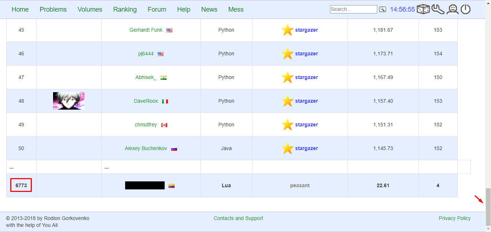
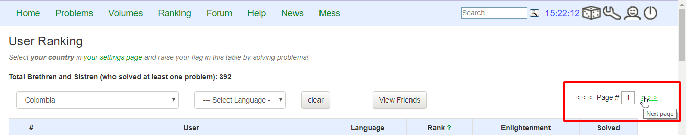

:slug: empleos/retos-tecnicos/
:category: empleos
:description: La siguiente página tiene como objetivo informar a los interesados en ser parte del equipo de trabajo de FLUIDAttacks sobre el proceso de selección realizado. La etapa de retos técnicos consiste en evaluar las competencias del candidato mediante ejercicios prácticos de programación y hacking.
:keywords: FLUIDAttacks, Empleos, Proceso, Selección, Retos, Técnicos.
:toc: yes
:translate: careers/technical-challenges/

= Retos Técnicos

Esta etapa es paralela a las demás etapas del proceso y
por ende, entre más avance desde ahora en ella,
mayor es la probabilidad que cuando finalicen las demás etapas,
usted pueda ser evaluado antes que los demás participantes.

También puede considerarse como una especie de salvavidas en el proceso,
pues usted puede no estar graduado, no tener experiencia,
o que el resultado de su examen de conocimiento sea bajo,
pero si fue capaz de finalizar esta etapa,
usted evidenciará que tiene la competencia más valiosa:
aprender de cosas nuevas sobre la marcha y aplicarlas para resolver problemas reales.
Esto, con la calidad humana, que tiene mayor peso que todo lo demás.

== 1. Filosofía

En esta etapa se busca que usted evidencie mediante ejercicios prácticos sus competencias técnicas en problemas parecidos a los que enfrentará en +FLUIDAttacks+,
y con las cuales podrá solucionar de forma efectiva problemas de nuestros clientes en el ámbito de la seguridad.
También demuestra que usted será un compañero valioso para enriquecer a los miembros actuales del equipo de trabajo.

Los retos técnicos se dividen en retos de +hacking+ y retos de programación.
Con los primeros usted demuestra su habilidad y astucia para sobrepasar controles de seguridad,
con los segundos usted demuestra que está en capacidad de rápidamente entender un programa,
comprender un lenguaje y por ende,
le será más fácil auditar código fuente y encontrar vulnerabilidades.

La filosofía es fomentar el aprendizaje a partir de la solución activa de problemas y
desestimular el aprendizaje pasivo.

El repositorio contiene las soluciones a retos computacionales públicos construidos en el contexto anterior.
Al hacer los retos públicos buscamos:

. Fomentar la solución de retos no resueltos,

. Si el reto está resuelto, fomentar la solución del reto de otra forma,

. Si el reto está resuelto, hacer evidente la similitud de la nueva solución.

. Darles vida a las soluciones financiadas por +FLUIDAttacks+,

. Permitir a terceros visualizar los entregables de nuestro equipo.

Los efectos colaterales de esta decisión permiten a +FLUIDAttacks+:

. Utilizar la infraestructura de +GitLab+ para analizar la calidad y velocidad
del desarrollo de las personas en formación,

. Desde etapas tempranas familiarizar a potenciales talentos con las
herramientas (+git+, +AsciiDoc+, +python+, +gherkin+, etc) y conceptos
(automatización, pruebas de unidad, integración continua, +linting+, etc.) que
utilizarán en su labor diaria en +FLUIDAttacks+,

. Hacer visible a la comunidad y al equipo los resultados propios (presión de
pares).

== 2. Objetivos

. Resuelva 10 retos de programación.

. Resuelva 10 retos de hacking.

== 3. Condiciones

. El entrenamiento es auto-dirigido e independiente (por su propia cuenta sin instrucción o ayuda alguna de otro).

== 4. Criterios

Las soluciones de retos de programación deberán cumplir con lo siguiente:

. No deben tener solución en el repositorio (carpeta del reto) para el lenguaje elegido por usted,
. No deben tener solución externa indexada (enlaces OTHERS.lst del reto) para el lenguaje elegido por usted,
. El lenguaje de la solución es uno de los aceptados por [button]#link:http://www.codeabbey.com/[Codeabbey]#.
. Los comandos de compilación y/o +linting+ utilizados y su salida deben estar al inicio del código fuente en comentarios multilínea.
+
.milogin.lua
[source, lua, linenums]
----
--[[
$ luacheck milogin.lua
Checking milogin.lua             OK
Total: 0 warnings / 0 errors in 1 file
--]]

Primera línea de mi programa
----
. Los comandos de ejecución utilizados y su salida deben estar al final del código fuente en comentarios multilínea.
. El código fuente de la solución debe seguir los parámetros de estilo de [button]#link:../../estilo/#explicaciones-con-codigo-fuente[esta guía]#.
. Si la solución opera sobre un conjunto de datos de entrada,
estos no deben estar quemados en código.

Las soluciones de retos de hacking deberán cumplir con lo siguiente:

. No deben tener solución en +Gherkin+ (+*.feature+) en el repositorio (carpeta del reto),
. No deben tener solución externa indexada (enlaces OTHERS.lst del reto),
. Deben ser retos que requieran nivel técnico (no matemático ni de adivinanzas) de [button]#link:http://www.wechall.net/[wechall]# o sus sitios relacionados,
. (Opcionalmente) Pueden ser retos que correspondan explotación en sistemas (+ToE+) vulnerables intencionalmente listados en:
.. [button]#link:https://www.owasp.org/index.php/OWASP_Vulnerable_Web_Applications_Directory_Project#Off-Line_apps[OWASP Off-Line apps]#
.. [button]#link:https://www.owasp.org/index.php/OWASP_Vulnerable_Web_Applications_Directory_Project#Virtual_Machines_or_ISOs[OWASP VMs / ISOs]#
.. [button]#link:https://www.owasp.org/index.php/OWASP_Vulnerable_Web_Applications_Directory_Project#On-Line_apps[OWASP On-Line apps]#
.. [button]#link:https://www.vulnhub.com/[Vulnhub]#
.  El formato Gherkin a utilizar debe adherirse estricamente a lo descrito [button]#link:../../../en/blog/gherkin-steroids/[aquí]#
. El código fuente de la solución debe seguir los parámetros de estilo de [button]#link:../../estilo/#explicaciones-con-codigo-fuente[esta guía]#.
. La solución debe haber pasado sin errores ni +warnings+ por un +linter+ del lenguaje correspondiente en su configuración más estricta posible.

== 5. Envío

Las soluciones se envían mediante +Merge Request+ (+MR+) a la rama +master+ del repositorio +training+.
Antes de realizar un +MR+ por favor verifique que cumple con los siguientes criterios:

. Solo debe trabajar en una rama cuyo nombre es exactamente su nombre de usuario en +gitlab+,
. Todos los archivos relacionados con la resolución de retos deben respetar la [button]#link:#estructura[estructura indicada]#,
. Si la solución requiere archivos adicionales debe incluirlos en el directorio del reto correspondiente,
. Cada solución a un reto debe enviarse con 10 link:#externas[soluciones externas] (10 +URLs+ en archivos +OTHERS.lst+),
. La solución y los archivos relacionados deben enviarse en 1 solo +commit+,
. Cada +commit+ de solución de retos debe ir en 1 solo +MR+,
. El +MR+ debe realizarse solo cuando su rama ha integrado satisfactoriamente (verde),
. Si el +MR+ es rechazado no debe reabrirse, deben corregirse los problemas indicados y hacer un nuevo +MR+,
. El mensaje de +commit+ para enviar la solución de un reto de complejidad 9.63,
del cual previamente se tienen 17 soluciones externas (+out+) y 8 dentro del repo (+in+)
y que tardó 4.5 horas de esfuerzo en resolverse durante la fase de retos (+challenges+) es el siguiente:

.commit-msg.txt
[source, text]
----
solution: codeabbey, 78 (9.63)

- others: 8 in, 17 out, 25 total.
- score: 25665 initial, 25723 final, 58 progress.
- global-rank: 797 initial, 795 final, 2 progress.
- national-rank: 38 initial, 38 final, 0 progress.
- effort: 4.5 hours during challenges phase.
----

== 6. Externas

Las reglas para los enlaces (+URLs+) a soluciones externas (+OTHERS.lst+) son las siguientes:

. Deben ser enlaces directos (+HTTP 200+) y sin redirección (+HTTP 302+).
. No tienen que ser del mismo reto del que se sube la solución,
. Deben ser de +hacking+ si se está solucionando un reto de +hacking+,
. Deben ser de programación si se está solucionando un reto de programación,
.. No debe añadir soluciones externas para un lenguaje del que ya se tenga solución externa,
.. Dentro de un +OTHERS+ de programación las +URLs+ deben estar ordenadas alfabéticamente por extensión,
. Si está en +github+ la +URL+ debe ser su versión +raw+ (link:https://raw.githubusercontent.com/[]),

== 7. Ejemplos

A continuación presentamos los enlaces para diferentes tipos de +MR+:

* +MR+ pendientes de aprobación: [button]#link:https://gitlab.com/autonomicmind/training/merge_requests?scope=all&utf8=%E2%9C%93&state=opened[click aquí]#.
* +MR+ rechazados en el pasado: [button]#link:https://gitlab.com/autonomicmind/training/merge_requests?scope=all&utf8=%E2%9C%93&state=closed[click aquí]#.

Ejemplos de +MR+ aceptados en el pasado:

* +MR+ ejemplares de +hacking+: [button]#link:https://gitlab.com/autonomicmind/training/merge_requests/868/diffs[1]#,
[button]#link:https://gitlab.com/autonomicmind/training/merge_requests/873/diffs[2]#,
[button]#link:https://gitlab.com/autonomicmind/training/merge_requests/703//diffs[3]#

* +MR+ ejemplares de programación: [button]#link:https://gitlab.com/autonomicmind/training/merge_requests/871/diffs[1]#,
[button]#link:https://gitlab.com/autonomicmind/training/merge_requests/814/diffs[2]#,
[button]#link:https://gitlab.com/autonomicmind/training/merge_requests/872/diffs[3]#

[NOTE]
Estos enlaces ejemplares no necesariamente siguen todas las reglas mencionadas pues las reglas evolucionan y
por ende en el momento que se hicieron las reglas pudieron ser otras.
En ningún momento los ejemplos tienen prioridad sobre las reglas,
sin embargo se relacionan como ejemplo para propósitos pedagógicos.

== 8. Recomendaciones

. Para cumplir los objetivos enunciados,
se sugiere buscar retos que no tengan solución ni en +OTHERS+ ni en el repositorio y
trabajar en resolver el reto en la respectiva plataforma.
Para esto, puede apoyarse usando el siguiente link:https://gitlab.com/autonomicmind/training/blob/master/utility.sh[script].

. Al momento de solucionar retos de programación,
se sugiere usar un lenguaje no muy usado y
resolver los retos en dicho lenguaje.

. Solucionar un reto e inmediatamente hacer su envío.
No acumule soluciones en su computador sin enviarlas,
pues de este modo usted nunca tendrá realimentación de lo que esta haciendo de forma errónea y
le puede generar por ende múltiples reprocesos tener que corregir sus soluciones luego.

== 9. Repositorio

El envío de soluciones se realizará en el siguiente [button]#link:https://gitlab.com/autonomicmind/training/[repositorio git]#

Es ideal que usted se familiarice con el versionamiento y la estructura que detallamos a continuación.

=== 9.1 Estructura

Los soluciones a los retos se almacenan en las siguientes carpetas:

[role="tb-col"]
[frame="topbot"]
|====
^.^s| Carpeta ^.^| challenges ^.^| system

^.^s| Descripción
| Carpeta para almacenar retos de programación y +hacking+.
| Carpeta exclusiva para retos de explotación de sistemas vulnerables

^.^s| Estructura
a| * sitio (directorio)
** código del reto (directorio)
*** loginGitLab.ext (archivo de solución)
a| * nombre del sistema o caja vulnerada (directorio)
** nombre de la explotación realizada (directorio)
*** loginGitLab.feature (archivo de solución)

^.^s| Ejemplo
a| * link:https://gitlab.com/autonomicmind/training/tree/master/challenges/codeabbey/[codeabbey]
** link:https://gitlab.com/autonomicmind/training/tree/master/challenges/codeabbey/005/[005]
*** link:https://gitlab.com/autonomicmind/training/tree/master/challenges/codeabbey/005/john2104.ml[john2104.ml]
*** link:https://gitlab.com/autonomicmind/training/tree/master/challenges/codeabbey/005/henryval.java[henryval.java]
a| * link:https://gitlab.com/autonomicmind/training/tree/master/systems/bwapp[bwapp]
*** link:https://gitlab.com/autonomicmind/training/tree/master/systems/bwapp/a1-command-injection[a1-command-injection]
**** link:https://gitlab.com/autonomicmind/training/blob/master/systems/bwapp/a1-command-injection/raballestasr.feature[raballestasr.feature]
|====

El nombramiento de todos los archivos y directorios,
a excepción de sus link:#82-archivos[archivos especiales],
debe realizarse en minúscula,
sin caracteres especiales y
en caso de requerir espacios usar *-* (guion) como sustituto.

=== 9.2 Archivos

En algunas carpetas de la estructura se encuentran algunos archivos
especiales de control:

** *LINK.lst:* Contiene la URL al enunciado del reto en la plataforma
correspondiente
(link:https://gitlab.com/autonomicmind/training/blob/master/challenges/codeeval/easy/235/LINK.txt[Ejemplo]).
Este archivo solo debe contener una linea y visitar el enlace debe
generar la respuesta +HTTP 200+ (sin redirección).

** *DATA.lst:* Contiene los casos de prueba con los cuales se han verificado
los retos. Este archivo solo debe contener casos de prueba que sea
inmediatamente procesables por cualquier archivo de solución.

** *OTHERS.lst:* Contiene los enlaces a las soluciones a dicho
reto que se encuentran en Internet y que no deben leerse ni utilizarse
como referencia para resolver el reto.
Este archivo permite que un script automático realice el análisis de similitud
con los retos enviados por los candidatos.
Deben cumplir con lo indicado [button]#link:#externas[aquí]#

** *SPEC.txt* (Solo para retos de systems): Contiene las especificaciones de la
máquina vulnerable con la que se está trabajando.
Puede ver un ejemplo link:https://gitlab.com/autonomicmind/training/blob/master/systems/bwapp/SPEC.txt[aquí]

== 10. Puntaje

A medida que realice soluciones a retos,
debe reportar el puntaje,
ranking y score obtenidos,
lo cual permitirá evidenciar su progreso en esta etapa.
Todos estos datos deben ir en el +commit message+ de acuerdo al formato indicado en las link:#envio[reglas de envío]

A continuación, se indica cómo obtener los puntajes y posiciones en el ranking de cada plataforma.

=== 10.1 En retos de programación

. Ranking mundial

.. Ir a la pestaña "Ranking" en la página de +codeabbey+: image:ranking-mundial-codeabbey.png[Ranking mundial codeabbey]

.. Baje hasta el final de la página y allí encontrará su posición en el ranking mundial: 

. Ranking Colombia

.. Estando en la pestaña "Ranking", seleccionar el país image:ranking-colombia-codeabbey.png[Ranking Colombia]

.. La página no muestra directamente su posición, por lo que deberá realizar el conteo manualmente.
Puede facilitar la tarea teniendo en cuenta que cada página muestra 50 usuarios.
Deberá avanzar a la siguiente página hasta encontrar su nombre de usuario en el tablero de ranking

=== 10.2 En retos de hacking

image::ranking-wechall.png[Ranking en Wechall]

== 11. Inicio

Para comenzar esta etapa, usted deberá:

. Registrarse en +GitLab+ usando su correo electrónico personal y creando el ID de usuario que más le guste.
Este ID no debe ser mayor a *12* caracteres y solo estar compuesto de letras minúsculas y/o números.

. Unirse a nuestro link:https://join.slack.com/t/autonomicmind/shared_invite/enQtMjg4ODI4NjM3MjY3LWUxMTNmMjk3MDdkMDAzYWY0ZjQ3MzNlYjUzZjM3NTM3MDVmYTliN2YyNGViZGUyNzUxOTAzNTdmZDQ5NWNjNGI[canal de Slack],
en donde encontrará personal de +FLUIDAttacks+ y otros candidatos actualmente en esta etapa,
quienes podrán guiarlo en caso de tener dudas o inconvenientes.

. Solicitar el permiso de acceso al repositorio vía +Slack+ presentándote a los demás en el canal *#general* con el siguiente mensaje:
[quote]
____________________________________________________________________
He leído y entendido toda la documentación de los retos técnicos,
acepto las condiciones y por ende solicito acceso al repo +git+ con mi usuario [nombreDeUsuario] en +GitLab+
____________________________________________________________________

== 12. Fin

La etapa de retos técnicos finaliza en cualquiera de las siguientes circunstancias:

. Usted haya completado los link:#objetivos[objetivos] y envíe vía +email+ los enlaces en +master+ de sus soluciones.
. De no haber movimiento (+push+ al repositorio +git+) en 14 días calendario.
. De haber alcanzado el tope máximo de 10 +MR+ fallidos, esto es, +MR+ que no se le hace +merge+ por
cuestiones detalladas en la documentación y que aun así se incumplen.
. Si usted explícitamente manifiesta mediante +email+ su deseo para retirarse del proceso.
. Si usted presenta como propias soluciones totales o parciales realizadas por otra persona (plagio).
. Si usted realiza soluciones a retos con ayuda de terceros.

En todos los casos la dirección de correo para estos pasos es: careers@autonomicmind.co

Si usted fue retirado por alguna de estas circunstancias, exceptuando las dos últimas,
puede volver a presentarse en cualquier momento y
volver a comenzar el proceso haciendo click [button]#link:../../../../forms/aplicacion[aquí]#.

== 13. Builds

Es posible correr integraciones locales con el fin de identificar errores antes de hacer +push+ o +merge requests+ al repositorio.
Para esto, se deben ejecutar los siguientes comandos:

* *En Sistemas Operativos +GNU/Linux+:*

.Instalar curl
[source, bash, linenums]
----
sudo apt-get update
sudo apt-get install curl
----

.Instalar Nix
[source, bash, linenums]
----
curl https://nixos.org/nix/install | sh
----

.Definir sus credenciales de acceso
[source, bash, linenums]
----
export DOCKER_USER=usuarioEnGitlab
export DOCKER_PASS=contraseñaEnGitlab
----

.Compilar y probar
[source, bash, linenums]
----
./build.nix
----

.Si la integración fue exitosa, hacer +commit+ y añadir los cambios a su rama personal
[source, bash, linenums]
----
git add .
git commit -m "Ejemplo"
git push origin ramaPersonal
----

* *En Sistemas Operativos +Windows+:* La forma de ejecutar la integración no se encuentra todavía disponible para Windows y
al basarse la integración en +Linux+,
esto hace que el proceso en +Windows+ sea más complicado.
Se sugiere instalar un software de virtualización
(link:https://my.vmware.com/en/web/vmware/free#desktop_end_user_computing/vmware_workstation_player/14_0[VMware],
link:https://www.virtualbox.org/wiki/Downloads[Virtualbox]) y crear una máquina virtual
basada en una distribución de +Linux+ (e.g. link:https://www.ubuntu.com/download/desktop[Ubuntu],
o la de su preferencia) y aplicar el proceso descrito anteriormente para Sistemas
Operativos +Linux+.

== 14. Preguntas

* Antes de realizar una pregunta, por favor lea nuevamente este documento y
las link:../faq[preguntas realizadas en el pasado] por otros participantes.

* Puede expresar sus dudas en el canal *#general* de nuestro link:https://join.slack.com/t/autonomicmind/shared_invite/enQtMjg4ODI4NjM3MjY3LWUxMTNmMjk3MDdkMDAzYWY0ZjQ3MzNlYjUzZjM3NTM3MDVmYTliN2YyNGViZGUyNzUxOTAzNTdmZDQ5NWNjNGI[Slack].

== 15. Propiedad

* Los derechos patrimoniales sobre el contenido de este repositorio se encuentran definidos en el archivo link:https://gitlab.com/autonomicmind/training/blob/master/COPYRIGHT.txt[COPYRIGHT].
* La licencia y privilegios que tienen los usuarios de este repositorio
se encuentran definidos en el archivo link:https://gitlab.com/autonomicmind/training/blob/master/LICENSE.txt[LICENSE].
* Realizar un +merge request+ implica la cesión de derechos patrimoniales.
Por ende, la información aquí contenida puede ser usada
por +FLUIDAttacks+ para cualquier fin comercial,
siempre preservando los derechos morales de sus autores.

== 16. Plagio

Tener las soluciones disponibles para su visualización propone un reto para el plagio,
¿cómo mostrarle al mundo las soluciones y evitar el plagio?
El plagio no es un problema técnico,
es un problema moral de atribuirse lo que no fue realizado por uno mismo como propio.

Para evitar el plagio buscamos la visibilidad y la declaración
explicita de autoría de cada algoritmo en un lugar centralizado y así,
queda evidencia clara de la atribución y puede ser sometido a
escrutinio público el acto de plagio.

Es decir, el modelo actual propuesto evita el plagio a partir de la
transparencia total.

Igualmente, +FLUIDAttacks+ trabaja activamente en aplicar técnicas de detección
de similitud algorítmica sobre todo el código que sea enviado.
En particular usando:

* link:https://theory.stanford.edu/~aiken/moss/[MOSS]
* link:https://en.wikipedia.org/wiki/Plagiarism_detection[Plagiarism Detection Theory]
* link:https://www.plagaware.com/[PlagAware]
* link:https://www.safe-corp.com/products_codematch.htm[Code Match]
