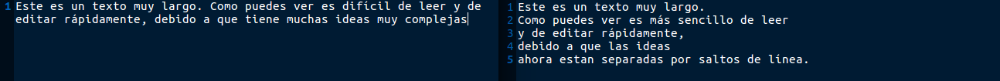
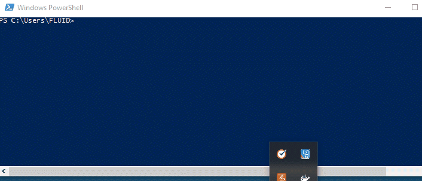

:slug: estilo/
:description: TODO
:keywords: TODO
:eth: no

= Estilo

El objetivo del blog de FLUID 
es compartir opiniones y conocimientos 
sobre temas de seguridad de forma clara y fácil de entender. 

[quote]
Te invitamos a compartir tus conocimientos con nosotros y el mundo.

El público objetivo son personas 
que no tienen conocimientos técnicos avanzados 
por lo que se debe manejar un lenguaje sencillo 
pero que aporte conocimientos específicos 
sobre temas de seguridad.

== Temáticas

Los temas del blog están orientados 
única y exclusivamente a temas de seguridad y TI, 
aunque hay situaciones que aunque no son de seguridad 
pueden ser tratadas como tal:

1. Cómo explicarle a un Gerente 
que debe invertir en la seguridad.

2. Cómo utilizar un componente específico: 
Puedes explicar la forma segura de utilizarlo.

3. Explicación de un concepto resolviendo un reto de seguridad.

4. Cómo protegerse…

== Perfil del lector

* *Rango de Edad:* 20 – 60 años.

* *Escolaridad:* Formación universitaria (Estudios superiores).

* *Cargo:* Desde estudiantes hasta Gerentes de Tecnología.

* *Conocimientos:* Variados con énfasis en temas de seguridad.

* *Intereses:* Temas de tecnología y seguridad informática.

== Criterios de aceptación

=== 1. Título

El título del documento debe llamar la atención del lector. 

. Convertir el tema del documento en algo divertido o curioso. Puede ser en modo de pregunta.
+
*Ejemplos:* 

* Deseando la Cookie.  
* Seguridad de la Información ¿Gasto o inversión? 
* Gerenciando una Tienda.

. Evitar a toda costa títulos genéricos.
+
*Ejemplos:* 

* Inyección SQL.
* Vulnerabilidad XSS.

. El título debe reflejar el contenido del documento, 
siempre evitar falsas expectativas.
+
*Ejemplo:* Listas blancas; tu aliado en validación de datos, 
y hablar en el documento solo sobre inyecciones 
y no tocar el tema de las listas blancas o como se implementan.

=== 2. Estructura

Todo documento debe tener:

. *Primera sección:* Una introducción que le transmita al lector 
que puede esperar del documento que va a leer.
La introducción es esencial para atraer la atención del lector 
ya que esta será usada para hacer el _mailing_ correspondiente al documento.

. *Última sección:* Una conclusión corta 
en donde se indique al lector el tema general.

. El documento deben tener 
una métrica de complejidad LIX inferior a 50, 
garantizando la lectura simple del texto.

. Información acerca del autor del post 
cuando el autor sea invitado 
(Ver la sección de autores).

=== 3. Formato

Los documentos serán recibidos únicamente en formato *asciidoc*.
Para mayor información consulta la
http://asciidoctor.org/docs/asciidoc-writers-guide/[guía de asciidoc],
o su http://asciidoctor.org/docs/asciidoc-syntax-quick-reference/[quick reference].

=== 4. Límite de palabras 

Los documentos tienen límites estrictos en su longitud :

. *Para documentos en la _Knowledge Base_ (KB):* 
Entre 400 y 800 palabras.

. *Para documentos en Post:*
Entre 800 y 1200 palabras.

. *Para documentos en Páginas:*
Entre 400 y 1200 palabras.

=== 5. Saltos de línea semánticos

Los documentos deben incluir saltos de línea semánticos 
(http://sembr.org/[SLB]), 
para facilitar su posterior edición 
y llevar un registro ordenado de las modificaciones 
dentro del sistema de control de versiones (GitHub, Gitlab). 
Para ello se definen las siguientes reglas:

. Mínimo de palabras antes de un SLB: 4.
. Máximo de caracteres antes de un SLB: 80.
. Se *debe* agregar un SLB luego de un punto y seguido (.).
. Se *puede* agregar un SLB después 
de un http://www.salutip.com/2012/03/los-conectores-o-conectivos-en-espanol.html[conector], dependiendo del contexto, 
siempre y cuando no incumpla las reglas anteriores.

Las excepciones a éstas reglas son:

. Hipervínculos.
. Códigos fuente.

Un ejemplo de uso se muestra a continuación:

Para mayor información sobre los SLB y cómo utilizarlos,
puedes consultar las guías de http://rhodesmill.org/brandon/2012/one-sentence-per-line/[semantic linefeeds],
https://scott.mn/2014/02/21/semantic_linewrapping/[semantic linewrapping],
o la http://asciidoctor.org/docs/asciidoc-recommended-practices/#one-sentence[documentación de asciidoc]

=== 6. Imágenes

. Todo documento debe incluir mínimo 
una imagen relacionada con el tema a tratar.
. Las imágenes que no sean propias 
deben incluir la referencia.

=== 7. Vídeos

. Deben ser vídeos propios.
. Se deben enviar el medio para subirlo al canal de FLUID en Youtube
. El vídeo no puede ir solo, debe tener introducción y conclusión.

=== 8. Explicaciones con código fuente

Para los documentos que utilicen código fuente, 
se establecen las siguientes reglas:

. El código no debe tener más de 8 líneas.
. No está permitido repetir un fragmento de código 
que ya se haya usado en la guía.
. No debe incluir comentarios, ya que el documento 
es para explicar el desarrollo.
. Añadir las líneas de código al post 
utilizando un bloque de código, no usar imágenes.

*Ejemplo:*

.test.py
[source, C, linenums]
----
function cool(x){
	/*No utilices comentarios en el código fuente.
	Puedes explicar el funcionamiento de tu código en el documento*/
	int y;
	y = x + 1;
	return y;
	//Y recuerda no sobrepasar las 8 líneas ;)	
}
----

=== 9. Explicaciones de explotación

Para el caso de documentos enfocados en temas de explotación,
una vez explicado el procedimiento
se recomienda incluir un gif corto 
demostrando el resultado de lo explicado.

=== 10. No se permiten

. Fragmentos de código fuente o ejemplos de implementaciones 
que no sean evidencias propias.

. Imágenes sin la referencia original.

. Explicaciones técnicas que no incluyan temas de seguridad:
+
*Ejemplo:* Introducción a un lenguaje de programación 
sin incluir cómo programar seguro en el.

=== 11. Información Adicional

. Si se usan acrónimos se debe incluir entre paréntesis su significado.

. Algunas veces se usan artículos o manuales 
para construir las opiniones del documento, 
no olvidar incluir las referencias 
cuando utilicen fragmentos de dichas fuentes.

== Autores

Si quieres compartir tus conocimientos y opiniones de seguridad 
con la comunidad y no haces parte del talento de FLUID 
puedes ser autor invitado, 
escribe tu post en el editor que te guste 
y envíanos todo lo necesario para publicarlo 
y *no olvides* enviar con él un párrafo 
contándonos un poco sobre ti  
y una imagen que te represente, 
ya que al final del post se incluirá el perfil del invitado.

. Nombre y Apellido del autor
. Descripción Corta mínimo: 15 palabras – máximo 30 . 
Puede incluir: A que te dedicas, años de experiencia, 
certificaciones, gustos.
. Opcional: link a blog personal – github – linkedin

=== Solicitudes

. Si eres parte del equipo de FLUID 
envía tu documento a través de un _Merge Request_
en formato *asciidoc* cumpliendo todas las reglas
anteriormente mencionadas.

. Si no eres parte del equipo de FLUID 
solo debes enviar a communications@fluid.la tu documento, 
adjuntando todos los archivos necesarios para crear el post.

== Términos y condiciones

Una vez se envíe el documento a FLUID (communications@fluid.la) 
entrará en un proceso de evaluación 
para definir si es publicado o no.

. FLUID se reserva el derecho de admisión 
de los documentos enviados.

. La revisión es de forma no de fondo, 
FLUID no evalúa si está de acuerdo o no con la opinión del autor 
solo revisa que cumpla con las normas descritas anteriormente.

. Una vez completado el borrador 
se debe solicitar la revisión del documento
a través del _Merge Request_
para entrar a evaluar el contenido.

Si el documento es aceptado y se decide publicar en el blog 
el autor *cede* los derechos patrimoniales del mismo a FLUID; 
de ser necesario se realizarán cambios de forma 
sin solicitar permisos al autor del mismo.
