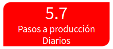
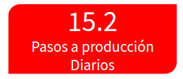

:slug: eventos/rompiendo-el-build/
:subtitle: Nuestros Hábitos SecDevOps
:category: eventos
:description: Ésta página tiene como objetivo informar a los clientes sobre el servicio de conferencias ofrecido por Fluid Attacks. La presente conferencia tiene por objetivo socializar nuestras metodologías de trabajo para implementar un ambiente SecDevOps y ofrecer mejoras al cliente diariamente.
:keywords: Fluid Attacks, Taller, SecDevOps, Seguridad, Software, Tecnología.

= Rompiendo el Build

== 1. Objetivo

El término +SecDevOps+ ha venido sonando mucho en estos últimos años.
Sin embargo, toda persona, todo +Webinar+ que habla del tema,
únicamente se centra en los beneficios que trae,
o en los posibles casos de uso,
sin prestarle mucha atención a la razón por la que probablemente
muchos deciden  ir a estos eventos.

Mínimamente se deduce que quieren saber
*¿ésto cómo se hace?, ¿por dónde empezar?* +
Tal vez nos enseñen cómo se hace una que otra prueba
sobre un ambiente exageradamente simple,
con el que nadie se relacionará respecto a su labor diaria,
por lo que se puede llegar a nuevas preguntas,
*¿esto en verdad funciona?*, *¿cómo puedo aplicarlo en mi empresa?*

Basados en los anterior,
en este espacio buscamos dar respuesta a las preguntas planteadas,
mediante la socialización
de nuestras metodologías y prácticas de trabajo, o costumbres,
que nos permiten implementar una cultura +SecDevOps+
en la ejecución de nuestros proyectos;
desde la administración de la infraestructura,
hasta el desarrollo de la plataforma de orquestación
para la remediación de vulnerabilidades:
[button]#link:../../productos/integrates/[Integrates]#.

Estos hábitos nos permiten aumentar no solo nuestra productividad,
y generar valor diario al cliente,
sino también incrementar la seguridad de nuestros despliegues a producción.
Así, logramos alcanzar, en los últimos seis meses, un promedio de:

[role="tb-alt"]
[frame="none",cols=2,caption=""]
|====
a|[caption=""]
.Promedio de todos los sistemas 2018/01/01 - 2018/06/06

a|[caption=""]
.Sistema con el mayor promedio 2018/01/01 - 2018/06/06

|====

== 2. Contenido

Este *taller* se puede entender
como la puesta en práctica de todo lo visto en
[button]#link:../quemar-el-datacenter/[Quemar el DataCenter]#.
Todo lo que se muestra es *en vivo y en directo*,
no una aplicación ni una infraestructura diseñada como +demo+
específicamente para este taller.
Se ofrece una visión de lo que está ocurriendo dentrás de cámaras:
las herramientas que se utilizan,
los +logs+ que arrojan y que permiten identificar problemas,
incluso el código fuente que define cada uno de los pasos
para el correcto despliegue de nuestros productos,
todo esto orientado a hacer posible la observación de cómo se actualiza
nuestra infraestructura y nuestros productos en *tiempo real*.

Para poder entender cómo ocurre todo lo mencionado anteriormente,
y poder demostrar cómo dar un primer paso para alcanzar esta configuración,
el taller viene acompañado de la explicación de todos los hábitos de trabajo
que nos han permitido llegar hasta este punto y seguir mejorando diariamente.
Estos hábitos tratan temas como:

* Administración del código fuente
al interior del repositorio,
siguiendo una estructura *monorepo*
(adiós al multirepo).

* Mantener un ambiente limpio y pequeño por desarrollador,
incluyendo todos los cambios en la rama principal,
evitando así la acumulación de código
y logrando tener *cero inventario* (dejar atrás el +gitflow+).

* Generar valor diario al cliente
mediante la metodología de *microcambios*
(no una funcionalidad enorme cada 3 semanas o más).

* Migrar y administrar toda la infraestructura como código fuente,
versionado, conviertiéndola en *infraestructura inmutable*
(olvidar consolas de gestión y evitar cambios no autorizados).

* Definir los ambientes de Integración Continua como código fuente,
+*pipeline as code*+, versionado,
de manera que sea más fácil de configurar, modificar,
y realizar todo tipo de pruebas
(evitando ser susceptibles a las limitaciones
que impone una interfaz gráfica para la configuración del +pipeline+).

* Evitar servidores a toda costa,
migrando a servicios en la nube
y alcanzando una estructura *serverless*

* Administración segura de credenciales
a la hora de desplegar una aplicación,
sin quemarlas en el código fuente
y manteniendo los *secretos protegidos*.

* Desplegar *ambientes efímeros*
que permitan probar todas las funcionalidades desarrolladas
antes de hacer el paso a producción
(sin complicar más el proyecto
teniendo ambientes de desarrollo, pruebas, +QA+, ...).

* *Rompimiento del +build+* incluso antes de hacer +commit+ al repositorio,
utilizando +*pre-commit*+ para hacer chequeos sobre el código fuente.

* Ejecutar pruebas sobre el código fuente y sobre el despliegue
que *rompan el +build+* ante el más mínimo error
(no que notifiquen y permitan que éste evolucione):
** Integración multiplataforma.
** Pruebas unitarias.
** Cobertura.
** +Linters+ intolerantes.
** +Security Gates (SAST y DAST)+

* Reducción extrema del tiempo de +build+,
mediante el correcto uso de la *caché*.

* Aprovechar funcionalidades del cliente de control de versionamiento +Git+:
** +Peer Review+.
** +Squashing+.
** +Rebasing+.
** +Rollback+
** +Trigger builds+.

* *Telemetría* accesible a los desarrolladores
(no +logs+ únicamente disponibles para el área de infraestructura).

Cada punto descrito anteriormente
está acompañado con la entrada al interior de los sistemas de +Fluid Attacks+
para ver su implementación y funcionamiento.
Según la necesidad o el interés de los asistentes,
es posible hacer énfasis en los temas que consideren más importantes.

== 3. Experiencia

Este *taller* se ha presentado a profesionales del área de tecnología
y auditoría de empresas como link:https://www.accenture.com/co-es/new-applied-now[+Accenture+], link:https://www.avianca.com/co/es/[+Avianca+],
link:https://www.grupobancolombia.com/wps/portal/personas[+Bancolombia+],
link:https://www.banistmo.com/[+Banitsmo+],
link:https://www.biva.mx/en/web/portal-biva/home[+BIVA+],
link:http://www.cadena.com.co/es/home.aspx[+Cadena+],
link:http://cidenet.com.co/[+Cidenet+], link:http://www.cognox.co[+Cognox+],
link:https://www.f2x.com.co/[+F2X+], link:http://www.gco.com.co/[+GCO+],
link:https://www.kometsales.com/[+Komet Sales+],
link:https://www.payvalida.com/co/es/[+Pay valida+]
y link:http://www.techandsolve.com/[+Tech and Solve+].

== 4. ¿Dónde?

* En *Bogotá* el taller es realizado en: +
Hotel Tryp Embajada, Avenida La Esperanza No. 51 - 40, Salón Calatrava

* En *Medellin* el taller es realizado en: +
Country Club de Ejecutivos, Diagonal 28 No. 16 - 129,
Kilometro 5 vía Las Palmas, Salon Siglo XXI

== 5. Duración

El *taller* tiene una intensidad de *5 horas*
(no es posible reducir su duración).
Comprende la demostración en vivo de nuestras prácticas,
además de un espacio para tomar una media-mañana,
y un almuerzo al mediodía.

== 6. Cuándo

El *taller* está diseñado para ser trabajado desde las *9 A.M.*
hasta las *2 P.M.*.
La fecha se agenda de común acuerdo
entre los asistentes por parte del cliente y +Fluid Attacks+.

== 7. Detalles

. *Inversión*: El espacio y alimentación de este taller
son cubiertos en su totalidad por +Fluid Attacks+.
Los asistentes solo deben comprometerse con el tiempo,
con los costos de sus desplazamientos
y con el parqueadero de sus vehículos
en caso de que las instalaciones copen su capacidad, o así lo indiquen.

. *Material*: Al igual que los demás eventos
ofrecidos por +Fluid Attacks+,
el material se envía a los asistentes
cuando *todos* hayan diligenciado la
[button]#link:http://go.fluidattacks.com/rompiendo-el-build[evaluación de satisfacción]#
*antes de salir* del lugar donde se realizó el taller.

== 8. Público

El *taller* está orientado al personal técnico y gerencial de tecnología.
Ambos perfiles son bienvenidos y su satisfacción es alta indistintamente.
Sin embargo, si su empresa desea disparar cambios
y experimentos dentro de su organización,
es importante considerar la presencia
de personas con poder de decisión.

El *taller* se encuentra diseñado para un público
entre *8 y 12* personas por parte del cliente,
además de las 4 adicionales que puede invitar +Fluid Attacks+.

== 9. Requisitos

[button]#link:../#requisitos[Requisitos]#

== 10. Expositores

* [button]#link:../../personas/jrestrepo/[Juan Restrepo]#
* [button]#link:../../personas/ralvarez/[Rafael Álvarez]#
* [button]#link:../../personas/acuberos/[Andrés Cuberos]#
