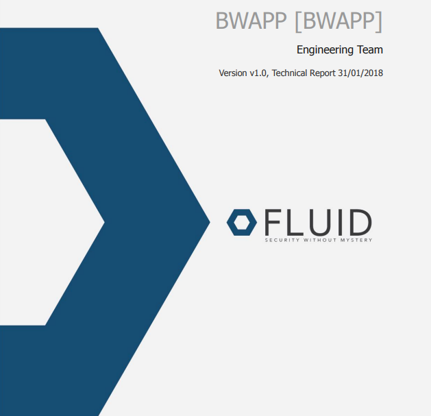

:slug: fluidintegrates/
:description: TODO
:keywords: TODO
:eth: no

= FLUIDIntegrates

Sistema donde confluyen todos los interesados
de la cadena de valor del proyecto.
Busca acercar el desarrollador al tester,
de modo que las vulnerabilidades se solucionen
de manera eficiente y eficaz.
También brinda información en tiempo real a los tomadores de decisiones
del estado de seguridad de los sistemas.

[role="integrates-table"]

[caption="Tabla"]
[cols="2*"]
|===
a|=== Autenticación fácil y rápida
Acceso por medio de una cuenta de Google o Microsoft.
a|image::login.png[Login]

a|image::dashboard.png[Dashboard]
a|=== Menú principal
El dashboard permite a los usuarios tener acceso directo a todos sus proyectos.
También es posible visualizar las eventualidades asociadas a cada uno de los proyectos.

a|=== Visualizar Eventualidades en Tiempo Real
Se puede conocer en tiempo real
los sucesos que impiden el desarrollo del proyecto.
a|image::events.png[Events]

a|image::graphs.png[Graphs]
a|=== Gráficas de Estado del Proyecto
Se puede visualizar el estado actual de los hallazgos que han sido reportados.

a|=== Métricas del proyecto
Permiten realizar un seguimiento del estado actual del proyecto.
Algunas métricas utilizadas son:

* La cantidad de hallazgos.
* El número de vulnerabilidades.
* La criticidad actual del proyecto.
* Vulnerabilidades remediadas.
a|image::metrics.png[Metrics]

a|
a|=== Generar Informes
Se pueden generar informes técnicos y ejecutivos
con la información actual del proyecto.

a|=== Ordenar Hallazgos
Los hallazgos reportados se pueden ordenar de acuerdo a diferentes criterios establecidos.
Algunos de ellos son:

* La edad.
* La severidad.
* El estado.
* El tratamiento.
a|image::sortfinding.png[sortfinding]

a|image::finding.png[Finding]
a|=== Visualizar Hallazgos
Cada hallazgo incluye información acerca del estado actual,
así como su criticidad, tipo y fecha de reporte.

a|=== Descripción del Hallazgo
Se encuentra el detalle técnico que permite entender la naturaleza del hallazgo,
donde se encuentra(n) la(s) vulnerabilidad(es),
requisitos incumplidos,
riesgos y recomendaciones de solución.
a|image::description.png[Description]

a|image::remediated.png[Remediated]
.2+a|=== Remediación/Tratamiento
Los clientes pueden solicitar la revisión^1^ de un hallazgo que ha sido corregido
y documentar^2^ el tratamiento del hallazgo.
a|image::treatment.png[Treatment]

a|=== Severidad del Hallazgo
Se muestra la calificación técnica del hallazgo
basado en el estándar CVSS (Common Vulnerability Scoring System). Esto con el fin de determinar la criticidad del hallazgo.
a|image::severity.png[Severity]

a|image::evidence.gif[Evidence]
a|=== Evidencias del Hallazgo
Se encuentra de forma gráfica la evidencia de la existencia de la vulnerabilidad.
En algunos casos se muestra el proceso de explotación por medio de una animación.

a|=== Exploit del Hallazgo
Se muestra el *script* usado para la explotación de la vulnerabilidad.
Este puede ser reutilizado para validar las correcciones aplicadas.
a|image::exploit.png[Exploit]

a|image::tracking.png[Tracking]
a|=== Línea de Tiempo del Hallazgo
Se encuentra la evolución del hallazgo a lo largo del tiempo,
relacionando las fechas de reporte
y los diferentes ciclos de cierre realizados.

a|=== Comentarios Sobre los Hallazgos
Los usuarios de la cadena de valor del proyecto incluyendo a FLUID,
pueden intercambiar apreciaciones,
dudas u observaciones sobre el hallazgo en cuestión.
a|image::comments.png[Comments]

a|image::chat.png[Chat]
a|=== Chatea con Nosotros
Le permite a los usuarios resolver dudas con respecto a los hallazgos
o de la plataforma en sí.

El equipo de ingeniería contestará en menos de 4 horas en horario 8x5.
También se enviará una notificación al correo electrónico
cuando le den respuesta a las dudas realizadas.
|===
