:slug: personas/
:description: Fluid Attacks es una compañía dedicada al ethical hacking, las pruebas de intrusión y la detección de vulnerabilidades en aplicaciones con más de 18 años de experiencia. La siguiente página tiene como propósito presentar a los miembros que conforman el equipo de trabajo de Fluid Attacks.
:keywords: Fluid Attacks, Equipo, Trabajo, Personas, Perfil, Experiencia
:translate: people/

= Personas

Somos un equipo apasionado por hackear software y encontrar vulnerabilidades,
entusiasta por la tecnología y la seguridad,
que siempre está atacando, probando y desarrollando nuevas aplicaciones,
el cambio hace parte de nuestro ADN.
Conoce a algunos de nuestros integrantes:

[role= "tb-ppl"]
[cols=3]
|===

a|=== Paula Vélez
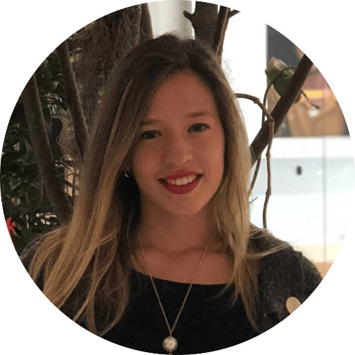
Architecture Team +
link:https://www.linkedin.com/in/pauveelez/[LinkedIn]

a|=== link:ralvarez/[Rafael Alvarez]
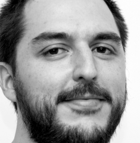
Operations Team +
link:https://www.linkedin.com/in/rafael-alvarez-7b04a2177/[LinkedIn]

a|=== link:jarmas/[Jonathan Armas]
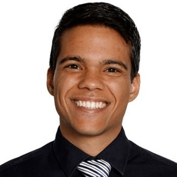
Testing Team +
link:https://www.linkedin.com/in/jonathan-armas[LinkedIn]

a|=== Diana Naspirán
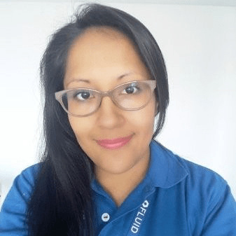
Projects Team +
link:https://www.linkedin.com/in/dianacarolinanaspiran/[LinkedIn]

a|=== Juan Carlos Restrepo

Development Team +
link:https://www.linkedin.com/in/juancrestrepo[LinkedIn]

a|=== Felipe Gómez
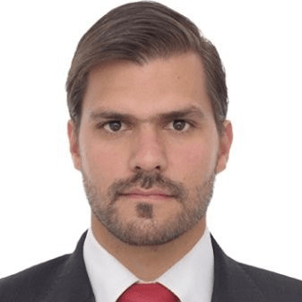
Sales Team +
link:https://www.linkedin.com/in/felipegomezarango[LinkedIn]

a|=== Eliana Cudriz
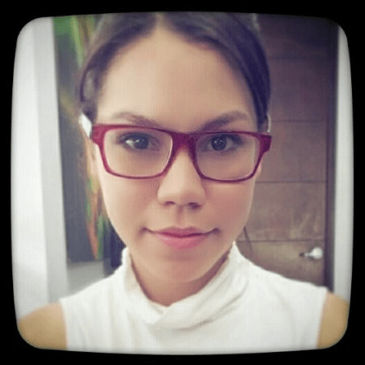
Finnance Team +
link:https://www.linkedin.com/in/eliana-cudriz-53b82210b/[LinkedIn]

a|=== Vladimir Villa
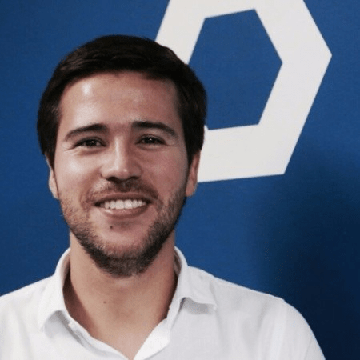
Management Team +
link:https://www.linkedin.com/in/vladimir-villa-g%C3%B3mez-31a23b5/[LinkedIn]

a|=== Mauricio Gómez
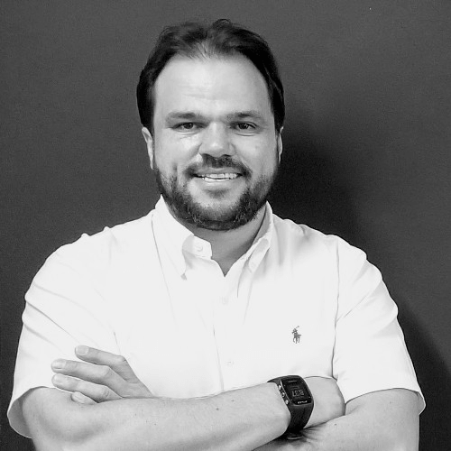
Management Team +
link:https://www.linkedin.com/in/mauricio-gomez-arango-52157b33/[LinkedIn]

a|=== Carolina Carrasco
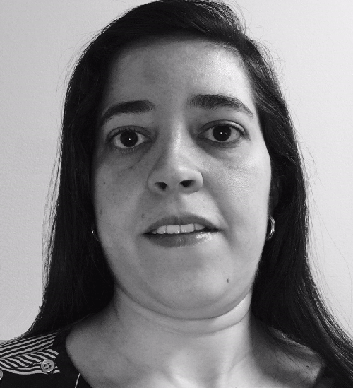
Project Team +
link:https://www.linkedin.com/in/carolina-carrasco-01612767/[LinkedIn]

a|=== Andrés Roldán
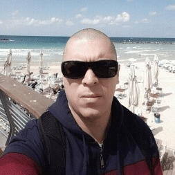
Architecture Team +
link:https://www.linkedin.com/in/andr%C3%A9s-rold%C3%A1n-0602702/[LinkedIn]

a|=== David Cardona
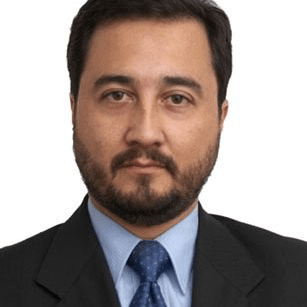
Operations Team +
link:https://www.linkedin.com/in/david-145843146/[LinkedIn]

a|=== Elkin Echeverri
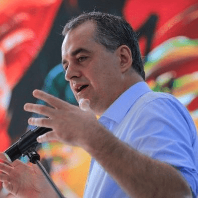
Board Team +
link:https://www.linkedin.com/in/elkin-echeverri-garcia-bb81505/[LinkedIn]

a|=== Juan Carlos Echeverri
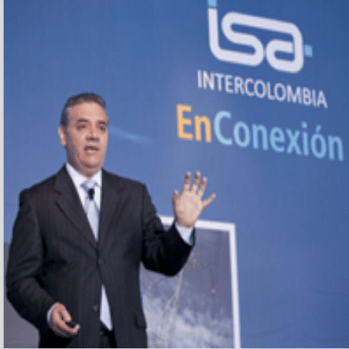
Board Team +
link:https://www.linkedin.com/in/juan-carlos-echeverri-cia-ccsa-29a6829a/[LinkedIn]

a|=== link:john-gomez/[John Gómez]
Board Team +
link:https://www.linkedin.com/in/john-g%C3%B3mez-594a3727/[LinkedIn]

|===
