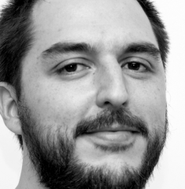

:slug: personas/ralvarez/
:category: personas
:description: FLUID es una compañía dedicada al ethical hacking, las pruebas de intrusión y la detección de vulnerabilidades en aplicaciones con más de 18 años de experiencia. La siguiente página tiene como propósito presentar a los miembros que conforman el equipo de trabajo de FLUID.
:keywords: FLUID, Equipo, Trabajo, Perfil, Rafael, Alvarez.
:translate: people/ralvarez

= Rafael Alvarez

Ingeniero de Sistemas de la Universidad EAFIT, 
becario de +International Max-Planck Research School 
for Computer Science+ de Alemania 
y por el +Center for Development of Advanced Computing+ del Gobierno de la India 
para el Programa de Reducción de Fraude Informático. 
Certificado actualmente como profesional en seguridad de la información +CISSP+. 
Se desempeñó como docente de cátedra 
de las materias de Sistemas Operativos en la Universidad EAFIT 
y Telemática y Sistemas Distribuidos 
en la Universidad Pontificia Bolivariana. 
Fue uno de los primeros Colombianos 
en ser desarrollador oficial del proyecto +Debian+.

Fue miembro del comité técnico 181 de +ICONTEC+ 
donde participó activamente en la homologación a Norma Técnica Colombiana 
de múltiples normas +ISO+ relacionadas con seguridad. 
Es socio fundador de FLUID y parte de su equipo directivo hace 16 años, 
desde donde lideró la implantación 
de la primera certificación +ISO 27001+ en Colombia 
y en la cual participó en su mantenimiento durante 6 años. 
Es inversionista y miembro de junta directiva en +Empiricus+ y +Biva+, 
además miembro independiente de las juntas directivas 
de +Cidenet+ y +Nous Digital+. 
En el pasado participó de las juntas directivas 
de +S-SQUARE+, +Nuva+ y +Al Derecho+. 
Ha sido jurado en +iNNpulsa Colombia+ y +Startup Weekend+, 
es un conferencista frecuente 
en temas relacionados con seguridad y emprendimiento.