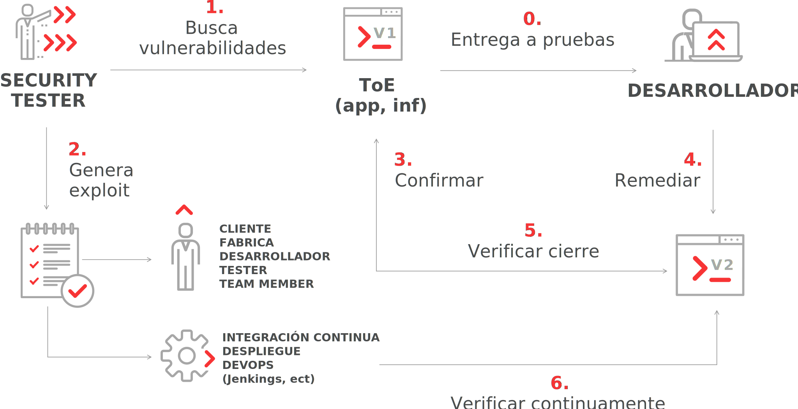
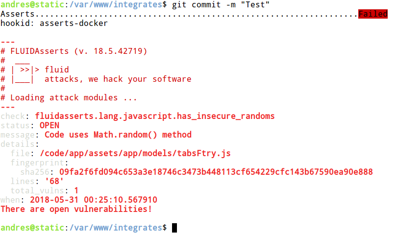

:slug: productos/asserts/
:category: productos
:description: En esta página presentamos nuestros productos más destacados. Asserts es un motor de cierre de hallazgos de seguridad sobre ambientes en ejecución, el cual puede ser implementado en un pipeline de CI para evaluar si los hallazgos de seguridad continúan presentes en la aplicación.
:keywords: Fluid Attacks, Productos, Asserts, Automatización, Hallazgos, Seguridad.
:translate: products/asserts/

= Asserts

== 1. Descripción

+Asserts+ es un motor de automatización de *cierre* de hallazgos de seguridad
sobre ambientes en ejecución +(DAST)+.

.Caso de uso

Ver la [button]#link:https://fluidattacks.com/asserts/[documentación de la API]#

== 2. Instalación

+Asserts+ está alojado +PyPI+,
de modo que puedes instalarlo fácilmente utiizando +pip3+
en un sistema con +Python3+:

[source, bash, linenums]
.asserts installation
----
$ pip3 install -U fluidasserts
----

Para uso normal o interactivo
se debe configurar la variable +FA_STRICT+ a +false+
en sistemas operativos similares a +UNIX+ (como se muestra a continuación):

[source, bash, linenums]
----
$ export FA_STRICT="false"
----

En +Windows+:

[source, bash, linenums]
----
> set FA_STRICT="false"
----

Ahora, estás listo para empezar con las link:https://fluidattacks.com/asserts/usage/[pruebas]
de cierre de vulnerabilidades.

=== Instalación en un contenedor de Docker

Si tienes +Docker+ puedes descargar y ejecutar +Asserts+
dentro de un contenedor, para ello ejecuta el siguiente comando:

[source, bash, linenums]
----
$ docker pull fluidattacks/asserts
----

Y luego entra al contenedor:

[source, bash, linenums]
----
$ docker run -it fluidattacks/asserts sh
/ # asserts
----

[source, bash, linenums]
----
#  ___
# | >>|> fluid
# |___|  attacks, we hack your software
#
# Loading attack modules ...
----

Es necesario asegurarse de realizar el +docker pull+
antes de cada ejecución del contenedor para asegurar que se está
utilizando la versión más reciente de +Asserts+.

Una vez dentro del contenedor es posible ejecutar +Asserts+
desde el +shell+ interactivo de +Python+
o contruir rápidamente un +script+ utilizando +vi+.
Pero sería mucho más útil
montar el directorio donde se localiza el +exploit+ en el contenedor.

[source, bash, linenums]
----
$ docker run -v /home/me/myexploits/:/exploits/ -it fluidattacks/asserts sh
/ # asserts /exploits/open-sqli.py
----

[source, bash, linenums]
----
#  ___
# | >>|> fluid
# |___|  attacks, we hack your software
#
# Loading attack modules ...

check: fluidasserts.proto.http.has_sqli
status: OPEN
message: A bad text was present
details:
  bad_text: Warning.*mysql_.*
  fingerprint:
    banner: "Server: nginx/1.4.1\r\nContent-Type: text/xml\r\nTransfer-Encoding: chunked\r\
      \nConnection: keep-alive\r\nX-Powered-By: PHP/5.3.10-1~lucid+2uwsgi2"
    sha256: 588702eb0b53294654f934d86664956e9739db47c34ffd8d703550cd5fd670a0
  url: http://testphp.vulnweb.com/AJAX/infoartist.php?id=3%27
when: 2018-09-06 08:33:08.781518
----

=== Uso en un pipeline de integración continua (CI)

Si tienes una aplicación suscrita a nuestro link:../../servicios/hacking-continuo/[servicio de hacking continuo]
el cual incluye el uso de +Asserts+,
es posible integrarlo en tu +pipeline+ de +CI+
para garantizar que tu software se construya y entregue
sin vulnerabilidades abiertas.
Entregaremos un contenedor +Docker+ personalizado
con las pruebas específicas necesarias para mantener
la ruptura de +builds+ con el +exploit+.

Para lograr esto, sigue los siguientes pasos:

. Agrega las variables de entorno requeridas: +USER+, +PASS+, +ORG+ y +APP+.
No te preocupes, los valores serán entregados por nosotros!:
+
* +USER:+ Nombre del usuario del registro de nuestro contenedor.
* +PASS:+ La contraseña del usuario.
* +ORG:+ El nombre de la organización.
* +APP:+ El nombre de la aplicación.
+
Por ejemplo, en +Gitlab+, tu entorno podría verse así:
+
image::vars.png[Variables de entorno de Gitlab]

. Agregar un +job+ para ejecutar +Asserts+.
Por ejemplo en +Gitlab+,
agregarías una de estas tres líneas a tu archivo +.gitlab-ci.yml+:
+
.asserts in gitlab
[source, bash, linenums]
----
fluidasserts:
  script:
    - docker login fluid-docker.jfrog.io -u "$USER" -p "$PASS"
    - docker pull fluid-docker.jfrog.io/"$ORG":"$APP"
    - docker run -e ORG="$ORG" -e APP="$APP" -e USER="$USER"
                 -e PASS="$PASS" -e FA_STRICT="true" --rm
                 fluid-docker.jfrog.io/"$ORG":"$APP"
    - docker logout fluid-docker.jfrog.io
----

. A partir de ahora, tu +pipeline+ fallará
si se encuentra alguna vulnerabilidades abierta.
Para evitar romper el +build+ pero aún así ejecutar las pruebas,
cambia el valor de la variable +FA_STRICT+ a +false+.

==== Etapas CI

De acuerdo, estoy dentro.
Pero en qué etapa debería probar mi aplicación con +Asserts+ ?
Existen al menos +3+ buenos momentos para ejecutar una prueba de cierre:

. Luego de desplegar a un ambiente efímero o real.
. Luego de desplegar al ambiente de producción.
. Luego de cada +commit+ !

==== Post-producción

Al igual que antes, iniciamos sesión en el repositorio de artefactos,
actualizamos la imagen personalizada, y la ejecutamos con +Docker+.
Esta vez, sin embargo, montamos el volumen correspondiente al +commit+ actual
+/tmp${CI_PROJECT_DIR}/${CI_COMMIT_REF_NAME}+
al directorio +/code+ en el contenedor,
debido a que el contenedor
ya está configurado para probar el código allí almacenado.
Este +job+ sólo se ejecuta en la rama +master+
y en una de las últimas etapas, llamada +post-deploy+

[source, bash, linenums]
.post-deploy
----
asserts-prod:
  stage: post-deploy
  script:
    - docker login fluid-docker.jfrog.io -u "$USER" -p "$PASS"
    - docker pull fluid-docker.jfrog.io/"$ORG":"$APP"
    - docker run -e ORG="$ORG" -e APP="$APP" -e USER="$USER" -e PASS="$PASS"
                 -e FA_STRICT="true" --rm -e STAGE=post-deploy
                 -v /tmp${CI_PROJECT_DIR}/${CI_COMMIT_REF_NAME}:/code
                 fluid-docker.jfrog.io/"$ORG":"$APP"
    - docker logout fluid-docker.jfrog.io
  retry: 2
  only:
    - master
----

==== Post-efímero

Pero espera! podemos evitar algunos +bugs+
antes de realizar el despliegue a producción.
Si utilizas ambientes efímeros,
también puedes ejecutar pruebas de cierre en éstos:

[source, bash, linenums]
----
Asserts-Review:
  stage: test
  script:
    - docker login fluid-docker.jfrog.io -u "$USER" -p "$PASS"
    - docker pull fluid-docker.jfrog.io/"$ORG":"$APP"
    - docker run -e ORG="$ORG" -e APP="$APP" -e USER="$USER" -e PASS="$PASS"
                 -e FA_STRICT="true" --rm -e STAGE=test
                 -e BRANCH="$CI_COMMIT_REF_SLUG"
                 -v /tmp${CI_PROJECT_DIR}/${CI_COMMIT_SHA}:/code
                 fluid-docker.jfrog.io/"$ORG":"$APP"
    - docker logout fluid-docker.jfrog.io
  retry: 2
  except:
    - master
    - triggers
----

En contraste con el +job+ anterior de post-despliegue,
este corre en las ramas de desarrollo, durante la etapa de pruebas (+test+).
Aparte de esto, todo lo demás sigue siendo igual,
justo como iniciar un ambiente de producción espejo.

==== Pre-commit

Como desarrollador, puede que te estés preguntando:
"¿Por qué debo esperar a que todas las etapas de +CI+ terminen
si solo quiero probar si mi ultimo +commit+ reparó la brecha de seguridad?"
Puedes ejecutar +Asserts+ localmente en tu máquina,
pero a veces algunos pequeños detalles (como las versiones de las dependencias)
pueden causar que la prueba pase exitosamente de forma local
pero falle en la integración continua.

En ese caso, puedes utilizar la versión +Dockerizada+ de +Asserts+
como un +hook+ del +pre-commit+:

[source, bash, linenums]
.pre-commit
----
- id: asserts-docker
  name: Running Asserts on the code
  description: Run Asserts to perform SAST
  entry: -v /path/to/your/code/:/code fluidattacks/asserts:latest /code/asserts.sh
  language: docker_image
----

Esta configuración en particular funciona para la herramienta link:https://pre-commit.com/[+pre-commit+]
pero puede ser adaptada a herramientas similares como link:https://github.com/brigade/overcommit[+overcommit+].
El uso de dichas herramientas es conveniente para el desarrollador,
ya que las pruebas pueden ser ejecutadas rápidamente en sus máquinas
con cada +commit+:

image::pre-commit-ok.png[Pre-commit test passed]

Las mismas pruebas pueden ser ejecutadas en tiempo de +CI+
(por ejemplo, en una entapa de +lint+)
para garantizar que nada se ha "roto"
incluso si el desarrollador olvida ejecutarlo.
Para ello sólo coloca la siguiente línea:

[source, bash, linenums]
----
pre-commit run --all-files
----

En algún lugar de tu +script+ de +CI+.
