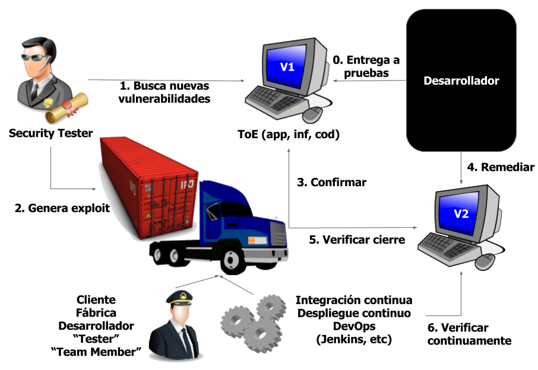
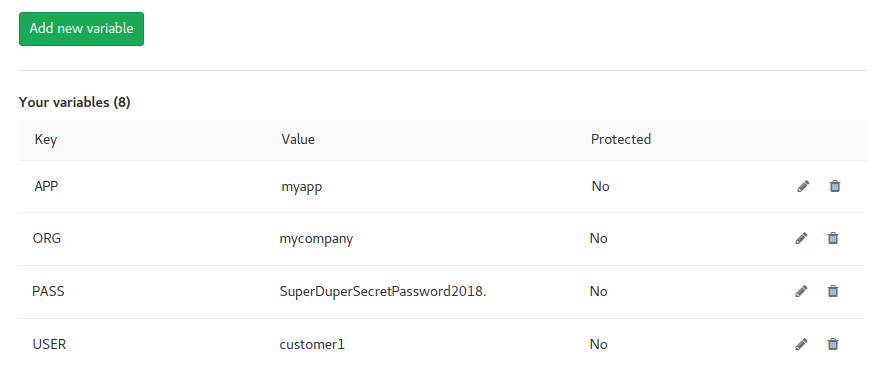

:slug: productos/fluidasserts/
:category: productos
:description: En esta página presentamos nuestros productos más destacados. FLUIDAsserts es un motor de cierre de hallazgos de seguridad sobre ambientes en ejecución, el cual puede ser implementado en un pipeline de CI para evaluar si los hallazgos de seguridad continúan presentes en la aplicación.
:keywords: FLUID, Productos, FLUIDAsserts, Automatización, Hallazgos, Seguridad.

= FLUIDAsserts

== 1. Descripción

+FLUIDAsserts+ es un motor de automatización de *cierre* de hallazgos de seguridad sobre ambientes en ejecución +(DAST)+.

.Flujo de uso

== 2. Ejecución

=== En un PC

==== Linux

Agregar en el archivo +~/.pip/pip.conf+ lo siguiente (¡El usuario y password serán entregados por nosotros!):

----
[global]
index-url = https://<user>:<pass>@fluid.jfrog.io/fluid/api/pypi/python/simple
----

Luego ejecutar:

[source, bash]
----
$ pip install -U fluidasserts
$ export FA_LICENSE_KEY=<ID de licencia>
$ export FA_USER_EMAIL=<Tu correo electrónico>
$ export FA_STRICT="false"

$ python exploit.py
----

==== Windows
[source, bash]
----
> pip install -U fluidasserts
> set FA_LICENSE_KEY=<ID de licencia>
> set FA_USER_EMAIL=<Tu correo electrónico>
> set FA_STRICT="false"

> python exploit.py
----

=== En un pipeline de CI

Si tienes una aplicación suscrita a nuestro servicio de *Pruebas Concurrentes de Seguridad* que incluya el uso de +FLUIDAsserts+, puedes agregarlo a tu pipeline de integración contínua. Para eso, debes seguir los siguientes pasos:

* Agregar las variables de entorno +USER+, +PASS+, +ORG+ y +APP+. No te preocupes, ¡los valores serán entregados por nosotros!:
** +USER+: Nombre de usuario para obtener la imagen de nuestro registro de contenedores
** +PASS+: Contraseña del usuario
** +ORG+: Nombre de la compañía
** +APP+: Nombre de la aplicación

.Ejemplo de variables en un ambiente Gitlab CI

* Agregar un job donde se ejecute el contenedor.

.En Gitlab CI, agregar:
[source, yaml]
----
fluidasserts:
    script:
        - docker login fluid-docker.jfrog.io -u $USER -p $PASS
        - docker pull fluid-docker.jfrog.io/$ORG:$APP
        - docker run -e ORG=$ORG -e APP=$APP -e USER=$USER -e PASS=$PASS -e FA_STRICT="true" fluid-docker.jfrog.io/$ORG:$APP
----

*NOTA:* La variable +FA_STRICT+ debe tener los valores +true+ o +false+. Si es +true+ y alguna de las vulnerabilidades está abierta, ¡el pipeline se romperá!

== 3. Requerimientos

=== Para ejecutar en un PC

* *Sistema operativo*:
** Cualquier SO que soporte Python
* *Red*:
** Acceso al repositorio de artefactos https://fluid.jfrog.io
* *Dependencias de software*:
** +Python 3.6+

=== Para integrar en un pipeline de CI

* *Sistema operativo*:
** Cualquier distribución basada en Linux que soporte +DockerCE+
** Windows Server con +HyperV+ y +Docker+
** MacOS
* *Red*:
** Acceso al registro de contenedores https://fluid-docker.jfrog.io
** Acceso al ambiente de integración donde tengas la aplicación o plataforma
* *Dependencias de software*:
** +DockerCE 17+ ó superior

=== Comunes

* *CPU*: 4 cores @1.8GHz
* *RAM*: 4GiB DDR3 @1.6Ghz
* *Espacio en disco*: 10GiB

== 4. Ejemplos de exploits

=== Inyección SQL

.ex1_open.py: Verificar inyección SQL aun presente
[source, python, linenum]
----
from fluidasserts.service import http

URL = 'http://testphp.vulnweb.com/AJAX/infoartist.php?id=3%27'

http.has_sqli(URL)
----

.Resultado de ejecución ex1_open.py
[source, bash]
----
$ python ex1_open.py
Loading modules...
2018-02-09 11:15:22,273 - FLUIDAsserts - INFO - OPEN: http://testphp.vulnweb.com/AJAX/infoartist.php?id=3%27 Bad text present, Details=Warning.*mysql_.*
----

.ex1_close.py: Verificar inyección SQL ya solucionada
[source, python, linenum]
----
from fluidasserts.service import http

URL = 'http://testphp.vulnweb.com/AJAX/infoartist.php?id=3'

http.has_sqli(URL)
----

.Resultado de ejecución ex1_close.py
[source, bash]
----
$ python ex1_close.py
Loading modules...
2018-02-09 11:16:04,923 - FLUIDAsserts - INFO - CLOSE: http://testphp.vulnweb.com/AJAX/infoartist.php?id=3 Bad text not present
----

=== Cross-Site Scripting

.ex2_open.py: Verificar XSS aun presente
[source, python, linenum]
----
from fluidasserts.service import http

URL = 'http://testphp.vulnweb.com/guestbook.php'
BAD_TEXT = r""

DATA = 'name=test&text=%3Cscript%3Ealert%28%27Hacked+by+FLUID%27%29%3C%2Fscript%3E&submit=add+message'
http.has_xss(URL, BAD_TEXT, data=DATA)
----

.Resultado de ejecución ex2_open.py
[source, bash]
----
$ python ex2_open.py
Loading modules...
2018-02-09 11:17:55,375 - FLUIDAsserts - INFO - OPEN: http://testphp.vulnweb.com/guestbook.php Bad text present, Details=
----

.ex2_close.py: Verificar XSS ya solucionado
[source, python, linenum]
----
from fluidasserts.service import http

URL = 'http://testphp.vulnweb.com/guestbook.php'
BAD_TEXT = r""

DATA = 'name=test&text=Hacked+by+FLUID&submit=add+message'
http.has_xss(URL, BAD_TEXT, data=DATA)
----

.Resultado de ejecución ex2_close.py
[source, bash]
----
$ python ex2_close.py
Loading modules...
2018-02-09 11:19:28,075 - FLUIDAsserts - INFO - CLOSE: http://testphp.vulnweb.com/guestbook.php Bad text not present, Details=
----

=== Rompiendo el pipeline de Integración Continua

.ex1_open.py: Verificar inyección SQL aun presente
[source, python, linenum]
----
from fluidasserts.service import http

URL = 'http://testphp.vulnweb.com/AJAX/infoartist.php?id=3%27'

http.has_sqli(URL)
----

.Resultado de ejecución rompiendo el pipeline
[source, bash]
----
$ export FA_STRICT="false"
$ python ex1_open.py
Loading modules...
2018-02-09 11:19:55,339 - FLUIDAsserts - INFO - OPEN: http://testphp.vulnweb.com/AJAX/infoartist.php?id=3%27 Bad text present, Details=Warning.*mysql_.*
$ echo $?
0
$ export FA_STRICT="true"
$ python ex1_open.py
Loading modules...
2018-02-09 11:20:07,758 - FLUIDAsserts - INFO - OPEN: http://testphp.vulnweb.com/AJAX/infoartist.php?id=3%27 Bad text present, Details=Warning.*mysql_.*
$ echo $?
1
$
----

== Licencia

Escríbenos mediante el siguiente [button]#link:https://fluid.la/#lp-pom-block-11[formulario >>]# para obtener información de licencias.
