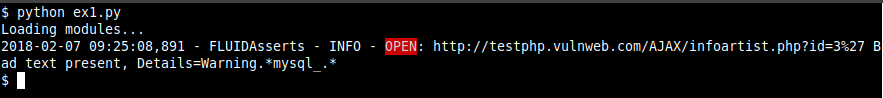
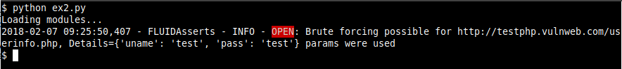
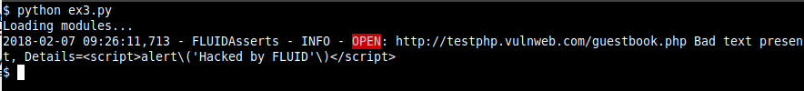
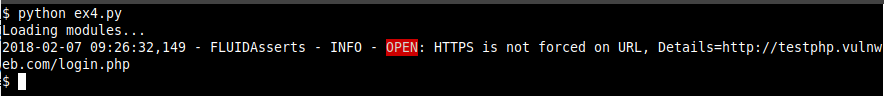

:slug: productos/fluidasserts/
:category: productos
:description: TODO
:keywords: TODO

= FLUIDAsserts

== 1. Descripción

+FLUIDAsserts+ es un motor de automatización de *cierre* de hallazgos de seguridad sobre ambientes en ejecución +(DAST)+.

.Flujo de uso
image::fluidassertses.png[FLUIDAsserts]

== 2. Ejecución

=== En un PC

==== Linux

Agregar en el archivo +~/.pip/pip.conf+ lo siguiente (¡El usuario y password serán entregados por nosotros!):

----
[global]
index-url = https://<user>:<pass>@fluid.jfrog.io/fluid/api/pypi/python/simple
----

Luego ejecutar:

[source, bash]
----
$ pip install -U fluidasserts
$ export FA_LICENSE_KEY=<ID de licencia>
$ export FA_USER_EMAIL=<Tu correo electrónico>
$ export FA_STRICT="false"

$ python exploit.py
----

==== Windows
[source, bash]
----
> pip install -U fluidasserts
> set FA_LICENSE_KEY=<ID de licencia>
> set FA_USER_EMAIL=<Tu correo electrónico>
> set FA_STRICT="false"

> python exploit.py
----

=== En un pipeline de CI

Si tienes una aplicación suscrita a nuestro servicio de *Pruebas Concurrentes de Seguridad* que incluya el uso de +FLUIDAsserts+, puedes agregarlo a tu pipeline de integración contínua. Para eso, debes seguir los siguientes pasos:

* Agregar las variables de entorno +USER+, +PASS+, +ORG+ y +APP+. No te preocupes, ¡los valores serán entregados por nosotros!:
** +USER+: Nombre de usuario para obtener la imagen de nuestro registro de contenedores
** +PASS+: Contraseña del usuario
** +ORG+: Nombre de la compañía
** +APP+: Nombre de la aplicación

.Ejemplo de variables en un ambiente Gitlab CI
image::vars.png[Variables de entorno]

* Agregar un job donde se ejecute el contenedor.

.En Gitlab CI, agregar:
[source, yaml]
----
fluidasserts:
    script:
        - docker login fluid-docker.jfrog.io -u $USER -p $PASS
        - docker pull fluid-docker.jfrog.io/$ORG:$APP
        - docker run -e ORG=$ORG -e APP=$APP -e USER=$USER -e PASS=$PASS -e FA_STRICT="true" fluid-docker.jfrog.io/$ORG:$APP
----

*NOTA:* La variable +FA_STRICT+ debe tener los valores +true+ o +false+. Si es +true+ y alguna de las vulnerabilidades está abierta, ¡el pipeline se romperá!

== 3. Requerimientos

=== Para ejecutar en un PC

* *Sistema operativo*:
** Cualquier SO que soporte Python
* *Red*:
** Acceso al repositorio de artefactos https://fluid.jfrog.io
* *Dependencias de software*:
** +Python 3.6+

=== Para integrar en un pipeline de CI

* *Sistema operativo*:
** Cualquier distribución basada en Linux que soporte +DockerCE+
** Windows Server con +HyperV+ y +Docker+
** MacOS
* *Red*:
** Acceso al registro de contenedores https://fluid-docker.jfrog.io
** Acceso al ambiente de integración donde tengas la aplicación o plataforma
* *Dependencias de software*:
** +DockerCE 17+ ó superior

=== Comunes

* *CPU*: 4 cores @1.8GHz
* *RAM*: 4GiB DDR3 @1.6Ghz
* *Espacio en disco*: 10GiB

== 4. Ejemplos de exploits

.ex1.py: Verificar inyección SQL
[source, python, linenum]
----
"""
Test a SQL Injection vulnerability
"""

from fluidasserts.service import http

URL = 'http://testphp.vulnweb.com/AJAX/infoartist.php?id=3%27'

http.has_sqli(URL)
----

.Resultado de ejecucion ex1.py

.ex2.py: Verificar fuerza bruta en formulario de login
[source, python, linenum]
----
"""
Check if it's possible to bruteforce a login form
"""

from fluidasserts.service import http

URL = 'http://testphp.vulnweb.com/userinfo.php'
DATA = 'uname=foo&pass=bar'
OK_TEXT = 'Smith'
USER_LIST = ['admin', 'test']
PASS_LIST = ['password', 'test', '123']

http.can_brute_force(URL, OK_TEXT, 'uname', 'pass', USER_LIST, PASS_LIST, data=DATA)
----

.Resultado de ejecucion ex2.py

.ex3.py: Verificar XSS
[source, python, linenum]
----
"""
Test a XSS vulnerability
"""

from fluidasserts.service import http

URL = 'http://testphp.vulnweb.com/guestbook.php'
BAD_TEXT = r""

DATA = 'name=test&text=%3Cscript%3Ealert%28%27Hacked+by+FLUID%27%29%3C%2Fscript%3E&submit=add+message'
http.has_xss(URL, BAD_TEXT, data=DATA)
----

.Resultado de ejecucion ex3.py

.ex4.py: Verificar si un formulario de login usa HTTPS
[source, python, linenum]
----
"""
Test if https is enforced on a login form
"""

from fluidasserts.service import http

URL = 'http://testphp.vulnweb.com/login.php'

http.is_not_https_required(URL)
----

.Resultado de ejecucion ex4.py

== Licencia

Escríbenos a relations@fluid.la para obtener información de licencias.
