:slug: productos/fluidintegrates/
:category: productos
:description: TODO
:keywords: TODO

= FLUIDIntegrates

Sistema donde confluyen todos los interesados
(hacker, desarrolladores, gerentes de proyectos, auditores, gerentes de producto, etc),
de la cadena de valor del proyecto.
Busca acercar el desarrollador al hacker,
de modo que las vulnerabilidades se solucionen
de manera eficiente y eficaz.
También brinda información en tiempo real a los tomadores de decisiones
del estado de seguridad de los sistemas.

[role="integrates"]
=
[role="int-row"]
==
[role="int-text"]
===
.Autenticación fácil y rápida
No se guardan las credenciales del usuario.
La autenticación es federada permitiendo así, la autenticación con usuarios corporativos.
===

[role="int-img"]
===
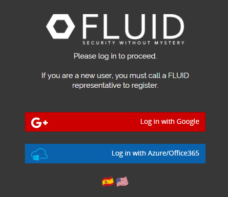
===
==

[role="int-row"]
==
[role="int-text"]
===
.Menú principal
El dashboard permite a los usuarios tener acceso directo a todos sus proyectos.
También es posible visualizar las eventualidades asociadas a cada uno de los proyectos.
===

[role="int-img"]
===
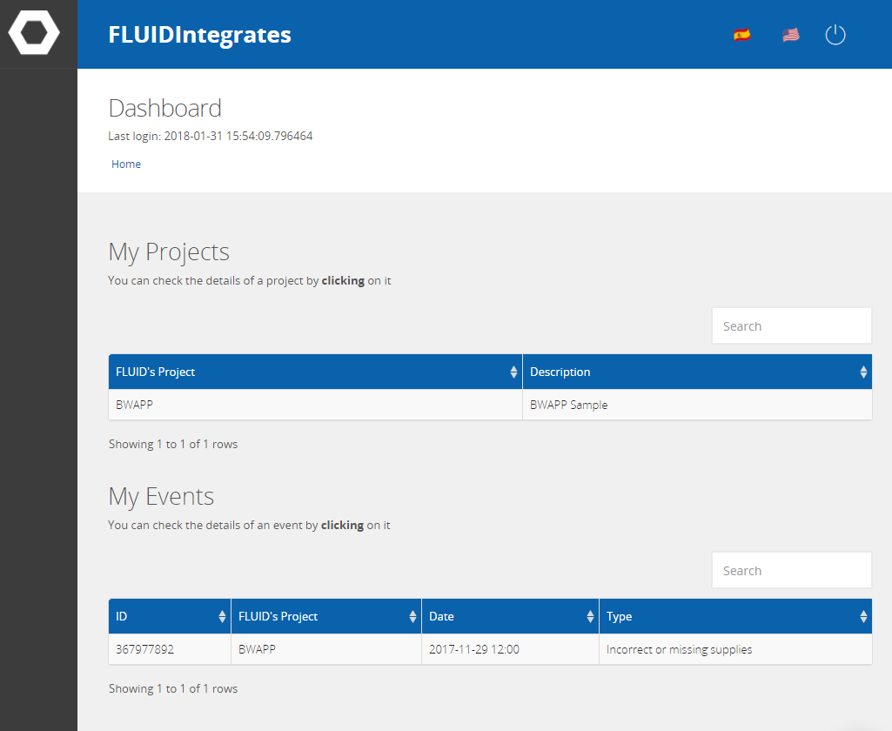
===
==

[role="int-row"]
==
[role="int-text"]
===
.Visualizar Eventualidades en Tiempo Real
Se puede conocer en tiempo real
los sucesos que impiden el desarrollo del proyecto.
===

[role="int-img"]
===
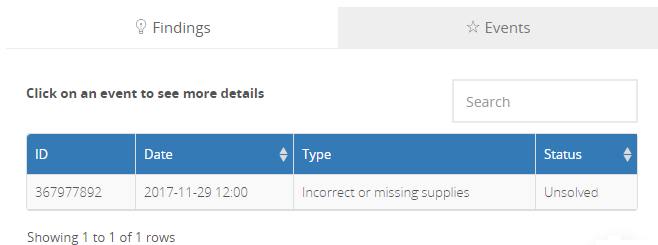
===
==

[role="int-row"]
==
[role="int-text"]
===
.Gráficas de Estado del Proyecto
Se puede visualizar el estado actual de las vulnerabilidades que han sido reportadas.
Permitiendo así:

* Priorizar las vulnerabilidades por su explotabilidad real confirmada.
* Indicar cuáles son vulnerabilidades y cuántos son problemas de tipo higiene de seguridad.
* Saber cuántas vulnerabilidades han sido solucionados y cuántas aun no.
===

[role="int-img"]
===
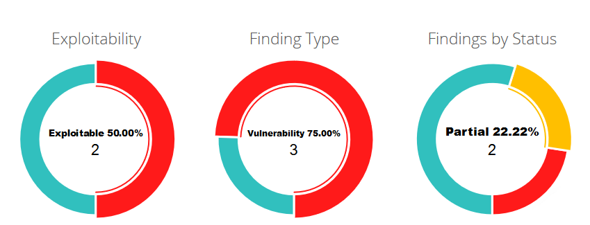
===
==

[role="int-row"]
==
[role="int-text"]
===
.Métricas del proyecto
Permiten realizar un seguimiento del estado actual del proyecto.
Algunas métricas utilizadas son:

* La cantidad de vulnerabilidades encontradas.
* La criticidad actual del proyecto.
* Vulnerabilidades remediadas.
===

[role="int-img"]
===
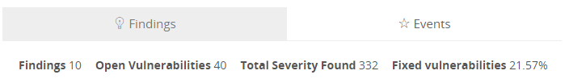
===
==

[role="int-row"]
==
[role="int-text"]
===
.Generar Informes Técnicos
En este documento se encuentra la información detallada de cada vulnerabilidad.
Es de gran utilidad para el personal técnico a la hora de darle una solución a las fallas de seguridad reportadas.

===

[role="int-img"]
===
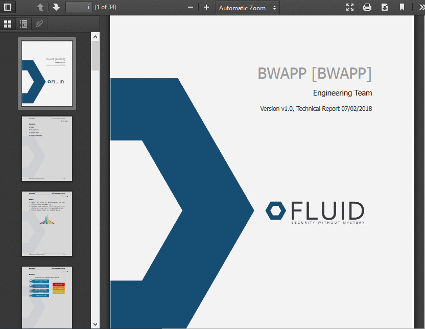
===
==

[role="int-row"]
==
[role="int-text"]
===
.Generar Informes Ejecutivos
En este documento se encuentra la información resumida y organizada.
De tal manera que pueda ser de utilidad para todas las personas en la cadena de valor del proyecto.
===

[role="int-img"]
===
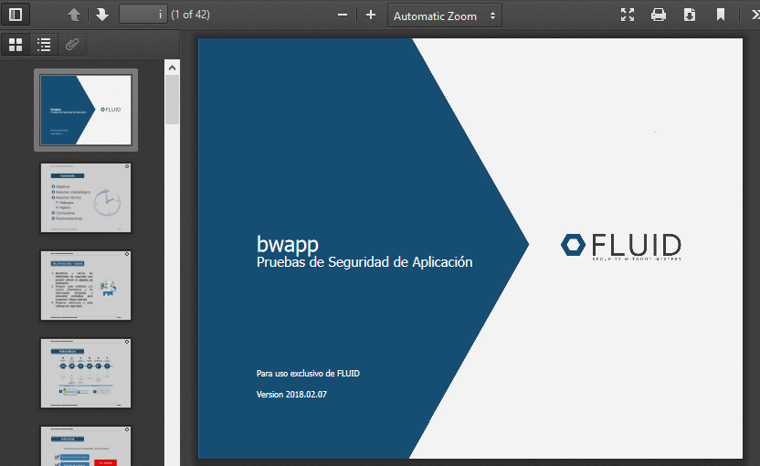
===
==

[role="int-row"]
==
[role="int-text"]
===
.Priorizar Remediación
Las vulnerabilidades se pueden priorizar de acuerdo a diferentes parámetros.
Esto con el fin de conocer cuáles necesitan una solución inmediata.
Algunos parámetros son:

* *La edad:* Tiempo que transcurre entre el reporte de la vulnerabilidad y la solución aplicada por el cliente.
* *La severidad:* Criticidad de acuerdo al estándar CVSS.
* *El estado:* Abierto, cerrado o parcialmente cerrado.
* *El tratamiento:* Asumido, pendiente o remediar.
===

[role="int-img"]
===
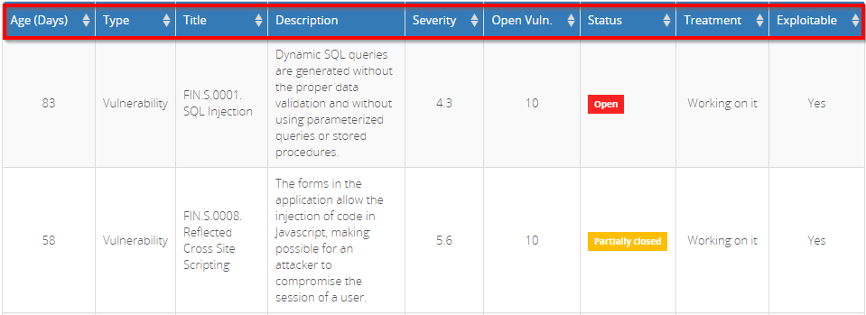
===
==

[role="int-row"]
==
[role="int-text"]
===
.Visualizar Vulnerabilidades
Cada vulnerabilidad incluye información acerca del estado actual,
así como su criticidad, tipo y fecha de reporte.
===

[role="int-img"]
===
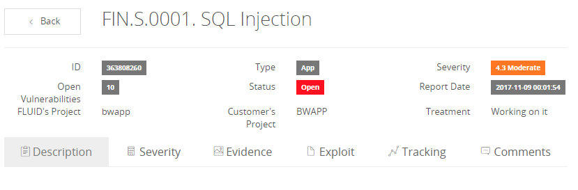
===
==

[role="int-row"]
==
[role="int-text"]
===
.Descripción de la Vulnerabilidad
Se encuentra el detalle técnico que permite entender la naturaleza de la vulnerabilidad,
donde se encuentran los problemas de seguridad,
requisitos incumplidos,
riesgos y recomendaciones de solución.
===

[role="int-img"]
===
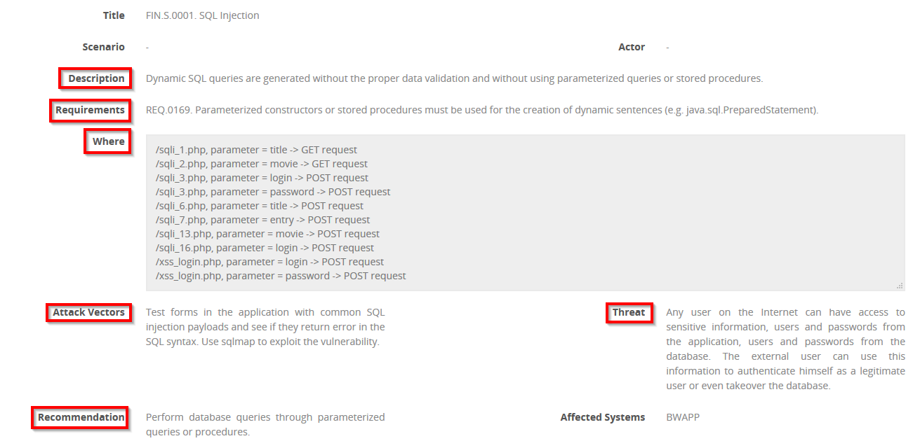
===
==

[role="int-row"]
==
[role="int-text"]
===
.Remediación / Tratamiento
Los clientes pueden solicitar la revisión^1^ de una vulnerabilidad que ha sido corregida
y documentar^2^ el tratamiento de esta.
Para la documentación el cliente tiene las siguientes opciones:

* *Asumido:* El cliente asume el riesgo que implica no solucionar el problema de seguridad.
* *Pendiente:* El cliente aun no tiene claro si asumirá o remediará la vulnerabilidad.
* *Remediar:* El cliente solucionará el problema de seguridad.
===

[role="int-img"]
===
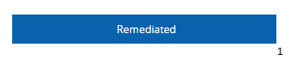

image::tratamiento.png[Tratamiento]
===
==

[role="int-row"]
==
[role="int-text"]
===
.Severidad de la Vulnerabilidad
Se muestra la calificación técnica de la vulnerabilidad
basado en el estándar CVSS (Common Vulnerability Scoring System).
Esto con el fin de determinar la criticidad de la vulnerabilidad.
===

[role="int-img"]
===
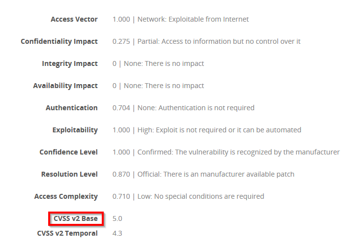
===
==

[role="int-row"]
==
[role="int-text"]
===
.Evidencias de la Vulnerabilidad
Se encuentra de forma gráfica la evidencia de la existencia de la vulnerabilidad.
En algunos casos se muestra el proceso de explotación por medio de una animación.
===

[role="int-img"]
===
image::evidencia-vulnerabilidad.gif[Evidencia De La Vulnerabilidad]
===
==

[role="int-row"]
==
[role="int-text"]
===
.Exploit de la Vulnerabilidad
Se muestra el *script* usado para la explotación de la vulnerabilidad.
Este puede ser reutilizado para validar las correcciones aplicadas.

Si el usuario cuenta con una licencia del producto link:../fluidasserts/[FLUIDAsserts],
podrá reproducir la vulnerabilidad.
===

[role="int-img"]
===
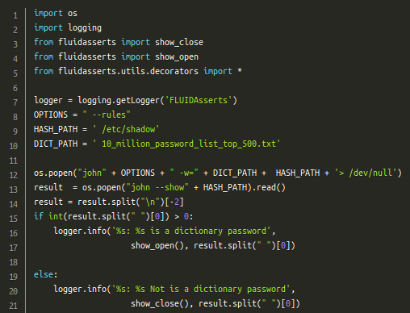
===
==

[role="int-row"]
==
[role="int-text"]
===
.Línea de Tiempo de la Vulnerabilidad
Se encuentra la evolución de la vulnerabilidad a lo largo del tiempo,
relacionando las fechas de reporte
y los diferentes ciclos de cierre realizados.
Esta sección es de gran utilidad para conocer la efectividad de los ciclos de cierre realizados.
===

[role="int-img"]
===
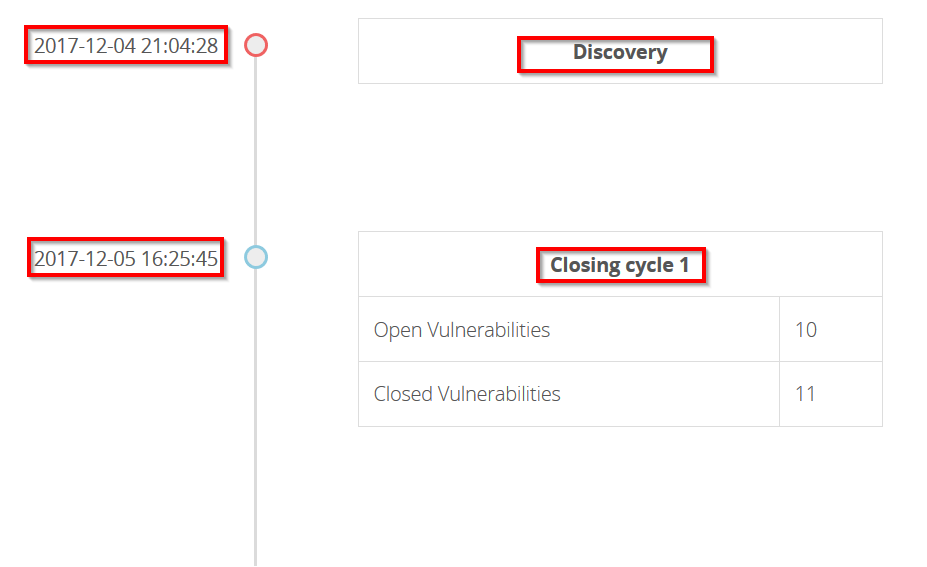
===
==

[role="int-row"]
==
[role="int-text"]
===
.Aclaraciones de Dudas Sobre las Vulnerabilidades
Los usuarios de la cadena de valor del proyecto incluyendo a FLUID,
pueden intercambiar apreciaciones,
dudas u observaciones sobre la vulnerabilidad en cuestión.
Esta sección es de gran utilidad para que los desarrolladores entiendan dónde se encuentra el problema,
y así puedan darle una solución.
===

[role="int-img"]
===
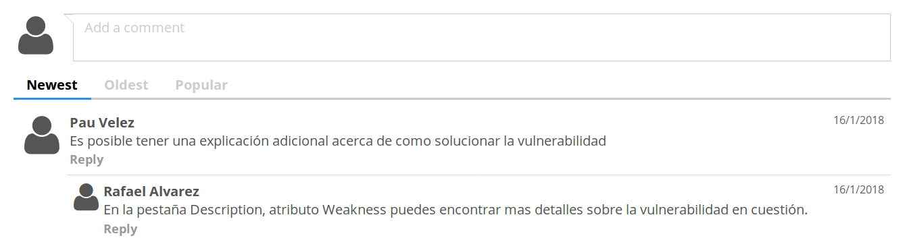
===
==

[role="int-row"]
==
[role="int-text"]
===
.Chatea con Nosotros
Le permite a los usuarios resolver dudas con respecto a las vulnerabilidades
o de la plataforma en sí.

El equipo de ingeniería contestará en menos de 4 horas en horario 8x5.
También se enviará una notificación al correo electrónico
cuando le den respuesta a las dudas realizadas.
===

[role="int-img"]
===
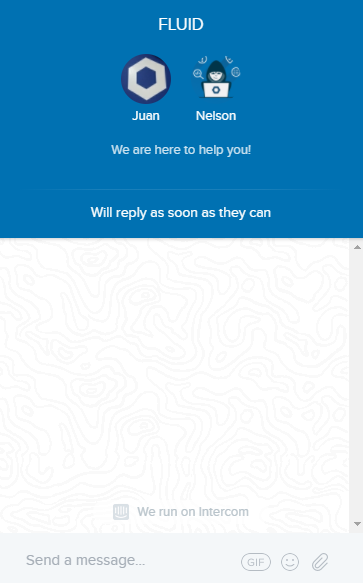
===
==

[role="int-row"]
==
[role="int-text"]
===
.Notificaciones Por Correo
Se envían notificaciones vía correo electrónico a los usuarios de la cadena de valor del proyecto.
Algunas de ellas son:

* Cada semana se informa sobre las nuevas vulnerabilidades reportadas.
* Cuando un usuario realiza un comentario sobre una vulnerabilidad.
* Cuando un usuario informa que ya fue remediada una vulnerabilidad.
* Cuando se verifica la remediación de una vulnerabilidad.
===

[role="int-img"]
===
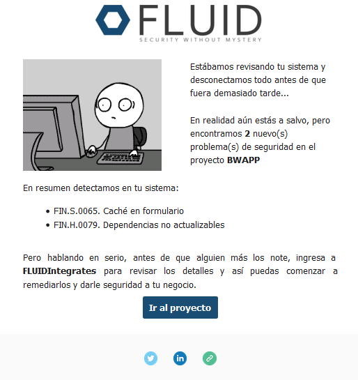
===
==

[role="int-row"]
==
[role="int-text"]
===
.Base De Conocimiento
Los usuarios tienen acceso a la base de conocimiento (link:../../kb/[KB]) de FLUID.
En esta se encuentran ejemplos de cómo cumplir con los requisitos de seguridad
que son evaluados en las pruebas realizadas.
===

[role="int-img"]
===
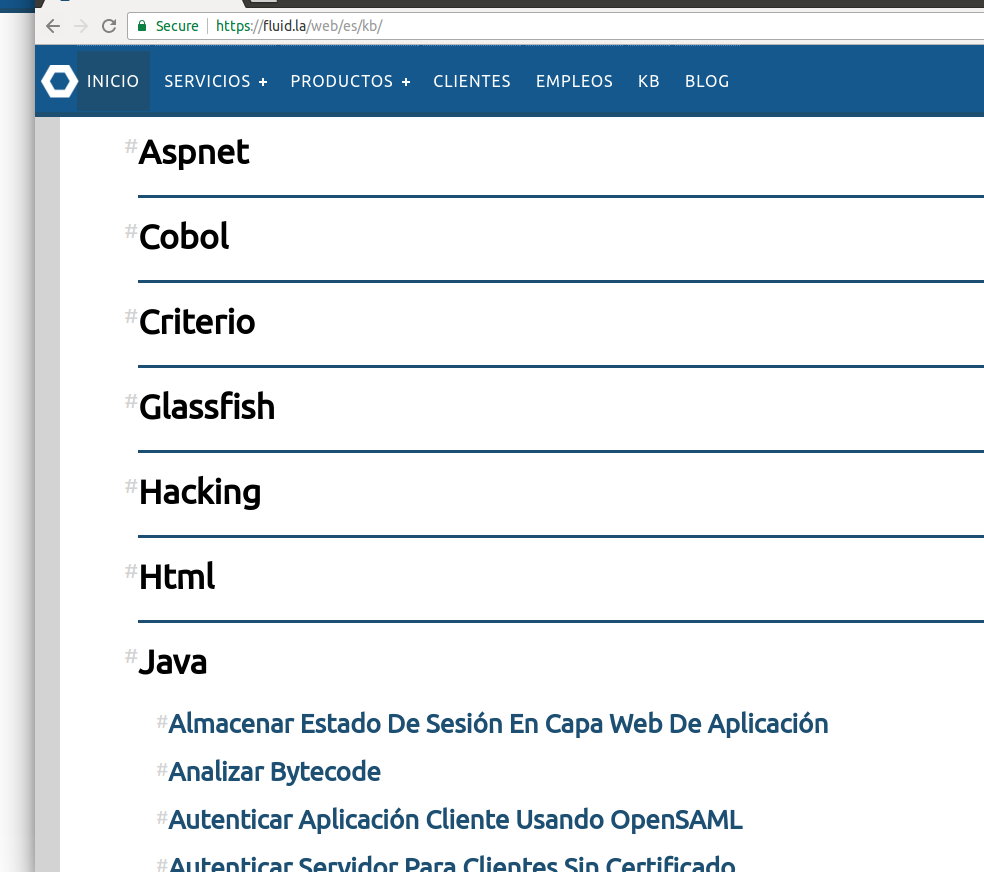
===
==
=
