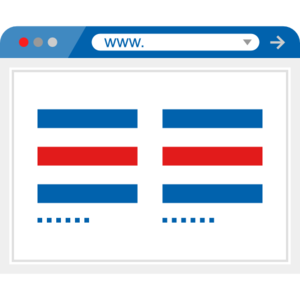
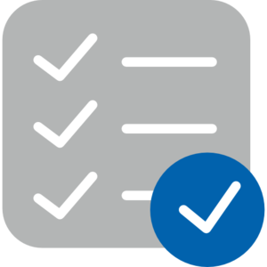
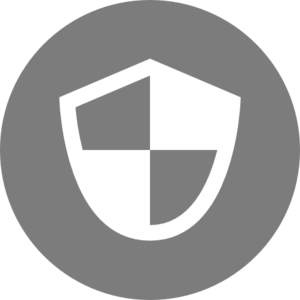
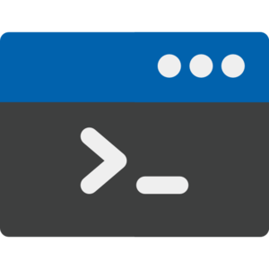

:slug: productos/
:description: Fluid Attacks tiene a su disposición una serie de productos que tienen como finalidad ayudar al cliente durante el proceso de Ethical Hacking, mejorar su experiencia y acercar al cliente con el hacker. Nuestros productos más destacados son Integrates, Asserts y Commands.
:keywords: Fluid Attacks, Productos, Ethical Hacking, Software, Hallazgos, Seguridad.
:translate: products/
:caption:

= Productos

[role="tb-alt"]
[cols=3, frame="topbot"]
|====

2+a|== link:integrates/[Integrates]

Sistema donde confluyen todos los interesados en el proyecto.
Busca acercar al +hacker+ y al desarrollador,
además de ofrecer la habilidad para remediar vulnerabilidades reportadas
de una manera efectiva.
a|.Ícono hecho por link:https://www.alfredocreates.com/[Alfredo Hernandez] de link:https://www.flaticon.com[Flaticon]

a|.Ícono hecho por link:https://www.freepik.com/[Freepik] de link:https://www.flaticon.com[Flaticon]

2+a|== link:asserts/[Asserts]

Motor para automatizar el cierre de hallazgos de seguridad
sobre ambientes en ejecución.
Puede ser ejecutado en computadores con Sistemas Operativos +Windows+ o +Linux+,
y también puede incluirse en tu ambiente de +Integración Continua+.

2+a|== link:rules/[Rules]

Conjunto de requisitos usados para parametrizar un +pen test+.
Estas reglas determinan qué tan riguroso es realmente un +pen test+,
definiendo qué es lo que se va a probar,
y qué es lo que será considerado como una vulnerabilidad.
a|.Ícono hecho por link:https://smashicons.com/[Smashicons] de link:https://www.flaticon.com[Flaticon]

a|.Ícono hecho por link:https://smashicons.com/[Smashicons] de link:https://www.flaticon.com[Flaticon]

2+a|== link:defends/[Defends]

Conjunto de procedimientos detallados que permiten el desarrollo
de aplicaciones seguras, la configuración segura de componentes tecnológicos,
y la remediación de vulnerabilidades encontradas
y reportadas por nosostros.

2+a|== link:commands/[Commands]

+Ciberarma+ desarrollada completamente por nosotros para una penetración
más profunda en estaciones de trabajo y servidores críticos durante
un +pen test+.
a|.Ícono hecho por link:https://www.freepik.com/[Freepik] de link:https://www.flaticon.com[Flaticon]

|====
