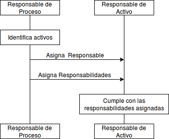

:slug: rules/004/
:category: rules
:description: En el presente documento se detallan los requerimientos de seguridad relacionados a los activos de información de la empresa. Todos los activos de información deben estar asociados a un responsable, de esta manera se garantiza la ejecución de controles de seguridad para protegerlo.
:keywords: Requerimiento, Seguridad, Activos, Información, Asignación, Responsable.
:rules: yes

= REQ.004 Activo de información asociado a responsable

== Requisito

Cada activo de información debe estar asociado con un responsable del activo.

== Descripción

Una vez la organización ha realizado
la identificación de cada uno de los activos,
se le debe asignar un responsable o responsables
determinadas responsabilidades asociadas
a todos los activos inventariados.
La asignación de responsabilidad garantiza la creación
y ejecución de controles de seguridad
así como la mejora en los procesos de identificación,
mitigación y/o remediación de riesgos de seguridad.
Los activos críticos de información incluyen, pero no se limitan a:
Información financiera, patentes y propiedad intelectual,
detalles de los empleados o información
confiada a la empresa por terceras partes.

== Implementación

La asignación del responsable del activo de información
es parte del proceso de gestión de activos de la organización.
El responsable del activo
es el encargado de garantizar la seguridad del activo de información.

Cada uno de los responsables debe tener asociadas
unas responsabilidades sobre el activo,
las cuales deben incluir como mínimo:

. Clasificar y valorar el activo de información.

. Establecer los requisitos de seguridad y buenas prácticas
que se deben garantizar
para evitar los posibles riesgos de seguridad
que puedan comprometer la integridad de dicho activo.

. Establecer, gestionar y aprobar
los accesos permitidos por los usuarios del activo.

. Garantizar que los requisitos de seguridad
se cumplan para cada uno de los activos de información.

. Identificar y gestionar los posibles riesgos
que pueden afectar o comprometer la integridad de activos de información.

== Diagrama

== Soluciones

* ISO 27005 - Gestión de riesgos para un SGSI con ISO 27005.

* Consultoría - Establecer el Inventario de Activos de Información.

* ISO 27003 - ​Guía ISO 27003.

* Consultoría - Determinar el Propietario de un Activo de Información​.

* Consultoría - Responder a cuestionario inventario activos de información.

== Ataques

Un usuario empleado o anónimo
ejecuta acciones las cuales van
en contravía de la seguridad
de cualquier activo de información de la organización.
El incidente no es gestionado
debido a que los activos afectados
no cuentan con un responsable asignado.

== Atributos

* Capa: Capa de Recursos.

* Activo: Activos de Información.

* Alcance: Adherencia.

* Fase: Análisis.

* Tipo de Control: Procedimiento.

== Referencias

. [[r1]] link:http://www.pmg-ssi.com/2015/05/como-clasificar-los-activos-de-seguridad-en-un-sgsi/[SGSI - ¿Cómo clasificar los activos de seguridad en un SGSI?].

. [[r2]] link:https://www.iso.org/isoiec-27001-information-security.html[Serie de normas ISO/IEC 27000].

. [[r3]] link:https://www.law.cornell.edu/cfr/text/45/164.308[`HIPAA Security Rules` 164.308(a)(2):]
Responsable de seguridad asignado:
Identificar el oficial responsable del desarrollo e implementación
de las políticas y procedimientos de seguridad requeridos
por esta parte de la organización.

. [[r4]] link:https://www.law.cornell.edu/cfr/text/45/164.310[`HIPAA Security Rules` 164.310(d)(2)(iii):]
Contabilidad: Mantener un registro de movimientos de hardware
y medios electrónicos y las personas responsables de ellos.

. [[r5]] link:https://www.bsimm.com/framework/governance/software-security-metrics-strategy.html[`BSSIM9` SM1.1:]
Publicar los procesos (roles, responsabilidades, planes),
permitiendo que evolucionen según se requiera.
