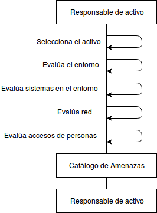

:slug: rules/006/
:category: rules
:description: En el presente documento se detallan los requerimientos de seguridad relacionados a los activos de información de la empresa. Se deben identificar y documentar las amenazas relacionadas a cada activo de información para tomar decisiones sobre los riesgos de seguridad de los activos.
:keywords: Requerimiento, Seguridad, Activos, Información, Documentación, Amenazas.
:rules: yes

= REQ.006 Identificar amenazas asociadas a activo

== Requisito

Las amenazas asociadas a un activo de información
deben estar identificadas y documentadas.

== Descripción

La organización debe modelar una estructura o representación
que incluya toda la información que afecta la integridad,
disponibilidad y confidencialidad de los activos de la compañía.
Una vez capturada, organizada y procesada esta información,
la organización está en la potestad
de tomar decisiones informadas
sobre los riesgos de seguridad de los activos.

== Implementación

. Una amenaza es un factor externo al activo
que puede aprovechar una debilidad de éste
y así producir un daño.
Cuando las amenazas se conocen
se puede monitorear su comportamiento
para establecer una respuesta inmediata
en caso de intensificar su actividad.
De la misma forma es posible identificar
posibles debilidades o vulnerabilidades
que puedan ser aprovechadas por la amenaza
y establecer controles para reducirla.

. Se suele dividir las amenazas existentes según su ámbito de acción:

* Desastre del entorno (Seguridad Física).
* Amenazas del sistema (Seguridad Lógica).
* Amenazas en la red (Comunicaciones).
* Amenazas de personas (Personal interno y externo).

La identificación de amenazas se realiza
para cada uno de los activos identificados.
La organización puede identificar inicialmente las amenazas
evaluando los incidentes sucedidos históricamente,
determinando cuáles fueron las causas externas
que se establecieron y pusieron en riesgo la integridad del activo.
Posterior a la identificación de las causas,
es altamente recomendable documentarlas en un catálogo de amenazas.

Se recomienda que las amenazas se clasifiquen para tipos de activos
de forma que el catálogo pueda ser usado fácilmente
para la identificación de riesgos.

Es importante que el catálogo de amenazas
se encuentre actualizado de forma que
se puedan tener en cuenta en la evaluación de riesgos.

== Diagrama

== Soluciones

* Consultoría - Aprender Teoría Básica de Riesgos
* ISO 27005 - Gestión de riesgos para un SGSI con ISO 27005

== Ataques

Un usuario empleado o anónimo
ejecuta acciones las cuales van
en contravía de la seguridad
de cualquier activo de la organización.
Debido a esta situación
los controles definidos para su protección
no son efectivos puesto que la amenaza que representa
no fue previamente identificada.

== Atributos

* Capa: Capa de Recursos.
* Activo: Activos de Información.
* Alcance: Adherencia.
* Fase: Análisis.
* Tipo de Control: Procedimiento.

== Referencias

. [[r1]] link:https://www.iso.org/isoiec-27001-information-security.html[Serie de normas ISO/IEC 27000].
. [[r2]] link:https://www.microsoft.com/en-us/sdl/adopt/threatmodeling.aspx[Microsoft: Modelado de Amenazas].
. [[r3]] link:https://www.law.cornell.edu/cfr/text/45/164.308[`HIPAA Security Rules` 164.308(a)(1)(ii)(A):]
Análisis de riesgos: Llevar a cabo una evaluación precisa y completa
de los riesgos y vulnerabilidades potenciales a la confidencialidad, integridad
y disponibilidad de la información sensible protegida electrónicamente
almacenada en la organización.
