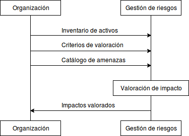

:slug: rules/010/
:category: rules
:description: En el presente documento se detallan los requerimientos de seguridad relacionados a los activos de información de la empresa. Las amenazas identificadas deben ser medidas en términos de su impacto, con el fin de mitigar las amenazas que afecten en mayor medida a la organización.
:keywords: Requerimiento, Seguridad, Activos, Información, Amenazas, Impacto.
:rules: yes

= REQ.010 Amenazas medidas en términos de impacto

== Nombre

Cada amenaza sobre un activo de información
debe ser medida en términos de su impacto

== Descripción

Luego de identificar la posibles amenazas
y establecer un catálogo de amenazas
para todos los activos de la organización,
es necesario estudiar cuáles son las amenazas
que puedan aprovechar posibles vulnerabilidades
en el activo de información y afectarlo negativamente.
Para ello se debe determinar el impacto
que causaría en la confidencialidad,
integridad y disponibilidad del activo
y la forma en la cual afectaría
el funcionamiento normal de la organización.

== Implementación

. Determinar el impacto que causaría una determinada amenaza,
es una tarea compleja, debido a que los activos de información
corresponden a bienes intangibles.
Las organizaciones pueden optar inicialmente
por una valoración cualitativa,
donde se definen unos criterios de valoración del impacto
y bajo estos criterios se valora el impacto ocasionado.
Sin embargo, es altamente recomendable
que al momento de establecer
el impacto que puede generar
el hecho de que un activo de información
se vea amenazado o vulnerado,
se cuente con una valoración económica de dicho activo
(link:../003/[REQ.003]).
Esto facilita enormemente la tarea
de clasificar y valorar los riesgos,
buscando proteger con mayor severidad
a los activos más críticos
o cuya amenaza cause mayor impacto dentro la organización.

. Para determinar el impacto de una vulnerabilidad
las organizaciones pueden tener en cuenta:

* El valor de activo o activos perjudicados.
* Los retrasos operativos o reprocesos causados.
* El impacto en la imagen de la organización.
* Multas o sanciones en las que se incurra.

. Una vez conocidos los impactos,
la organización está en capacidad de determinar
el nivel de riesgo que está dispuesta a asumir,
así como las posibles modificaciones a los procesos,
que contribuyan directamente a la mejora
de la seguridad de los activos involucrados.

== Diagrama

== Soluciones

* ISO 27005 - Gestión de riesgos para un SGSI con ISO 27005.
* Consultoría - Aprender teoría básica de riesgos.

== Ataques

Un usuario empleado o anónimo ejecuta acciones
las cuales van en contravía de la seguridad
de cualquier activo de la organización.
Debido a la situación descrita anteriormente
el control establecido no fue eficiente
debido a una falla en la valoración de riesgo
al no determinar el impacto real.

== Atributos

* Capa: Capa de Recursos.
* Activo: Activos de Información.
* Alcance: Adherencia.
* Fase: Análisis.
* Tipo de Control: Procedimiento.

== Referencias

. link:https://www.iso.org/isoiec-27001-information-security.html[Serie de normas ISO/IEC 27000].
. link:https:https://www.pmg-ssi.com/2015/04/iso-27001-amenazas-y-vulnerabilidades/[Amenazas y vulnerabilidades ISO 27001].
