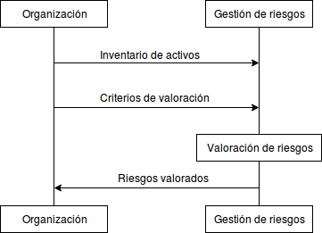

:slug: rules/011/
:category: rules
:description: En el presente documento se detallan los requerimientos de seguridad relacionados a los activos de información de la empresa. Todos los activos de información de la compañía deben estar clasificados de acuerdo a su nivel de confidencialidad y de criticidad.
:keywords: Requerimiento, Seguridad, Activos, Información, Criticidad, Confidencialidad.
:rules: yes

= REQ.011 Activos clasificados según criticidad.

== Nombre

Los activos de información deben estar clasificados 
de acuerdo a su nivel de confidencialidad y de criticidad.

== Descripción

La clasificación de activos de información 
con base a su nivel de confidencialidad y criticidad
tiene como objetivo asegurar que la información 
recibe los niveles de protección adecuados. 
Al realizar un análisis de criticidad <<r1, ^[1]^>> 
es posible jerarquizar a los activos de información 
de la empresa facilitando la toma de decisiones.
Para implementar un análisis de criticidad 
es necesario definir un alcance y propósito, 
seleccionar criterios de evaluación y clasificación adecuados, 
y establecer un método de evaluación para la jerarquización de activos 
teniendo en cuenta varios factores 
estudiados en requerimientos anteriores.
Una vez los activos han sido clasificados
se determina el manejo que se les da
y los controles necesarios para su protección.

Con lo anteriormente mencionado también es posible determinar 
el nivel de seguridad y la rigurosidad de los controles. 
Los activos de información más críticos 
en la mayoría de los casos necesitarán medidas de seguridad estrictas 
para proteger su integridad.

== Guía de implementación

Para realizar la clasificación de los activos 
la organización debe definir un criterio con los parámetros 
que les permita a los responsables de los activos 
realizar una clasificación objetiva.

Para definir los criterios de clasificación 
es recomendable que la organización tenga en cuenta valores 
para los parámetros de Confidencialidad, Integridad y Disponibilidad, 
así mismo como el valor de activo. 
Con criterios de clasificación para estas variables 
la clasificación puede dar una priorización objetiva 
que servirá para tener en cuenta en los procesos de gestión de riesgos 
y gestión de la continuidad del negocio. 

== Diagrama

== Soluciones

. Consultoría - Determinar valor de información.
. Consultoría - Establecer Inventario de Activos de Información.

== Casos de abuso

Un usuario empleado o anónimo ejecuta acciones 
las cuales van en contravía de la seguridad de un activo de la organización, 
los controles establecidos no son suficientes 
debido a que se desconoce la clasificación del activo. 

== Atributos

* Capa: Capa de Recursos.
* Activo: Activos de Información.
* Alcance: Adherencia.
* Fase: Diseño.
* Tipo de Control: Procedimiento.

== Referencias

. [[r1]] link:https://reliabilityweb.com/sp/articles/entry/el-analisis-de-criticidad-una-metodologia-para-mejorar-la-confiabilidad-ope[Análisis de criticidad].
. [[r2]] link:https://www.iso.org/isoiec-27001-information-security.html[Serie de normas ISO/IEC 27000].

