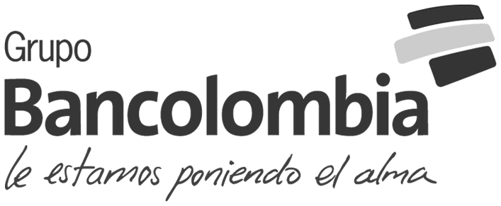
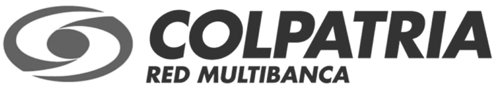
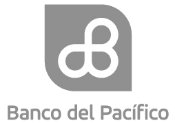
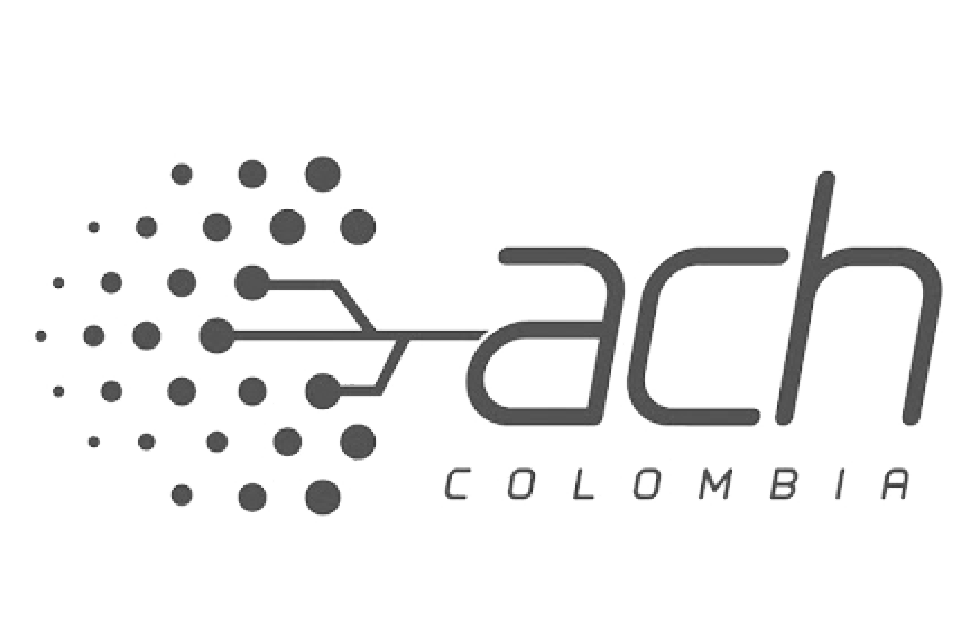
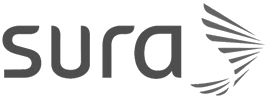
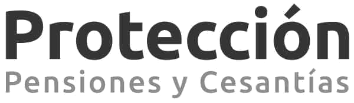

:slug: sectores/financiero/
:category: sectores
:description: FLUID es una compañía especializada en seguridad informática, ethical hacking, pruebas de intrusión y detección de vulnerabilidades en aplicaciones con más de 18 años prestando sus servicios en el mercado colombiano. En esta página presentamos nuestras soluciones en el sector financiero.
:keywords: FLUID, Soluciones, Seguridad, Financiero, Pentesting, Ethical Hacking.
// :translate: sectors/financial/

= Financiero

[frame="none", cols="^.^,^.^,^.^"]
|=======
| |image:logo-aval.png[logo aval, 300, 110] |
| |image:logo-banistmo.png[logo banistmo, 300, 100] |
| | |
3+|
|=======
