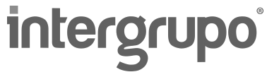

:slug: sectores/tecnologia/
:category: sectores
:description: FLUID es una compañía especializada en seguridad informática, ethical hacking, pruebas de intrusión y detección de vulnerabilidades en aplicaciones con más de 18 años prestando sus servicios en el mercado colombiano. En esta página presentamos nuestras soluciones en el sector tecnológico.
:keywords: FLUID, Tecnología, Información, Seguridad, Pentesting, Soluciones.
// :translate: sectors/technology/

= Tecnología

[frame="none", cols="^.^,^.^,^.^"]
|=======
|image:logo-conexia.png[logo conexia, 290, 100] | |image:logo-psl.png[logo psl, 300, 100]
| | |image:logo-komet.png[logo komet, 300, 90]
| | |
|=======
