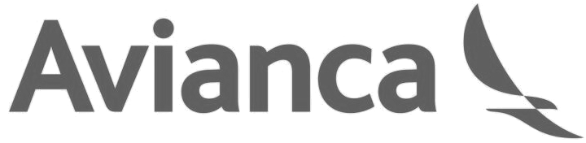

:slug: sectores/transporte/
:category: sectores
:description: FLUID es una compañía especializada en seguridad informática, ethical hacking, pruebas de intrusión y detección de vulnerabilidades en aplicaciones con más de 18 años prestando sus servicios en el mercado colombiano. En esta página presentamos nuestras soluciones en el sector del transporte.
:keywords: FLUID, Soluciones, Sector, Transporte, Información, Seguridad.
// :translate: sectors/transportation/

= Transporte

[frame="none", cols="^.^,^.^"]
|=======
|
|*Avianca* es la marca comercial que representa a las aerolíneas latinoamericanas integradas en Avianca Holdings S.A. Especializadas en el transporte de pasajeros y carga, atención directa en más de 100 destinos en 26 países de América y Europa a bordo de una moderna flota de 172 aeronaves de corto, mediano y largo alcance.
|=======
