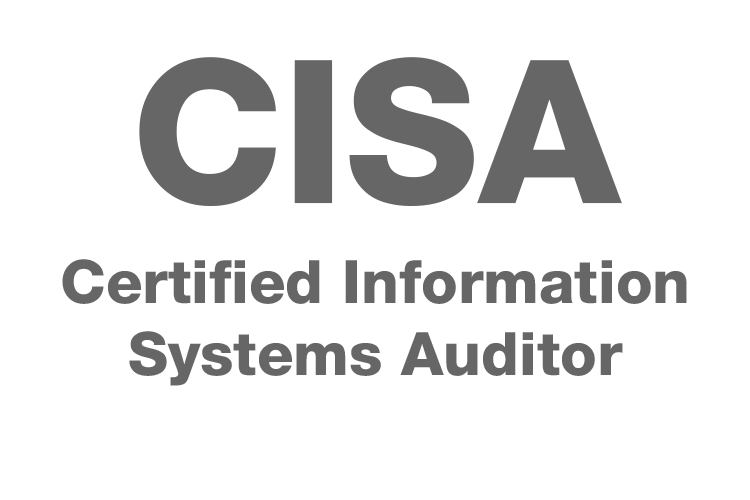
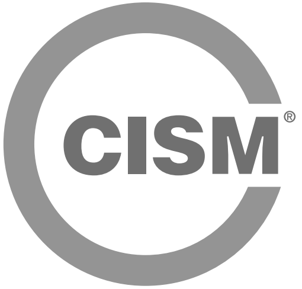
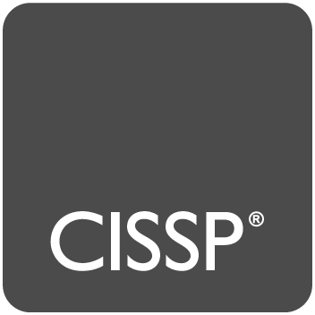
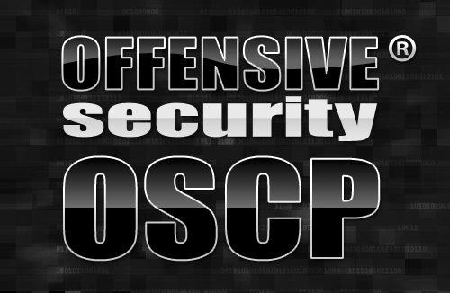
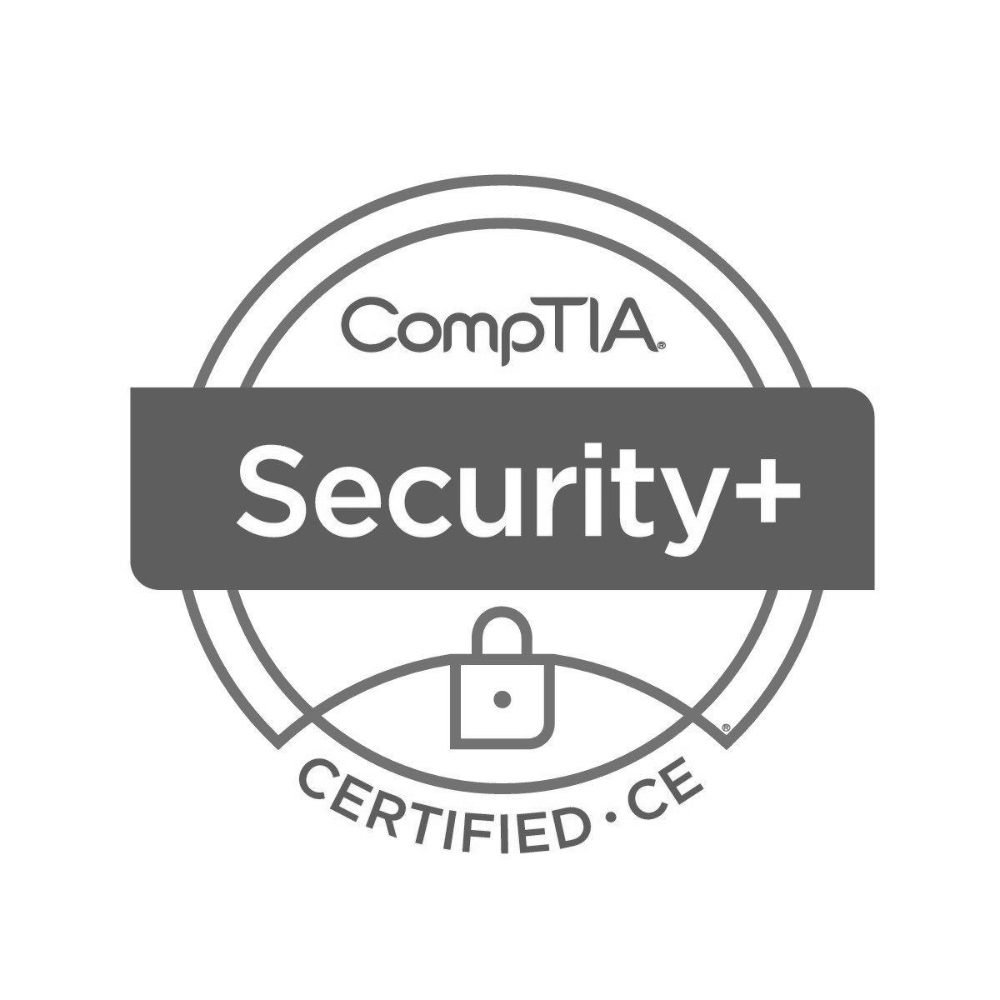

:slug: servicios/certificaciones/
:category: servicios
:description: Nuestros servicios de Ethical Hacking y Pentesting buscan encontrar y reportar todas las vulnerabilidades de seguridad presentes en su aplicación. El objetivo de la siguiente página es presentar las certificaciones con las que cuenta nuestro equipo de profesionales.
:keywords: FLUID, Ethical Hacking, Equipo, Certificaciones, Seguridad, Información.
:translate: services/certifications/

= Certificaciones

[role="aliados tb-alt"]
[cols=2, frame="none"]
|====

^.^a|

a|== Ethical Hacker Certificado (CEH)

Certificación de +EC-Council+ reconocida a nivel internacional,
la cual acredita los conocimientos de las principales técnicas de hacking,
así como de auditoría de seguridad de sistemas de información.
Esta certificación es actualizada de forma periódica,
incorporando las últimas técnicas y metodologías referentes a este campo.

a|== Auditor certificado en sistemas de información (CISA)

Certificación que valida las habilidades y experticia de un profesional
en los campos de auditoría, control y seguridad de la información.
Con esta certificación se verifica la capacidad
de evaluar vulnerabilidades, informar sobre el cumplimiento
y validar y mejorar los controles de seguridad en una empresa.

^.^a|

^.^a|

a|== Gerente certificado en seguridad de la información (CISM)

Certificación enfocada en la gestión,
la cual promueve prácticas internacionales de seguridad
y acredita personas que administran, diseñan, supervisan
y evalúan la seguridad de la información de una empresa.

a|== Profesional certificado en seguridad de sistemas de información (CISSP)

Certificación de alto nivel profesional,
la cual tiene como objetivo ayudar a las empresas
a reconocer a los profesionales con formación
en el área de seguridad de la información.
Es ampliamente reconocida y acreditada a nivel mundial.

^.^a|

^.^a|

a|== Profesional certificado en seguridad ofensiva (OSCP)

Certificación de +ethical hacking+ ofrecida por la empresa +Offensive Security+
la cual enseña metodologías de penetración
incluyendo el examen de penetración +BackTrack+.
Esta certificación es una de las pocas que requiere evidencia
de las habilidades en la parte práctica
a través de una prueba de penetración.

a|== CompTIA Security+

Certificación en la que se confía mundialmente
para validar conocimiento y habilidades de seguridad
de +TI+ esencial y neutra en cuanto a proveedor.
Como referencia de mejores prácticas en seguridad de +TI+,
esta certificación aborda los principios esenciales de seguridad de redes
y gestión de riesgos, lo que la convierte en un punto de partida importante
para una carrera en seguridad de +TI+.

^.^a|

|====
