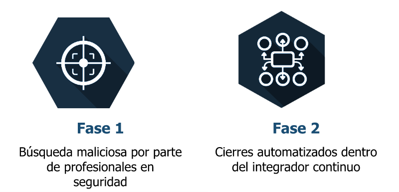
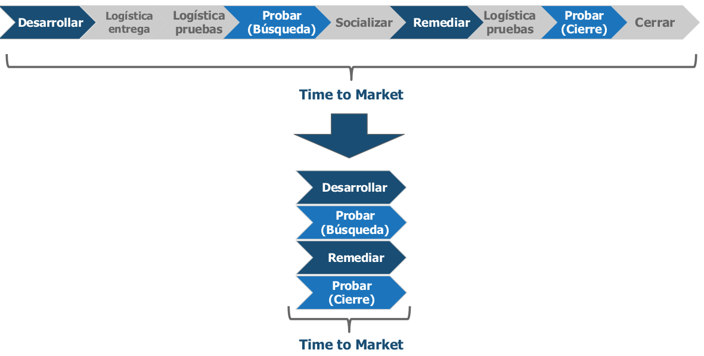
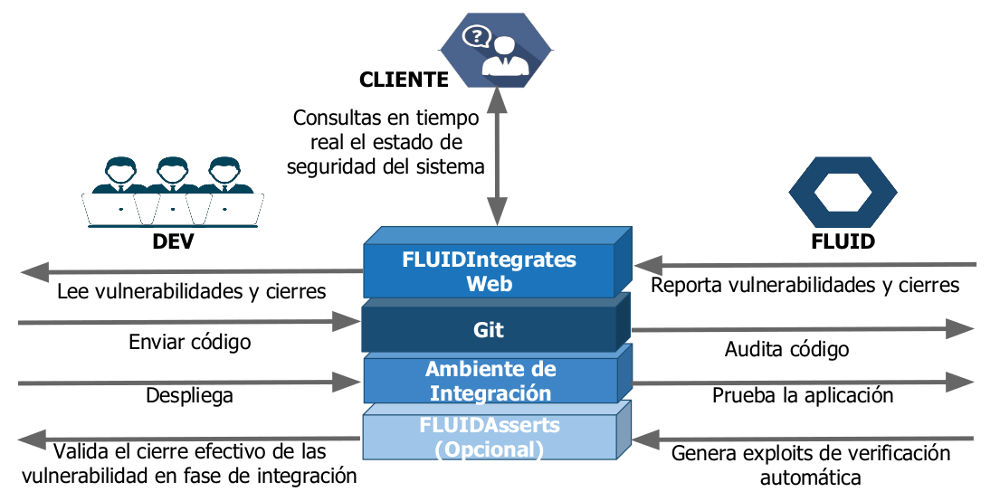
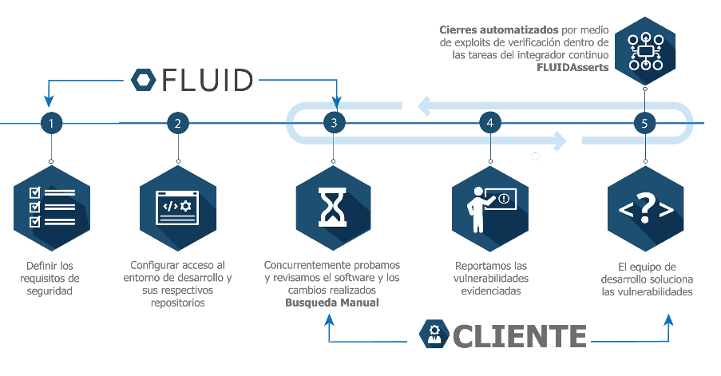
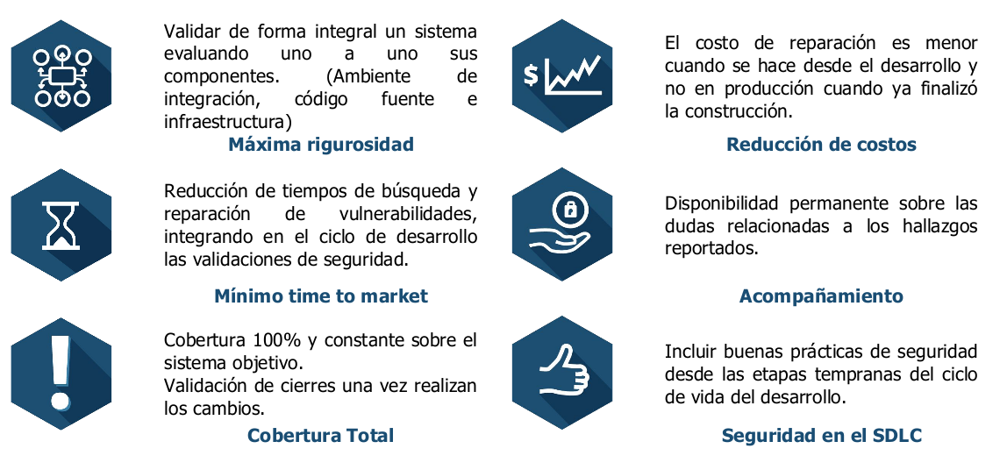

:slug: servicios/hacking-continuo/
:category: servicios
:description: Nuestro servicio de Hacking Continuo busca encontrar todas las vulnerabilidades y reportarlas lo antes posible. A través de la participación en el ciclo de vida de desarollo, estamos en la capacidad de encontrar vulnerabilidades de forma paralalela al desarrollo. Con esto, nuestros clientes podrán reducir los costos de remediación y reducir a cero el tiempo de certificación de seguridad.
:keywords: hacking, vulnerabilidad

= Hacking Continuo

== Encontrar Todas las Vulnerabilidades y Reportarlas lo Antes Posible

=== Pruebas tempranas en el SDLC:

* Minimizando el costo de reparación.
* Reduciendo a cero el tiempo de certificación en seguridad.
* Confirmando el cierre efectivo de las vulnerabilidades durante la integración continua de los
proyectos.

=== ¿Por qué lo hacemos?

* +Time to market+, las organizaciones buscan liberar más funcionalidades en menos tiempo.
* Cobertura, lograr una cobertura del 100% sin aumentar los tiempos de liberación.
* Mitigación, cerrar vulnerabilidades antes de liberar nuevas funcionalidades.
* Rigurosidad, revisión evolutiva por manos expertas.

=== ¿Cómo?

* +Hacking+ Ético continuo sobre el código fuente y las aplicaciones. (Revisión experta)
* Automatización del cierre de vulnerabilidades confirmadas.

== Solución

== Transformación

== Arquitectura

== Metodología

== Beneficios

== Comparativo

[role="tb-fluid tb-row"]
[cols="1,2,2", options="header"]
|====
| Aspecto
| FLUID
| Otros

| Método de revisión
| Híbrido (Herramientas + revisión manual experta)
| Estático (Solo herramientas)

|Tipo de hallazgos
a|* De impacto específico del negocio
* Prácticas inseguras de programación
* Alineación a estándares y regulaciones de seguridad
* Vulnerabilidades +*_"Zero Day"_*+
|Sintácticos

|Posibilidad de falsos positivos
|No
|Sí

|Estimación
a|* Únicamente líneas de código efectivas
* Por campos de entrada de formularios, visibles, invisibles y cabeceras (mayor cobertura y rigurosidad)
a|* Tamaño total del código fuente
* Por pantallas o aplicación (menor cobertura y rigurosidad)

|Capacidad de explotación
|Sí (Si se tiene acceso a la aplicación desplegada)
|No

|Entregables
|Plataforma Web - [button]#link:../../productos/fluidintegrates/[FLUIDIntegrates >>]# (Exploit, Evidencias de explotación, Recomendaciones generales)
|Informe resumen
|====
